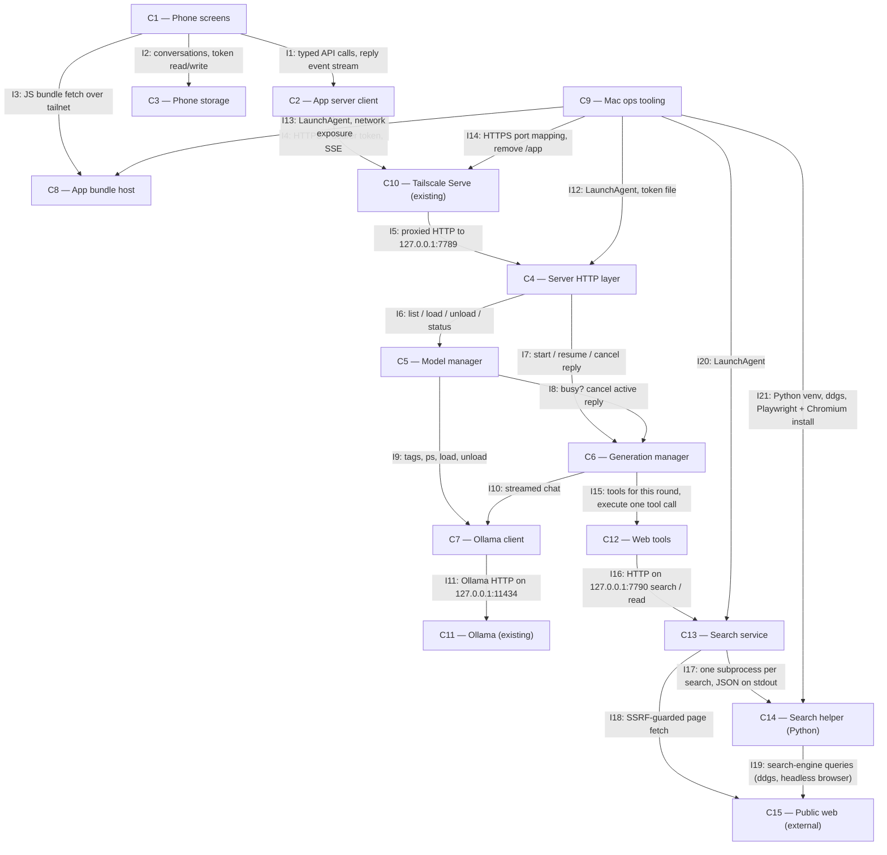

# Architecture

## Status

AGREED

## Overview

Two halves joined only by the tailnet. On the phone, an Expo Go app (C1–C3) holds all durable
user state — conversations and the token — and resends full history with every prompt, so the
Mac keeps no sessions. On the Mac, one small Bun server (C4–C7) is the only thing that talks to
Ollama: it owns the "one model resident, one reply at a time" rules, the confirmation checks, and
an in-memory event log per reply so a dropped stream can resume. The Expo dev server (C8) hands the
JS bundle to Expo Go; Mac-side tooling (C9) installs, supervises and exposes both over Tailscale.

Web search (FR18–FR25, added 2026-09-29): when a conversation's switch is on, C6 runs an Ollama
tool-calling loop and hands each tool call to C12, which calls a separate loopback-only Bun search
service (C13). C13 reads pages itself (SSRF-guarded) and runs a short-lived Python helper (C14)
per search: `ddgs` first, a headless browser as fallback. C13 is its own process so OpenCode can
share it later; nothing new is exposed to the tailnet.

## Diagram

## Components

### C1 — Phone screens

Responsibility: The Expo Go UI — model list with load/unload and confirmations, chat list, chat
view with streaming, thinking and Stop, the per-chat web-search switch, live web steps and
tappable sources, and the password settings screen.
Location: `mobile/app/` (expo-router routes) and `mobile/src/ui/`
Depends on: C2, C3, C8
Realises: FR1, FR2, FR3, FR5, FR6, FR7, FR8, FR9, FR10, FR13, FR16, FR18, FR20, FR22

### C2 — App server client

Responsibility: Every HTTP call to the server, SSE parsing, and resume-after-drop (Last-Event-ID
retry with backoff on transport drop, AppState foreground), mapping every error to a typed,
user-facing outcome.
Location: `mobile/src/api/` (SSE reader, recovery policy and error wording ported from
`phoneToLocalModel/web/src`)
Depends on: C10
Realises: FR9, FR11, FR13, FR16, FR22, FR23

### C3 — Phone storage

Responsibility: Persist conversations (including an in-flight reply's generation id and last
seq, the web-search switch, and each reply's web steps and sources) and the bearer token on the
phone.
Location: `mobile/src/store/` (conversation store ported from `phoneToLocalModel`)
Depends on: None
Realises: FR7, FR8, FR11, FR13, FR18, FR23

### C4 — Server HTTP layer

Responsibility: `Bun.serve` on `127.0.0.1:7789` — bearer auth wrapping all routes, request
validation, routing, SSE writing.
Location: `server/src/http/`
Depends on: C5, C6
Realises: FR12, FR13, FR14, FR16, FR18

### C5 — Model manager

Responsibility: Report installed and resident models, perform swap-load and unload with
`keep_alive: -1`, track which model this server loaded, report each model's `tools` capability,
and enforce the confirmation rule.
Location: `server/src/models/`
Depends on: C6, C7
Realises: FR1, FR2, FR3, FR4, FR5, FR6, FR18, FR23

### C6 — Generation manager

Responsibility: Admit one reply at a time globally, run it against the resident model (as a
tool-calling loop when web search is on, offering tools only while under the 10-call cap), keep a
seq-numbered event log for resume, and cancel on request.
Location: `server/src/generations/`
Depends on: C7, C12
Realises: FR4, FR8, FR9, FR10, FR11, FR18, FR19, FR23

### C7 — Ollama client

Responsibility: Thin typed wrapper over Ollama's `/api/tags`, `/api/ps`, `/api/generate`
(load/unload), `/api/show` (capabilities) and streamed `/api/chat` (with optional `tools` and
returned `tool_calls`).
Location: `server/src/ollama/`
Depends on: C11
Realises: FR1, FR2, FR3, FR4, FR5, FR10, FR12, FR18, FR19

### C8 — App bundle host

Responsibility: Serve the app's JS bundle to Expo Go — the Expo dev server in production mode
(`--no-dev --minify`), `REACT_NATIVE_PACKAGER_HOSTNAME` set to the Mac's tailnet name, port
8081.
Location: `mobile/` (run via C9's LaunchAgent)
Depends on: None
Realises: FR15

### C9 — Mac ops tooling

Responsibility: Mac-side commands — create and copy the token (refusing a group/world-readable
file), install/uninstall the LaunchAgents for C4 and C8, apply the Tailscale Serve mapping for
C4, install/uninstall a macOS packet-filter (pf) anchor that blocks inbound TCP 8081 on every
interface except loopback and the Tailscale interface (one-time admin password, run by the human),
retire the PWA, install/uninstall C13's LaunchAgent, and install C14's Python venv (`ddgs`,
Playwright) and Chromium.
Location: `ops/` (LaunchAgent and Serve installers ported from `phoneToLocalModel/src/host`)
Depends on: C4, C8, C10, C13, C14
Realises: FR13, FR14, FR15, FR17, FR20, FR25

### C10 — Tailscale Serve (existing)

Responsibility: Tailnet-only HTTPS in front of C4. Existing mapping (`/` → harness 7787) is left
alone; C4 gets its own HTTPS port (8443 → `127.0.0.1:7789`).
Location: external — Tailscale on the Mac
Depends on: C4
Realises: FR14

### C11 — Ollama (existing)

Responsibility: Model runtime on `127.0.0.1:11434`.
Location: external — `/opt/homebrew/bin/ollama`
Depends on: None
Realises: —

### C12 — Web tools

Responsibility: Inside the server, define the `web_search`/`read_page` tools and the current-date
note, execute one tool call against C13 (with a client timeout and the reply's abort signal), and
turn the outcome into step and source events plus the tool result text given to the model.
Location: `server/src/web/`
Depends on: C13
Realises: FR19, FR20, FR22, FR24

### C13 — Search service

Responsibility: A separate Bun process on `127.0.0.1:7790` answering search and page-read
requests: search via C14 with a time limit; page read via an SSRF-guarded fetch, main-content
extraction to markdown and truncation.
Location: `search/`
Depends on: C14, C15
Realises: FR20, FR21, FR24, FR25

### C14 — Search helper (Python)

Responsibility: One short-lived process per search that tries `ddgs` (UK/English) and, on error
or zero results, a headless Chromium search via Playwright, printing normalised results as JSON.
Location: `search/helper/`
Depends on: C15
Realises: FR20

### C15 — Public web (external)

Responsibility: Search engines and web pages on the public internet.
Location: external
Depends on: None
Realises: —

## Interfaces

**I1 C1→C2, I2 C1→C3** — in-process TypeScript modules. C2 exposes typed functions returning
either a value or a typed error (`unauthorized`, `unreachable`, `ollama_down`, `unknown_model`,
`model_not_resident`, `generation_in_flight`, `confirmation_required`, `load_failed`, …) and an
async iterator of reply events that transparently resumes across drops.

**I3 C1→C8** — Expo Go opens `exp://ryans-mac-studio.tailc3648a.ts.net:8081` over the tailnet.

**I4/I5 C2→C10→C4** — `https://ryans-mac-studio.tailc3648a.ts.net:8443`, all routes require
`Authorization: Bearer <token>`, else `401 {error:"unauthorized"}`. Error bodies are
`{error: <code>, message, ...}`. No response compression.

| Route | Request | Success | Failures |
| --- | --- | --- | --- |
| `GET /v1/state` | — | `200 {models:[{name,size_bytes,tools}], resident:{name,loaded_by_server}\|null, operation:{kind:"idle"\|"loading"\|"unloading", model?, error?}, generation:{id,model}\|null}` | `503 ollama_down` |
| `POST /v1/models/load` | `{name, confirm?}` | `202 {operation}` | `404 unknown_model`, `409 confirmation_required {reasons:["reply_in_progress"\|"not_loaded_by_server"]}`, `409 operation_in_progress` |
| `POST /v1/models/unload` | `{confirm?}` | `202 {operation}` | `409 confirmation_required`, `409 operation_in_progress` |
| `POST /v1/chat` | `{model, messages:[{role:"user"\|"assistant", content, sources?:[{title,url}]}], web?:boolean}` | `200 text/event-stream`, header `x-generation-id` | `409 model_not_resident`, `409 generation_in_flight {generation_id}`, `409 operation_in_progress` |
| `GET /v1/generations/{id}/events` | `Last-Event-ID` header | `200 text/event-stream`: replay after seq, then live | `404 unknown_generation` |
| `POST /v1/generations/{id}/cancel` | — | `200 {status}` | `404 unknown_generation` |

SSE events, each with `id: <seq>`: `thinking {text}`, `content {text}`, `done {status:"complete"|"cancelled", model, eval_count, tokens_per_second}`, `error {code, message}`. `done`/`error` are terminal.

Web additions (FR18–FR23): `tools` in `GET /v1/state` is true when `/api/show` lists the `tools`
capability. `web:true` on `POST /v1/chat` is accepted only when the model has `tools` (else
`409 tools_unsupported`). Assistant `sources` are rendered by the server into that turn's text
for the model (a short "Sources:" list); page text is never sent by the phone. Extra SSE events:
`step {step_id, kind:"search"|"read", status:"started"|"done"|"failed"|"unavailable", query?,
url?, detail?}` (a step is emitted `started` then once more with its final status) and
`sources {items:[{title,url}]}` (once, just before `done`, when the reply used the web). Both
are logged and replayed by C6 like every other event.

Load/unload are asynchronous: the app polls `GET /v1/state` while an operation is running.
Confirmed load/unload cancels any in-flight reply first. `generation_in_flight` carries the
blocking `generation_id`, so the client can always resume or cancel it.

**I6 C4→C5** — `state()`, `load(name, confirm)`, `unload(confirm)`, `assertResident(model)`.

**I7 C4→C6** — `start(model, messages) → {id, events}`, `events(id, afterSeq)`, `cancel(id)`.

**I8 C5→C6** — `active() → {id, model} | null`, `cancelActive()`.

**I9/I10 C5,C6→C7** — `tags()`, `ps()`, `load(name)` = `POST /api/generate {model, keep_alive:-1}`,
`unload(name)` = `POST /api/generate {model, keep_alive:0}`, `chat(model, messages, signal)` =
streamed `POST /api/chat {keep_alive:-1, think:true when supported}`.

**I12–I14 C9→C4/C8/C10** — `launchctl` LaunchAgents with restart-on-exit; token file
`~/.phone-models/token` (mode 0600) read by C4 at start; `tailscale serve --https=8443
http://127.0.0.1:7789`; `tailscale serve --set-path=/app off` for PWA retirement; a pf anchor loaded at boot by a
LaunchDaemon, passing TCP 8081 only on `lo0` and the Tailscale `utun` interface.

**I10 (web) C6→C7** — `chat(model, messages, signal, tools?)` streams as before and additionally
yields `tool_calls` from Ollama's streamed `/api/chat`; C6 appends the assistant tool-call message
and each `role:"tool"` result, then calls `chat` again. `tools` is omitted once 10 calls have run.
`show(name) → {capabilities}` backs the `tools` flag.

**I15 C6→C12** — `tools() → OllamaTool[]`, `systemNote(now) → string` (current date),
`execute(call, signal) → {toolResult: string, events: (step|source)[]}`. `execute` never throws
for search/read failure: failure becomes a `failed`/`unavailable` step and a tool result telling
the model so. It rejects only on abort (Stop).

**I16 C12→C13** — HTTP on `127.0.0.1:7790`, no auth, JSON. The documented API that OpenCode may
later wrap (FR25):

| Route | Request | Success | Failures |
| --- | --- | --- | --- |
| `POST /v1/search` | `{query, max_results?≤10}` | `200 {results:[{title,url,snippet}], backend:"ddgs"\|"browser"}` | `503 {error:"search_unavailable", detail}`, `504 {error:"timeout"}` |
| `POST /v1/read` | `{url}` | `200 {url, final_url, title, markdown, truncated}` | `400 {error:"blocked_destination"\|"bad_url"}`, `415 {error:"unsupported_content"}`, `502 {error:"fetch_failed", status?}`, `504 {error:"timeout"}` |
| `GET /v1/health` | — | `200 {ok:true}` | — |

Client disconnect aborts the work (subprocess killed, fetch aborted).

**I17 C13→C14** — `helper/.venv/bin/python helper/search.py --query <q> --max <n>`; stdout one
JSON object `{results:[{title,url,snippet}], backend}` or `{error, detail}`; exit 0 either way;
killed by C13 on timeout or abort.

**I18 C13→C15** — page fetch through `node:https`/`node:http` with a custom `lookup` that resolves
every A/AAAA record and rejects if any is non-public (FR21 list); the socket connects to the
checked address, so there is no rebinding gap. Redirects are followed manually (max 5), each hop
re-checked. Caps: 5 MiB body, 15 s, `text/html`/`text/plain`/`application/xhtml+xml` only.
Extraction: Defuddle over linkedom → markdown, truncated to 40 000 characters with a marker.

**I19 C14→C15** — `ddgs` text search, region `uk-en`; fallback Playwright headless Chromium
loading a search-engine results page and scraping result links.

**I20–I21 C9→C13/C14** — LaunchAgent `com.harness.search` (restart-on-exit, like I12);
`helper/.venv` created from Homebrew Python 3.14 with `ddgs` and `playwright`, then
`playwright install chromium`.

## Data

| Data | Owner | Where |
| --- | --- | --- |
| Bearer token | C9 creates; C4 reads | Mac: `~/.phone-models/token` (0600). Phone: `expo-secure-store` (C3). |
| Conversations `{id, title, created_at, updated_at, web_search:boolean, messages:[{id, role, content, thinking?, model?, status:"complete"\|"stopped"\|"error"\|"streaming", generation_id?, last_seq?, steps?:[{kind, status, query?, url?}], sources?:[{title,url}]}]}` | C3 | Phone: AsyncStorage, one key per conversation plus an index. `web_search` defaults to false for existing conversations. Page text and full search results are never stored. |
| Tool-call transcript for a web reply (assistant tool calls, tool results incl. page text) | C6 | Server memory only, for the life of the reply; dropped when it ends. |
| Model loaded by this server, current load/unload operation | C5 | Server memory only; lost on restart (resident model then reports `loaded_by_server:false`). |
| Active reply and per-reply event logs | C6 | Server memory only; logs kept 10 minutes after the terminal event. A server restart mid-reply surfaces as `unknown_generation` → "reply interrupted". |

## Technology Choices

| Choice | Decision | Why | Rejected |
| --- | --- | --- | --- |
| Phone runtime | Expo Go, current SDK, expo-router | Required (Constraints) | Dev/standalone builds (Non-Goals) |
| Streaming on phone | `expo/fetch` streaming body + ported SSE parser | Native streaming in Expo Go; reuses proven PWA parser | `react-native-sse`/EventSource polyfills (extra dependency, no resume control); WebSockets (no benefit over SSE, loses reuse) |
| Phone storage | AsyncStorage for chats, `expo-secure-store` for token | Both bundled in Expo Go; data is small | SQLite (unneeded for a handful of chats) |
| Server | Bun + `Bun.serve`, no framework, `idleTimeout: 255` | Matches neighbouring projects; `idleTimeout` avoids the PWA's cold-load stream kill | Hono/Express (no need); extending the harness or routing via OpenCode (Decisions) |
| Conversation state | Stateless server; phone resends full history | No server sessions to lose or rebuild; removes the PWA's hardest failure mode | Server-side sessions like the harness |
| Bundle delivery | Expo dev server in production mode under a LaunchAgent | The only way Expo Go loads a bundle without Expo's cloud | EAS Update (Expo account + cloud hosting); self-hosted updates server (not loadable by Expo Go); `--tunnel` (public ngrok URL, violates FR14) |
| Server exposure | Loopback bind + Tailscale Serve HTTPS on its own port 8443 | Leaves the harness's `/` mapping untouched; no path-prefix rewriting | A path under the existing 443 origin |
| Repo layout | One repo: `mobile/`, `server/`, `ops/`, `shared/` (API types, imported by both via Metro `watchFolders`) | One API type definition, no drift | Separate repos |
| Search placement | Separate loopback Bun process (C13), own LaunchAgent | FR25: shareable with OpenCode later; isolates scraping/browser failures from the chat server | Inside C4–C7 (not shareable); exposing it on the tailnet (not needed) |
| Search backend | `ddgs` per-search subprocess, Playwright headless Chromium fallback, both in one Python venv (C14) | Free, no account (FR20); both libraries are Python-first; no extra always-on process | `ddgs[api]` server (another daemon); SearXNG/degoog (heavier, same blocking; degoog ships no engines); Playwright under Bun (unproven); hosted APIs (FR20); whole service in Python (Constraints: Mac-side code targets Bun) |
| Page reading | `node:http(s)` with custom `lookup` + Defuddle over linkedom → markdown | Checks the address actually connected to; Defuddle kept code blocks in the 2026-09-29 test (`.harness/research/`) | Bun `fetch` (no lookup hook → rebinding gap); trafilatura (flattened code, invented a date); Jina/Firecrawl/Crawl4AI (hosted, Docker or heavy) |
| Tool calling | Ollama native `tools` on streamed `/api/chat` | All installed models report `tools`; no new runtime | OpenCode as the tool runner (not in the request path); prompt-parsed tool calls |

## Requirement Coverage

| Functional requirement | Component(s) |
| --- | --- |
| FR1 | C1, C5, C7 |
| FR2 | C1, C5, C7 |
| FR3 | C1, C5, C7 |
| FR4 | C5, C6, C7 |
| FR5 | C1, C5, C7 |
| FR6 | C1, C5 |
| FR7 | C1, C3 |
| FR8 | C1, C3, C6 |
| FR9 | C1, C2, C6 |
| FR10 | C1, C6, C7 |
| FR11 | C2, C3, C6 |
| FR12 | C4, C7 |
| FR13 | C1, C2, C3, C4, C9 |
| FR14 | C4, C9, C10 |
| FR15 | C8, C9 |
| FR16 | C1, C2, C4 |
| FR17 | C9 |
| FR18 | C1, C3, C4, C5, C6, C7 |
| FR19 | C6, C7, C12 |
| FR20 | C1, C9, C12, C13, C14 |
| FR21 | C13 |
| FR22 | C1, C2, C12 |
| FR23 | C2, C3, C5, C6 |
| FR24 | C12, C13 |
| FR25 | C9, C13 |

## Risks

- **R1 — Expo dev server listens beyond loopback.** Metro binds all interfaces and
  `--localhost` is reported not to restrict it (expo/expo#40465), so C8 is reachable on the home
  LAN on its own. Mitigated by C9's pf anchor (agreed). Trigger to revisit: the Tailscale
  interface name changes (e.g. a Tailscale reinstall), which would silently block the phone —
  C9's installer must resolve the interface by the Mac's tailnet IP, and AC10 must be re-proven
  from a LAN device and from the phone.
- **R2 — Expo Go SDK drift.** App Store Expo Go supports only recent SDKs; an Expo Go update on
  the phone can stop the project opening. Trigger: Expo Go reports an incompatible SDK → upgrade
  the project's SDK.
- **R3 — Deployment runs from the working tree.** C8 serves whatever is on disk (the PWA's
  `bun --watch` lesson). Mid-edit states can reach the phone. Trigger: live proofs flaking during
  implementation → serve from a separate checkout.
- **R4 — Something else loads a model.** Ollama loads on demand for any client, so another tool
  can make two models resident. C5 reports the truth; it does not police other clients.
- **R5 — Streaming through Tailscale Serve on iOS.** Proven for the PWA over the same proxy;
  `expo/fetch` on iOS is new here. First milestone should prove a token-by-token stream end to end.
- **R6 — SSRF guard depends on Bun's `node:http(s)` honouring a custom `lookup`.** Unverified
  (research 2026-09-29). The first web milestone must prove a hostname resolving to `127.0.0.1`
  and a redirect to a tailnet address are both refused at connect time. If Bun ignores `lookup`,
  move page fetching into C14 (Python, where resolver pinning is standard) — a Deviation, not a
  silent workaround.
- **R7 — `ddgs` on Python 3.14 and engine blocking.** Install on 3.14 is unverified, and engines
  intermittently block a single home IP (empty results rather than errors). Trigger: install
  fails → pin a compatible Python via Homebrew for the venv; blocking frequent → tune the
  fallback engine in C14. Results are best-effort by requirement.
- **R8 — Tool-calling quality varies by model.** Some models may ignore tools, call them badly,
  or loop. The 10-call cap bounds loops; acceptance is proven on at least one installed model and
  the others are observed, not guaranteed.
- **R9 — Prompt injection from page text.** Tools are read-only and the server has no other
  tools, so the impact is a misleading answer; page text is delimited as untrusted in the tool
  result.

## Open Architecture Questions

None

## Deviations

### D-M5b-1 — `operation.error_code` on `GET /v1/state`

Milestone: M5b
Material: no
Change: I5's `operation` object gains an optional `error_code` (`ollama_down` | `unknown_model` |
`load_failed`), set by C5 alongside the existing `error` string when a load fails. C2 maps it to
plain-language wording (FR16) instead of parsing the `error` string.
Why: the load/unload failure reason is otherwise free text; a typed code lets C2 tell "model no
longer installed" from "model failed to load" and "Ollama down" reliably. Additive field; no
component boundary, technology or responsibility changes.

### D-M7b-1 — Test-only `SEARCH_HELPER_FORCE_DDGS` hook on the search helper

Milestone: M7b
Material: no
Change: C14 (`search/helper/search.py`) reads an optional environment variable
`SEARCH_HELPER_FORCE_DDGS` (`fail` | `empty`) that makes only the ddgs step behave as if it raised
or returned nothing, so the browser fallback (I19) can be proven live through C13's real
`POST /v1/search` (the helper inherits C13's environment). Unset in normal operation. The browser
fallback uses Bing's results page (`cc=GB`, `setlang=en-GB`, locale en-GB).
Why: AC16 requires ddgs to be *forced* to fail or return nothing; an env hook is the smallest seam
that exercises the real entry point. Test hook alongside the existing `SEARCH_PORT`; no component
boundary, technology or responsibility changes.
