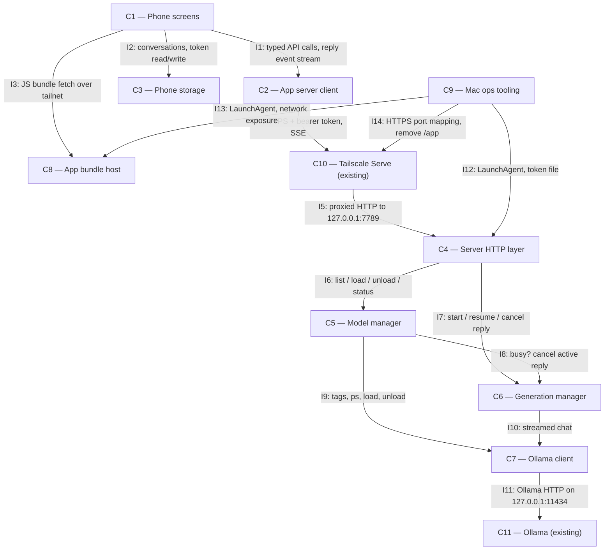

# Architecture

## Status

AGREED

## Overview

Two halves joined only by the tailnet. On the phone, an Expo Go app (C1–C3) holds all durable
user state — conversations and the token — and resends full history with every prompt, so the
Mac keeps no sessions. On the Mac, one small Bun server (C4–C7) is the only thing that talks to
Ollama: it owns the "one model resident, one reply at a time" rules, the confirmation checks, and
an in-memory event log per reply so a dropped stream can resume. The Expo dev server (C8) hands the
JS bundle to Expo Go; Mac-side tooling (C9) installs, supervises and exposes both over Tailscale.

## Diagram

## Components

### C1 — Phone screens

Responsibility: The Expo Go UI — model list with load/unload and confirmations, chat list, chat
view with streaming, thinking and Stop, and the password settings screen.
Location: `mobile/app/` (expo-router routes) and `mobile/src/ui/`
Depends on: C2, C3, C8
Realises: FR1, FR2, FR3, FR5, FR6, FR7, FR8, FR9, FR10, FR13, FR16

### C2 — App server client

Responsibility: Every HTTP call to the server, SSE parsing, and resume-after-drop (Last-Event-ID
retry with backoff on transport drop, AppState foreground), mapping every error to a typed,
user-facing outcome.
Location: `mobile/src/api/` (SSE reader, recovery policy and error wording ported from
`phoneToLocalModel/web/src`)
Depends on: C10
Realises: FR9, FR11, FR13, FR16

### C3 — Phone storage

Responsibility: Persist conversations (including an in-flight reply's generation id and last
seq) and the bearer token on the phone.
Location: `mobile/src/store/` (conversation store ported from `phoneToLocalModel`)
Depends on: None
Realises: FR7, FR8, FR11, FR13

### C4 — Server HTTP layer

Responsibility: `Bun.serve` on `127.0.0.1:7789` — bearer auth wrapping all routes, request
validation, routing, SSE writing.
Location: `server/src/http/`
Depends on: C5, C6
Realises: FR12, FR13, FR14, FR16

### C5 — Model manager

Responsibility: Report installed and resident models, perform swap-load and unload with
`keep_alive: -1`, track which model this server loaded, and enforce the confirmation rule.
Location: `server/src/models/`
Depends on: C6, C7
Realises: FR1, FR2, FR3, FR4, FR5, FR6

### C6 — Generation manager

Responsibility: Admit one reply at a time globally, run it against the resident model, keep a
seq-numbered event log for resume, and cancel on request.
Location: `server/src/generations/`
Depends on: C7
Realises: FR4, FR8, FR9, FR10, FR11

### C7 — Ollama client

Responsibility: Thin typed wrapper over Ollama's `/api/tags`, `/api/ps`, `/api/generate`
(load/unload) and streamed `/api/chat`.
Location: `server/src/ollama/`
Depends on: C11
Realises: FR1, FR2, FR3, FR4, FR5, FR10, FR12

### C8 — App bundle host

Responsibility: Serve the app's JS bundle to Expo Go — the Expo dev server in production mode
(`--no-dev --minify`), `REACT_NATIVE_PACKAGER_HOSTNAME` set to the Mac's tailnet name, port
8081.
Location: `mobile/` (run via C9's LaunchAgent)
Depends on: None
Realises: FR15

### C9 — Mac ops tooling

Responsibility: Mac-side commands — create and copy the token (refusing a group/world-readable
file), install/uninstall the LaunchAgents for C4 and C8, apply the Tailscale Serve mapping for
C4, install/uninstall a macOS packet-filter (pf) anchor that blocks inbound TCP 8081 on every
interface except loopback and the Tailscale interface (one-time admin password, run by the human),
and retire the PWA.
Location: `ops/` (LaunchAgent and Serve installers ported from `phoneToLocalModel/src/host`)
Depends on: C4, C8, C10
Realises: FR13, FR14, FR15, FR17

### C10 — Tailscale Serve (existing)

Responsibility: Tailnet-only HTTPS in front of C4. Existing mapping (`/` → harness 7787) is left
alone; C4 gets its own HTTPS port (8443 → `127.0.0.1:7789`).
Location: external — Tailscale on the Mac
Depends on: C4
Realises: FR14

### C11 — Ollama (existing)

Responsibility: Model runtime on `127.0.0.1:11434`.
Location: external — `/opt/homebrew/bin/ollama`
Depends on: None
Realises: —

## Interfaces

**I1 C1→C2, I2 C1→C3** — in-process TypeScript modules. C2 exposes typed functions returning
either a value or a typed error (`unauthorized`, `unreachable`, `ollama_down`, `unknown_model`,
`model_not_resident`, `generation_in_flight`, `confirmation_required`, `load_failed`, …) and an
async iterator of reply events that transparently resumes across drops.

**I3 C1→C8** — Expo Go opens `exp://ryans-mac-studio.tailc3648a.ts.net:8081` over the tailnet.

**I4/I5 C2→C10→C4** — `https://ryans-mac-studio.tailc3648a.ts.net:8443`, all routes require
`Authorization: Bearer <token>`, else `401 {error:"unauthorized"}`. Error bodies are
`{error: <code>, message, ...}`. No response compression.

| Route | Request | Success | Failures |
| --- | --- | --- | --- |
| `GET /v1/state` | — | `200 {models:[{name,size_bytes}], resident:{name,loaded_by_server}\|null, operation:{kind:"idle"\|"loading"\|"unloading", model?, error?}, generation:{id,model}\|null}` | `503 ollama_down` |
| `POST /v1/models/load` | `{name, confirm?}` | `202 {operation}` | `404 unknown_model`, `409 confirmation_required {reasons:["reply_in_progress"\|"not_loaded_by_server"]}`, `409 operation_in_progress` |
| `POST /v1/models/unload` | `{confirm?}` | `202 {operation}` | `409 confirmation_required`, `409 operation_in_progress` |
| `POST /v1/chat` | `{model, messages:[{role:"user"\|"assistant", content}]}` | `200 text/event-stream`, header `x-generation-id` | `409 model_not_resident`, `409 generation_in_flight {generation_id}`, `409 operation_in_progress` |
| `GET /v1/generations/{id}/events` | `Last-Event-ID` header | `200 text/event-stream`: replay after seq, then live | `404 unknown_generation` |
| `POST /v1/generations/{id}/cancel` | — | `200 {status}` | `404 unknown_generation` |

SSE events, each with `id: <seq>`: `thinking {text}`, `content {text}`, `done {status:"complete"|"cancelled", model, eval_count, tokens_per_second}`, `error {code, message}`. `done`/`error` are terminal.

Load/unload are asynchronous: the app polls `GET /v1/state` while an operation is running.
Confirmed load/unload cancels any in-flight reply first. `generation_in_flight` carries the
blocking `generation_id`, so the client can always resume or cancel it.

**I6 C4→C5** — `state()`, `load(name, confirm)`, `unload(confirm)`, `assertResident(model)`.

**I7 C4→C6** — `start(model, messages) → {id, events}`, `events(id, afterSeq)`, `cancel(id)`.

**I8 C5→C6** — `active() → {id, model} | null`, `cancelActive()`.

**I9/I10 C5,C6→C7** — `tags()`, `ps()`, `load(name)` = `POST /api/generate {model, keep_alive:-1}`,
`unload(name)` = `POST /api/generate {model, keep_alive:0}`, `chat(model, messages, signal)` =
streamed `POST /api/chat {keep_alive:-1, think:true when supported}`.

**I12–I14 C9→C4/C8/C10** — `launchctl` LaunchAgents with restart-on-exit; token file
`~/.phone-models/token` (mode 0600) read by C4 at start; `tailscale serve --https=8443
http://127.0.0.1:7789`; `tailscale serve --set-path=/app off` for PWA retirement; a pf anchor loaded at boot by a
LaunchDaemon, passing TCP 8081 only on `lo0` and the Tailscale `utun` interface.

## Data

| Data | Owner | Where |
| --- | --- | --- |
| Bearer token | C9 creates; C4 reads | Mac: `~/.phone-models/token` (0600). Phone: `expo-secure-store` (C3). |
| Conversations `{id, title, created_at, updated_at, messages:[{id, role, content, thinking?, model?, status:"complete"\|"stopped"\|"error"\|"streaming", generation_id?, last_seq?}]}` | C3 | Phone: AsyncStorage, one key per conversation plus an index. |
| Model loaded by this server, current load/unload operation | C5 | Server memory only; lost on restart (resident model then reports `loaded_by_server:false`). |
| Active reply and per-reply event logs | C6 | Server memory only; logs kept 10 minutes after the terminal event. A server restart mid-reply surfaces as `unknown_generation` → "reply interrupted". |

## Technology Choices

| Choice | Decision | Why | Rejected |
| --- | --- | --- | --- |
| Phone runtime | Expo Go, current SDK, expo-router | Required (Constraints) | Dev/standalone builds (Non-Goals) |
| Streaming on phone | `expo/fetch` streaming body + ported SSE parser | Native streaming in Expo Go; reuses proven PWA parser | `react-native-sse`/EventSource polyfills (extra dependency, no resume control); WebSockets (no benefit over SSE, loses reuse) |
| Phone storage | AsyncStorage for chats, `expo-secure-store` for token | Both bundled in Expo Go; data is small | SQLite (unneeded for a handful of chats) |
| Server | Bun + `Bun.serve`, no framework, `idleTimeout: 255` | Matches neighbouring projects; `idleTimeout` avoids the PWA's cold-load stream kill | Hono/Express (no need); extending the harness or routing via OpenCode (Decisions) |
| Conversation state | Stateless server; phone resends full history | No server sessions to lose or rebuild; removes the PWA's hardest failure mode | Server-side sessions like the harness |
| Bundle delivery | Expo dev server in production mode under a LaunchAgent | The only way Expo Go loads a bundle without Expo's cloud | EAS Update (Expo account + cloud hosting); self-hosted updates server (not loadable by Expo Go); `--tunnel` (public ngrok URL, violates FR14) |
| Server exposure | Loopback bind + Tailscale Serve HTTPS on its own port 8443 | Leaves the harness's `/` mapping untouched; no path-prefix rewriting | A path under the existing 443 origin |
| Repo layout | One repo: `mobile/`, `server/`, `ops/`, `shared/` (API types, imported by both via Metro `watchFolders`) | One API type definition, no drift | Separate repos |

## Requirement Coverage

| Functional requirement | Component(s) |
| --- | --- |
| FR1 | C1, C5, C7 |
| FR2 | C1, C5, C7 |
| FR3 | C1, C5, C7 |
| FR4 | C5, C6, C7 |
| FR5 | C1, C5, C7 |
| FR6 | C1, C5 |
| FR7 | C1, C3 |
| FR8 | C1, C3, C6 |
| FR9 | C1, C2, C6 |
| FR10 | C1, C6, C7 |
| FR11 | C2, C3, C6 |
| FR12 | C4, C7 |
| FR13 | C1, C2, C3, C4, C9 |
| FR14 | C4, C9, C10 |
| FR15 | C8, C9 |
| FR16 | C1, C2, C4 |
| FR17 | C9 |

## Risks

- **R1 — Expo dev server listens beyond loopback.** Metro binds all interfaces and
  `--localhost` is reported not to restrict it (expo/expo#40465), so C8 is reachable on the home
  LAN on its own. Mitigated by C9's pf anchor (agreed). Trigger to revisit: the Tailscale
  interface name changes (e.g. a Tailscale reinstall), which would silently block the phone —
  C9's installer must resolve the interface by the Mac's tailnet IP, and AC10 must be re-proven
  from a LAN device and from the phone.
- **R2 — Expo Go SDK drift.** App Store Expo Go supports only recent SDKs; an Expo Go update on
  the phone can stop the project opening. Trigger: Expo Go reports an incompatible SDK → upgrade
  the project's SDK.
- **R3 — Deployment runs from the working tree.** C8 serves whatever is on disk (the PWA's
  `bun --watch` lesson). Mid-edit states can reach the phone. Trigger: live proofs flaking during
  implementation → serve from a separate checkout.
- **R4 — Something else loads a model.** Ollama loads on demand for any client, so another tool
  can make two models resident. C5 reports the truth; it does not police other clients.
- **R5 — Streaming through Tailscale Serve on iOS.** Proven for the PWA over the same proxy;
  `expo/fetch` on iOS is new here. First milestone should prove a token-by-token stream end to end.

## Open Architecture Questions

None

## Deviations
