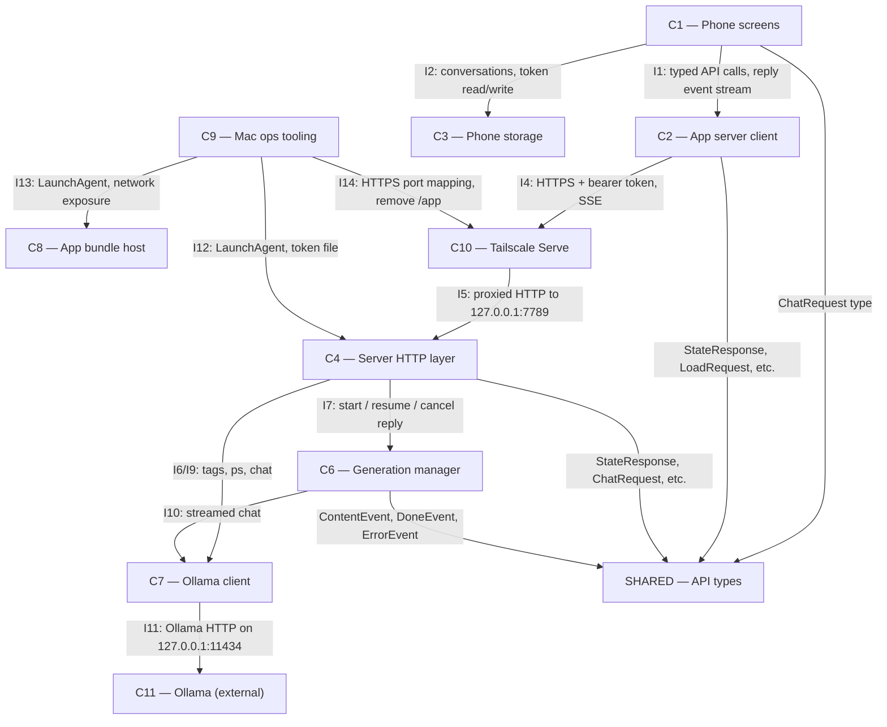

# As Built — M1

Baseline: 04bb92b7be06984856c1dd1c34b52e2533f656e3
Change source: git diff 04bb92b7be06984856c1dd1c34b52e2533f656e3 HEAD

## Diagram

## Components Observed

| Id | Name | Files | Claimed? |
| --- | --- | --- | --- |
| C1 | Phone screens | mobile/src/app/*, mobile/src/app-routing/*, mobile/src/chat/*, mobile/src/ui/*, mobile/scripts/*, mobile config files | Yes |
| C2 | App server client | mobile/src/api/{client,config,expoFetchClient}.* | Yes |
| C3 | Phone storage | mobile/src/api/{token,secureStoreToken}.* | No |
| C4 | Server HTTP layer | server/src/{http,index}.* | Yes |
| C6 | Generation manager | server/src/generations/manager.* | Yes |
| C7 | Ollama client | server/src/ollama/client.* | Yes |
| C8 | App bundle host | mobile/ (Expo dev server infrastructure) | Yes |
| C9 | Mac ops tooling | ops/ (scripts and token management) | Yes |
| C10 | Tailscale Serve | (external, configured by C9) | Yes |
| C11 | Ollama | (external, called by C7) | Yes |
| SHARED | API types | shared/api.ts | (N/A) |

## Edges Observed

| From | To | What crosses | Evidence |
| --- | --- | --- | --- |
| C1 | C2 | `chat.tsx` imports `createAPIClient` from `expoFetchClient`; `chatController.ts` imports `APIClient`, `StreamEvent`, `ModelNotResidentError`, `UnauthorizedError` from `api/client` | mobile/src/app/chat.tsx:21-22; mobile/src/chat/chatController.ts:22-23 |
| C1 | C3 | `chat.tsx` and `index.tsx` import `getToken`, `saveToken`, `clearToken` from `secureStoreToken` | mobile/src/app/chat.tsx:20; mobile/src/app/index.tsx:11 |
| C1 | SHARED | `chatController.ts` imports `ChatRequest` type from `@shared/api` | mobile/src/chat/chatController.ts:24 |
| C2 | SHARED | `client.ts` imports `StateResponse`, `LoadRequest`, `UnloadRequest`, `ChatRequest`, `OperationResponse`, `ThinkingEvent`, `ContentEvent`, `DoneEvent`, `ErrorEvent` from `@shared/api` | mobile/src/api/client.ts:13-22 |
| C2 | C10 | (network edge) `client.ts` makes HTTP/SSE requests to configured server URL (proxied through Tailscale Serve) | mobile/src/api/client.ts; architecture I4 |
| C4 | C6 | `server.ts` imports `GenerationManager` from `../generations/manager`; passes as dependency; calls start/resume/cancel/subscribe | server/src/http/server.ts:8-10 |
| C4 | C7 | `server.ts` imports `OllamaStateClient` interface and types from `../ollama/client`; passes ollama instance to routes | server/src/http/server.ts:14-15 |
| C4 | SHARED | `server.ts` imports `ErrorResponse`, `ChatRequest`, `StateResponse`, `Model`, `ResidentModel` from `@shared/api` | server/src/http/server.ts:17-22 |
| C6 | C7 | `manager.ts` imports `OllamaChatRequest`, `OllamaChatResponse` from `../ollama/client`; calls `ollamaClient.chat()` | server/src/generations/manager.ts:12, 65-86 |
| C6 | SHARED | `manager.ts` imports `ChatRequest`, `ContentEvent`, `DoneEvent`, `ErrorEvent` from `@shared/api` | server/src/generations/manager.ts:13 |
| C7 | C11 | (network edge) `client.ts` makes HTTP requests to `127.0.0.1:11434` (Ollama) | server/src/ollama/client.ts (implicit in implementation) |
| C9 | C4 | `ops/scripts/com.harness.server.plist` is LaunchAgent that launches server; `ops/src/token.ts` generates token read by server | ops/scripts/com.harness.server.plist; server/src/index.ts |
| C9 | C8 | `ops/scripts/com.harness.bundle-host.plist` is LaunchAgent that launches Expo dev server | ops/scripts/com.harness.bundle-host.plist |
| C9 | C10 | `ops/scripts/configure-tailscale-serve.sh` configures Tailscale Serve mapping | ops/scripts/configure-tailscale-serve.sh |

## Unmapped Files

| File | Why it could not be attributed |
| --- | --- |
| .gitignore | Root-level configuration file, not part of any component |
| mobile/assets/.gitkeep | Placeholder directory marker |
| mobile/bun.lock | Package manager lock file (supporting infrastructure) |
| mobile/tsconfig.json, ops/tsconfig.json, server/tsconfig.json | TypeScript configuration (supporting infrastructure) |
| mobile/package.json, ops/package.json, server/package.json | Package manager files (supporting infrastructure) |
| mobile/.eslintrc.json, mobile/.prettierrc.json, mobile/.gitignore | Development tool configuration |
| mobile/expo-router.js | Expo routing framework configuration |
| server/scripts/curl-chat-stream-proof.sh, server/scripts/entry-smoke.sh | Integration test scripts (supporting infrastructure, not a component) |

## Claim vs Observation

1. **C5 (Model manager) is claimed but not observed.** The diff contains no files in `server/src/models/`. Comments in `server/src/http/server.ts` explicitly state "Will be implemented with ModelManager (M2)", confirming C5 is deferred to milestone M2.

2. **C3 (Phone storage) is observed but not claimed.** The diff contains `mobile/src/api/token.ts`, `mobile/src/api/token.test.ts`, and `mobile/src/api/secureStoreToken.ts`, which implement phone token storage using `expo-secure-store`. Per architecture: "Persist conversations (including an in-flight reply's generation id and last seq) and the bearer token on the phone. Location: `mobile/src/store/`". The token portion is implemented but not in the claimed architecture for M1.

3. **C8 (App bundle host) is partially realized.** Configuration and LaunchAgent infrastructure are present (via C9); the Expo dev server itself is pre-existing external software configured by these files, not new code written in this milestone. The app source (`mobile/src/`) that gets bundled is C1.

No other mismatches.
