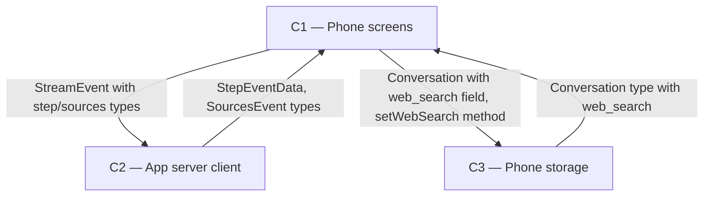

# As Built — M10

Baseline: e98f0601a4330343f9a1063ce48e154d60109d8a (M9 DONE)
Change source: git diff e98f0601a4330343f9a1063ce48e154d60109d8a HEAD (branch m10-phone-web-switch)

## Diagram

## Components Observed

| Id | Name | Files | Claimed? |
| --- | --- | --- | --- |
| C1 | Phone screens | mobile/src/app/chat.tsx, mobile/src/chat/chatController.ts, mobile/src/chat/chatController.test.ts, mobile/src/chat/conversationSession.ts, mobile/src/chat/conversationSession.test.ts, mobile/src/ui/chatItems.ts, mobile/src/ui/chatItems.test.ts, mobile/src/ui/streamReducer.ts, mobile/src/ui/streamReducer.test.ts, mobile/src/ui/ui.test.ts, mobile/src/ui/webSwitch.ts, mobile/src/ui/webSwitch.test.ts | Yes |
| C2 | App server client | mobile/src/api/client.ts, mobile/src/api/client.test.ts | Yes |
| C3 | Phone storage | mobile/src/store/conversationStore.ts, mobile/src/store/conversationStore.test.ts | Yes |

## Edges Observed

| From | To | What crosses | Evidence |
| --- | --- | --- | --- |
| C1 | C2 | StreamEvent type, chat() call | mobile/src/chat/conversationSession.ts imports `StreamEvent` from `@/api/client`; chat.tsx imports `createAPIClient` and calls `clientRef.current.chat()` |
| C1 | C3 | Conversation type, setWebSearch() call | mobile/src/app/chat.tsx imports `createConversationStore` and calls `storeRef.current.setWebSearch()` and `store.get()` |
| C2 | C1 | StepEventData, SourcesEvent types | mobile/src/api/client.ts parseSSEEvent() returns `step` and `sources` event types; mobile/src/ui/chatItems.ts imports `StepEventData` from `@shared/api` |
| C3 | C1 | Conversation with web_search field | mobile/src/store/conversationStore.ts exports Conversation interface with `web_search?: boolean` field; mobile/src/app/chat.tsx reads `conversation?.web_search` |
| C2 (internal) | C1 | SSE event parsing | mobile/src/api/client.ts lines 940–970 parse `step` and `sources` event types yielded by server; mobile/src/ui/streamReducer.ts applyStreamEvent() handles them |

## Unmapped Files

| File | Why it could not be attributed |
| --- | --- |
| mobile/scripts/web-switch-proof.sh | Test/proof script harness; not part of the application. Executes web-switch-proof.ts via bun. |
| mobile/scripts/web-switch-proof.ts | Test/proof script that imports and tests C1, C2, C3 components directly via their public modules. Not part of the shipped application. |

## Claim vs Observation

No mismatch. All claimed components (C1, C2, C3) are observed in the diff. No additional components were observed.
