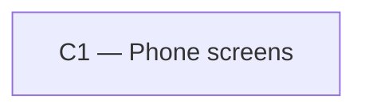

# As Built — M10b

Baseline: 4e6039f5030b5fea0d13f1086f30c1cac2a08100
Change source: git diff 4e6039f5030b5fea0d13f1086f30c1cac2a08100 HEAD (non-harness files only)

## Diagram

## Components Observed

| Id | Name | Files | Claimed? |
| --- | --- | --- | --- |
| C1 | Phone screens | mobile/src/ui/markdown.ts, mobile/src/ui/MarkdownText.tsx, mobile/src/app/chat.tsx, mobile/src/ui/markdown.test.ts, mobile/src/ui/markdownText.test.ts | Yes |

## Edges Observed

None. Markdown parsing and rendering are internal to C1.

## Unmapped Files

| File | Why it could not be attributed |
| --- | --- |
| mobile/scripts/markdown-render-proof.sh | Test harness/proof script (infrastructure) |
| mobile/scripts/markdown-render-proof.ts | Test harness/proof script (infrastructure) |

## Claim vs Observation

No mismatch. Claimed component C1 is the only component observed in the diff, and all changes are within its responsibility (Phone screens UI, specifically markdown rendering for assistant replies).
