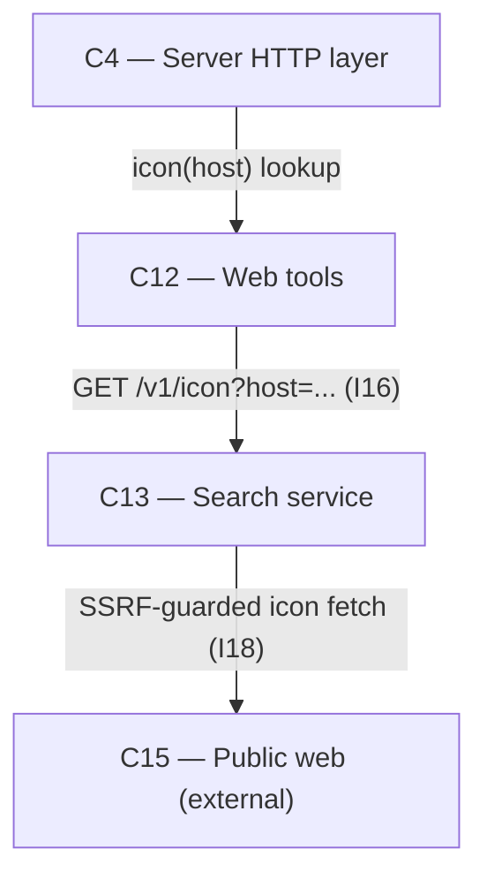

# As Built — M10c1

Baseline: b8ec398b0bdaa3dff72bef6a6ba85d939b320e4d
Change source: git diff b8ec398b0bdaa3dff72bef6a6ba85d939b320e4d HEAD (excluding .harness/ and uncommitted work)

## Diagram

## Components Observed

| Id | Name | Files | Claimed? |
| --- | --- | --- | --- |
| C4 | Server HTTP layer | server/src/http/server.ts, server/src/http/server.test.ts, server/src/index.ts | Yes |
| C12 | Web tools | server/src/web/tools.ts, server/src/web/tools.test.ts | Yes |
| C13 | Search service | search/API.md, search/src/fetch/fetchPage.ts, search/src/http/server.ts, search/src/http/server.test.ts, search/src/icon/icon.ts, search/src/icon/icon.test.ts, search/src/icon/cache.ts, search/src/index.ts | Yes |

## Edges Observed

| From | To | What crosses | Evidence |
| --- | --- | --- | --- |
| C4 | C12 | icon(host, signal) function call | server/src/http/server.ts line 419: `result = icon ? await icon(host, req.signal)` |
| C12 | C13 | GET /v1/icon?host=... HTTP request | server/src/web/tools.ts line 194: `${baseUrl}/v1/icon?host=${encodeURIComponent(host)}` |
| C13 | C15 | SSRF-guarded HTTP fetch of website's own icon | search/src/icon/icon.ts lines 160-173: `fetchPage()` and `fetchBytes()` calls for icon lookup; reuses I18 guard from /v1/read |

## Unmapped Files

| File | Why it could not be attributed |
| --- | --- |
| server/scripts/icon-route-proof.sh | Test/proof script; not part of any component's runtime responsibility |

## Claim vs Observation

No mismatch. All three claimed components (C4, C12, C13) appear in the diff with implementation of the icon feature. The milestone adds:
- C4: GET /v1/icon route (lines 410-441 of server/src/http/server.ts) delegating to C12's icon callback
- C12: icon(host, signal) async function (lines 190-212 of server/src/web/tools.ts) calling C13
- C13: Full icon lookup implementation in new module search/src/icon/ (icon.ts, cache.ts, icon.test.ts) with validateHost, findIconHref, lookupIcon, getIcon, and disk cache; GET /v1/icon route handler (lines 60-96 of search/src/http/server.ts); API documentation in search/API.md (lines 214-276); integration via search/src/index.ts
