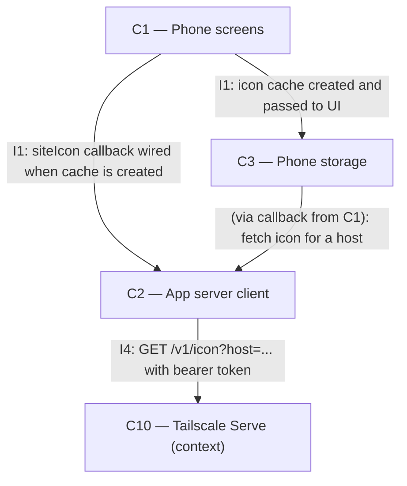

# As Built — M10c2

Baseline: 8f4428053ad71a5bd39d1641ef5c25266a9e84af
Change source: git diff 8f4428053ad71a5bd39d1641ef5c25266a9e84af HEAD

## Diagram

## Components Observed

| Id | Name | Files | Claimed? |
| --- | --- | --- | --- |
| C1 | Phone screens | mobile/src/app/chat.tsx, mobile/src/ui/MarkdownText.tsx, mobile/src/ui/SourceLogo.tsx, mobile/src/ui/inlineLink.ts, mobile/src/ui/inlineLink.test.ts, mobile/src/ui/sourceLinks.ts, mobile/src/ui/sourceLinks.test.ts, mobile/src/ui/markdownText.test.ts | Yes |
| C2 | App server client | mobile/src/api/client.ts, mobile/src/api/client.test.ts | Yes |
| C3 | Phone storage | mobile/src/store/iconCache.ts, mobile/src/store/iconCache.test.ts | Yes |

## Edges Observed

| From | To | What crosses | Evidence |
| --- | --- | --- | --- |
| C1 | C2 | siteIcon callback wired when creating icon cache | chat.tsx lines 92-99: `createIconCache(asyncStoragePort, async (host) => { ... clientRef.current.siteIcon(host) })` |
| C1 | C3 | createIconCache called and stored | chat.tsx lines 92-99, line 70 import |
| C3 | C2 | fetchIcon callback invoked to retrieve icons | iconCache.ts lines 31, 39: `const fetched = await fetchIcon(host)` |
| C2 | C10 | HTTP GET /v1/icon request | client.ts lines 415-429: `async siteIcon(host): ... this.fetchImpl(... /v1/icon?host=...)` |

## Unmapped Files

| File | Why it could not be attributed |
| --- | --- |
| mobile/scripts/source-logo-proof.sh | Test/proof harness, not production component |
| mobile/scripts/source-logo-proof.ts | Test/proof harness, not production component |

## Claim vs Observation

No mismatch.

The milestone claims C1, C2, C3. All three components are observed in the change set:
- C1 implements the phone screens that display logos next to source-matched links (SourceLogo, MarkdownText, chat.tsx)
- C2 provides the client method to fetch icons from the Mac (client.ts siteIcon method)
- C3 implements the phone-side icon cache in storage (iconCache.ts)

The responsibilities align with the architecture document:
- **C1** (FR27): "The logo...falls back to a bundled globe icon while loading, when the site has none, or when the Mac is unreachable. Icons are requested at display time, so replies saved before M10c get logos too."
- **C2** (FR27): "C2 gains `siteIcon(host) -> dataUri | null` (null on any error; never throws into the UI)."
- **C3** (FR27): "C3 caches fetched icons on the phone (data URI per normalised host, including a "none" marker) so a render does not re-ask the Mac."

All tasks map to the claimed components:
- T1 (match an answer's link to the reply's saved sources) → C1 (sourceLinks.ts, inlineLink.ts utilities used by MarkdownText)
- T2 (phone asks the Mac for a site's logo and caches it) → C2 (client.siteIcon) + C3 (createIconCache)
- T3 (a source-matched link in an answer shows the site's logo) → C1 (SourceLogo component, MarkdownText integration)
- T4 (live proof) → proof script that exercises C1, C2, C3 edge-to-edge
