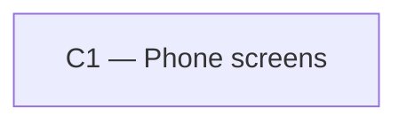

# As Built — M10c3

Baseline: d4a4e67e5da0803bfb3874ded201202ba7c2dd04
Change source: git diff d4a4e67e5da0803bfb3874ded201202ba7c2dd04 HEAD

## Diagram

## Components Observed

| Id | Name | Files | Claimed? |
| --- | --- | --- | --- |
| C1 | Phone screens | mobile/src/ui/markdown.ts, mobile/src/ui/markdown.test.ts, mobile/src/ui/tableLayout.ts, mobile/src/ui/tableLayout.test.ts, mobile/src/ui/MarkdownText.tsx, mobile/src/ui/markdownText.test.ts | Yes |

## Edges Observed

| From | To | What crosses | Evidence |
| --- | --- | --- | --- |
| (none — all within C1) | | | |

## Unmapped Files

| File | Why it could not be attributed |
| --- | --- |

## Claim vs Observation

No mismatch.

### Detailed Changes

**C1 — Phone screens** (location: `mobile/src/ui/`)

All changes are internal to C1's markdown parser and renderer (FR26, FR29):

- **mobile/src/ui/markdown.ts** (modified): Enhanced table row parsing to ensure every body row has exactly the header's cell count. Missing cells are padded with empty content; surplus cells are joined into the last column with " | " separator. Streaming table parsing preserves header width throughout. Changes to `fitRow()` function and table parsing in `scanBlocks()`.

- **mobile/src/ui/tableLayout.ts** (new): Pure layout decision module for markdown tables. Exports:
  - `tableLayout(rows)`: Converts parsed table rows into either a grid layout (≤2 columns, aligned columns with flex: 1) or card layout (≥3 columns, heading/value pairs per row).
  - `gridWidth(windowWidth)`: Calculates the definite width of the 2-column grid based on window dimensions, accounting for screen padding (16), bubble max-width (85%), and bubble padding (12). Returns a whole number ≥0.
  - Imports: `Inline` type from markdown.ts (internal dependency within C1).

- **mobile/src/ui/MarkdownText.tsx** (modified): Integration of table rendering via `tableLayout()`. Reads window width using `useWindowDimensions()` and passes computed grid width to `renderBlock()`. Renders grid layouts as aligned columns in a `View` container with fixed width; renders card layouts as bordered cards with heading/value pairs. All table cell content flows through `renderInline()` for consistent markup (bold, italic, code, links).

- **mobile/src/ui/markdown.test.ts** (modified): Comprehensive tests for FR29 table parsing:
  - Tables with ≤2 columns align under headings.
  - Tables with ≥3 columns align under headings when well-formed.
  - Short rows padded to header width (no text loss).
  - Surplus rows joined into last column (no text loss).
  - Streaming tables maintain header width as they grow.
  - Full prefix parsing: every partial render has consistent row width.

- **mobile/src/ui/tableLayout.test.ts** (new): Tests for `tableLayout()` and `gridWidth()`:
  - 2-column tables render as grids; 3+ columns render as cards.
  - Row normalization (padding/joining) preserves inline content structure.
  - Edge cases: header-only, short rows, surplus cells.
  - `gridWidth()` correctly derives the width from window size and constants.

- **mobile/src/ui/markdownText.test.ts** (modified): Tests for FR29 table rendering in MarkdownText:
  - `tableLayout()` is imported and called once per block.
  - Both grid and card paths render inline content consistently.
  - Single MarkdownText instance in chat.tsx renders all assistant replies (streamed and saved).
  - No other source in the app renders tables or calls `parseMarkdown`/`tableLayout`.
  - Grid container gets a definite width from `gridWidth()`, bounded by maxWidth 100%.
  - Grid cells use flex: 1 for aligned columns; wrapping is allowed (no horizontal scroll).

### No Cross-Component Edges

All parsing, layout, and rendering stays within C1's `mobile/src/ui/` module. No calls to C2 (app server client), C3 (phone storage), or any server components. The markdown tree produced by C1 remains internal to C1; C3 stores conversation text (including table markdown) but does not parse or render it.
