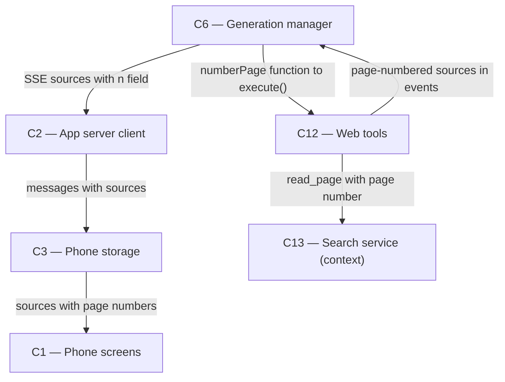

# As Built — M10c4

Baseline: f3576993fee872e8fe4bfffdc2b075eecb44596d
Change source: git diff f3576993fee872e8fe4bfffdc2b075eecb44596d HEAD

## Diagram

## Components Observed

| Id | Name | Files | Claimed? |
| --- | --- | --- | --- |
| C1 | Phone screens | mobile/src/ui/MarkdownText.tsx, inlineLink.test.ts, inlineLink.ts, markdown.test.ts, markdown.ts, markdownText.test.ts, sourceLinks.test.ts, sourceLinks.ts, streamReducer.test.ts | Yes |
| C2 | App server client | mobile/src/api/client.test.ts, client.ts | Yes |
| C3 | Phone storage | mobile/src/store/conversationStore.test.ts | Yes |
| C6 | Generation manager | server/src/generations/manager.test.ts, manager.ts | Yes |
| C12 | Web tools | server/src/web/pageNumbers.test.ts, pageNumbers.ts, tools.test.ts, tools.ts | Yes |

## Edges Observed

| From | To | What crosses | Evidence |
| --- | --- | --- | --- |
| C6 | C12 | pageNumberer function passed to webTools.execute(toolCall, signal, numberPage) | server/src/generations/manager.ts:19 imports createPageNumberer; line 150 creates instance; line 205 passes to execute() |
| C12 | C6 | source events with optional page number (n field) | server/src/web/tools.ts:174-175 emits source event with n if numberPage provided |
| C6 | C2 | SSE sources event with items[].n field | server/src/generations/manager.ts:273-274 appends SourcesEvent to log for replay |
| C2 | C3 | messages with sources including optional n field | mobile/src/api/client.ts:1000-1008 parses and preserves n field from SSE |
| C3 | C1 | sources array with optional n field per source | mobile/src/store/conversationStore.test.ts test confirms sources with n persist and reload |
| C1 | C1 | citation resolution via page numbers | mobile/src/ui/sourceLinks.ts:sourceByNumber() looks up source by n; inlineLink.ts:presentCitation() uses it; markdown.ts:CITE_BRACKET/CITE_LENTICULAR parse [1] and 【2】 patterns |
| C12 | C13 | page number added to read_page tool result | server/src/web/tools.ts:176 includes "Page [n] - cite this page as [n]" in toolResult |

## Unmapped Files

| File | Why it could not be attributed |
| --- | --- |
| server/scripts/source-diversity-proof.sh | Test/proof script infrastructure, not part of the system implementation |
| shared/api.ts | Shared type definitions imported by C1, C2, C3, C6 — all changes are additive (SourcesEvent items now support optional n field) |

## Claim vs Observation

No mismatch. All claimed components (C12, C6, C2, C3, C1) appear in the change set. No new components were created by this milestone; the proof script is testing infrastructure only.

Key features implemented:
- C12 now provides page numbering via createPageNumberer and passes it through the web tools chain
- C12's readPage tool now labels each read page with a number and instructs the model to cite by number
- C6 collects page-numbered sources from tool calls and sends them via SSE
- C2 preserves the optional n field from source events through SSE parsing
- C3 persists sources with their page numbers
- C1 parses numbered citations ([1], [2], 【2】 formats) and resolves them to saved sources, rendering logos
