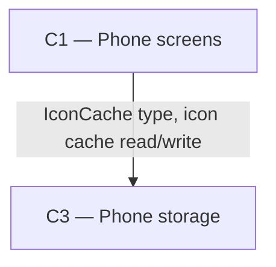

# As Built — M10d

Baseline: ba6d03256dcc55711a0f0385718fcfdc1546c8a5 (on branch m10d-sources-folded)
Change source: git diff ba6d03256dcc55711a0f0385718fcfdc1546c8a5 HEAD (branch m10d-sources-folded)

## Diagram

## Components Observed

| Id | Name | Files | Claimed? |
| --- | --- | --- | --- |
| C1 | Phone screens | mobile/src/ui/SourceList.tsx, mobile/src/ui/sourceListModel.ts, mobile/src/ui/sourceListModel.test.ts, mobile/src/app/chat.tsx (modified), mobile/src/ui/markdownText.test.ts (modified) | Yes |
| C3 | Phone storage | (no changes; type reference only) | No |

## Edges Observed

| From | To | What crosses | Evidence |
| --- | --- | --- | --- |
| C1 | C3 | IconCache type | mobile/src/ui/SourceList.tsx imports `type { IconCache } from "@/store/iconCache"` and receives `iconCache: IconCache` prop; passes it to SourceLogo component for fetching and displaying site icons |

## Unmapped Files

| File | Why it could not be attributed |
| --- | --- |
| mobile/scripts/sources-list-proof.sh | Test/proof script harness; not part of shipped application. Wrapper for sources-list-proof.ts executed via bun with configuration. |
| mobile/scripts/sources-list-proof.ts | Test/proof script that imports C1, C2, C3 modules directly for integration testing and live validation of sources list behavior. Not part of shipped application; tests existing client APIs. |

## Claim vs Observation

No mismatch. Claimed component C1 is observed in the diff. No additional components observed. C3 appears only as a type reference (IconCache), not as a changed component, which is correct as C3 storage itself was not modified by this milestone.
