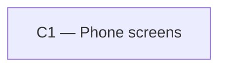

# As Built — M10e

Baseline: 1b139be3d6add2607288a2811c3cc3db2c3b2739
Change source: git diff 1b139be3d6add2607288a2811c3cc3db2c3b2739 11501e9

## Diagram

## Components Observed

| Id | Name | Files | Claimed? |
| --- | --- | --- | --- |
| C1 | Phone screens | mobile/package.json, mobile/bun.lock, mobile/src/app/chat.tsx, mobile/src/ui/answerLayout.test.ts | Yes |

## Edges Observed

| From | To | What crosses | Evidence |
| --- | --- | --- | --- |
| (none) | | | |

## Unmapped Files

| File | Why it could not be attributed |
| --- | --- |
| (none) | |

## Claim vs Observation

No mismatch. C1 (Phone screens) is claimed and observed. Changes include: adding the `yoga-layout` test dependency, creating a computed-layout test (`answerLayout.test.ts`) to validate FR32 (answer bubbles fit at full width), and modifying `chat.tsx` to apply a definite `width: "85%"` style to the `assistantMessage` component so the bubble does not shrink-wrap its content. All changes are internal to the phone UI and contain no cross-component edges.
