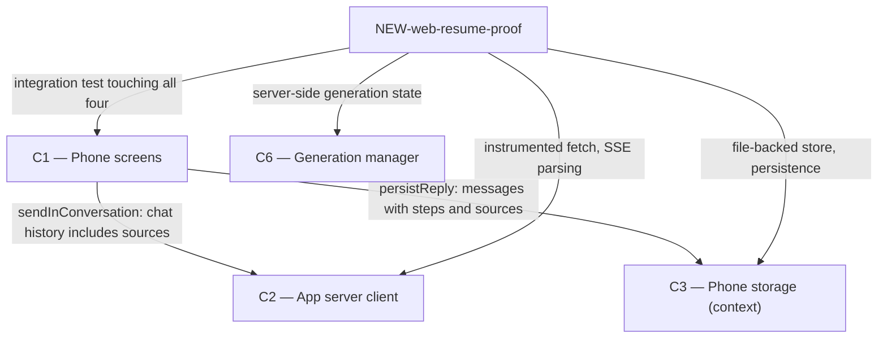

# As Built — M11

Baseline: 9d8270f6cd0e5f21f6d121fa10065f3aa51bbffb
Change source: git diff 9d8270f6cd0e5f21f6d121fa10065f3aa51bbffb HEAD

## Diagram

## Components Observed

| Id | Name | Files | Claimed? |
| --- | --- | --- | --- |
| C1 | Phone screens | mobile/src/chat/conversationSession.ts, mobile/src/chat/conversationSession.test.ts | Yes |
| C2 | App server client | mobile/src/api/client.test.ts | Yes |
| C3 | Phone storage | (used by C1, not directly modified) | Yes |
| C6 | Generation manager | server/src/http/webReplyInProgress.test.ts | Yes |
| NEW-web-resume-proof | Integration test for web reply drop/resume | mobile/scripts/web-resume-proof.ts, mobile/scripts/web-resume-proof.sh | No |

## Edges Observed

| From | To | What crosses | Evidence |
| --- | --- | --- | --- |
| C1 | C2 | Chat request with history reconstructed from stored messages including sources | mobile/src/chat/conversationSession.ts: `historyContent(message)` formats assistant messages with source URLs for follow-ups; `sendInConversation` calls `sendMessage(client, history, ...)` where history is constructed with `historyContent` |
| C1 | C3 | Messages persisted with steps and sources fields | mobile/src/chat/conversationSession.ts lines 158-159: `persistReply` appends message to store with `...(accumulator.steps.length > 0 ? { steps: accumulator.steps } : {})` and `...(accumulator.sources.length > 0 ? { sources: accumulator.sources } : {})` |
| NEW-web-resume-proof | C1, C2, C3, C6 | Integration test that exercises all four components end-to-end | mobile/scripts/web-resume-proof.ts: imports and uses APIClient (C2), sendInConversation (C1), conversationStore (C3), and makes network calls to server with GenerationManager (C6) |

## Unmapped Files

| File | Why it could not be attributed |
| --- | --- |
| mobile/scripts/web-resume-proof.sh | Shell script wrapper; contains no logic beyond invoking the TypeScript script. Grouped with web-resume-proof.ts as same component. |

## Claim vs Observation

No mismatch. All four claimed components (C1, C2, C3, C6) are present in the change set:
- **C1**: conversationSession.ts and test.ts show new `historyContent()` function that reconstructs history with sources for follow-ups (FR23)
- **C2**: client.test.ts modified with new test cases for step/sources event handling and drop/resume with web replies
- **C3**: Not directly modified but now used by C1 to persist messages containing steps and sources
- **C6**: webReplyInProgress.test.ts new file tests that generation manager correctly reports generation_in_flight while web reply is searching, and that event log replay works exactly

One additional component observed: NEW-web-resume-proof integration test script that validates M11 acceptance criteria (AC1–AC3) across the entire system.
