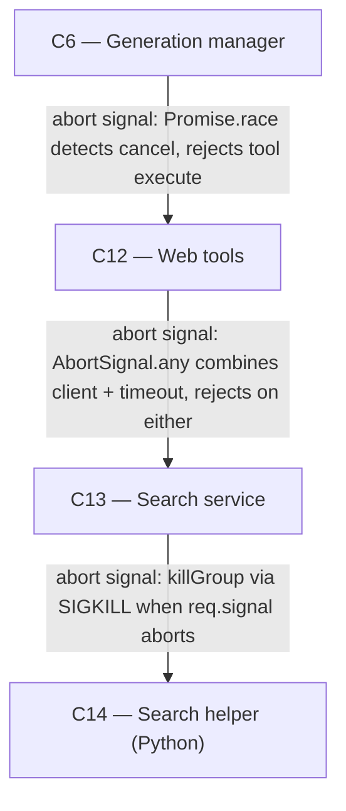

# As Built — M12

Baseline: d8db7d58c91f580d09137d0a02ccdb7b4a71f05d
Change source: git diff d8db7d58c91f580d09137d0a02ccdb7b4a71f05d HEAD (test and proof files only; abort signal implementation pre-existed)

## Diagram

## Components Observed

| Id | Name | Files | Claimed? |
| --- | --- | --- | --- |
| C6 | Generation manager | server/src/http/webStop.test.ts | Yes |
| C12 | Web tools | server/src/http/webStop.test.ts | Yes |
| C13 | Search service | search/src/http/stop.test.ts | Yes |
| C14 | Search helper (Python) | search/src/http/stop.test.ts | Yes |

## Edges Observed

| From | To | What crosses | Evidence |
| --- | --- | --- | --- |
| C6 | C12 | abort signal on web tool execute | server/src/generations/manager.ts line 205: `await Promise.race([this.webTools.execute(toolCall, signal, numberPage), aborted])` |
| C12 | C13 | abort signal via AbortSignal.any | server/src/web/tools.ts line 110: `signal: AbortSignal.any([signal, timeout])` in fetch to /v1/search and /v1/read |
| C13 | C14 | abort signal to kill helper process group | search/src/search/runHelper.ts line 86: `killGroup()` called when abort detected, line 51: `process.kill(-pid, "SIGKILL")` |

## Unmapped Files

| File | Why it could not be attributed |
| --- | --- |
| server/scripts/web-stop-proof.sh | Live proof script; validates the entire flow but is not part of any component's code |

## Claim vs Observation

All four claimed components (C6, C12, C13, C14) are present in the change set and their stop/cancel behavior is tested:

- **C6**: Generation manager tests at server/src/http/webStop.test.ts demonstrate cancel during web_search and read_page tool calls abort the downstream request and end the reply as cancelled.
- **C12**: Web tools tests in the same file and tools.ts source show abort signals are passed through to the search service via AbortSignal.any combining client and timeout signals.
- **C13**: Search service tests at search/src/http/stop.test.ts show client abort (req.signal) is passed to helper execution.
- **C14**: The same tests verify that when client abort occurs, runHelper.ts kills the entire helper process group with SIGKILL (line 86, line 51).

All components were claimed and all were observed. No new components introduced. **No mismatch.**

The implementation of abort signal handling in all four components pre-dated this milestone (existed in the baseline); M12 added tests and a live proof to validate that cancelling a generation during a web tool call correctly propagates the abort signal through the chain: C6 → C12 → C13 → C14 (process kill).
