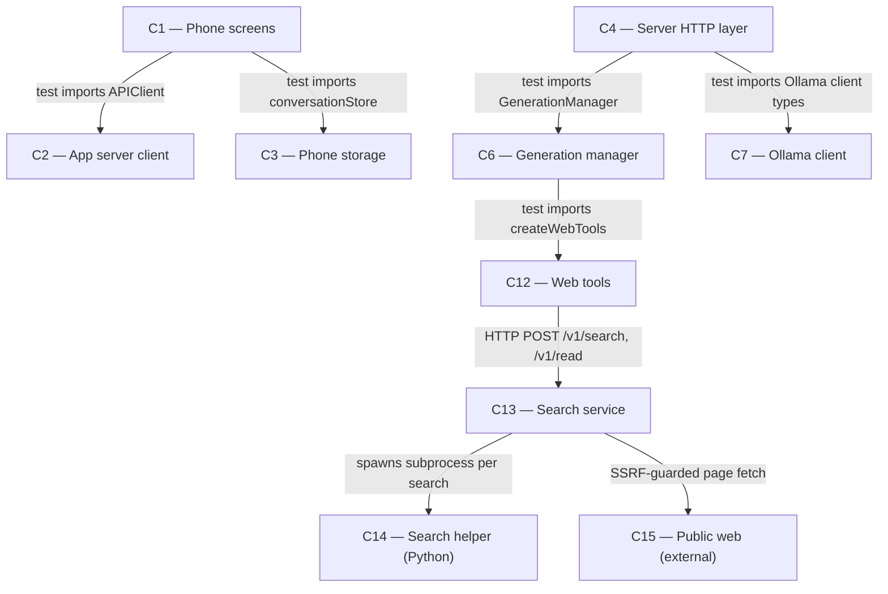

# As Built — M13

Baseline: f3e67dfa9514b9446bf29567078819e11fe462fb
Change source: git diff f3e67df HEAD (excluding .harness/)

## Diagram

## Components Observed

| Id | Name | Files | Claimed? |
| --- | --- | --- | --- |
| C1 | Phone screens | mobile/src/chat/webFailureSession.test.ts, mobile/src/ui/webFailureDisplay.test.ts | Yes |
| C4 | Server HTTP layer | server/src/http/webFailure.test.ts | No |
| C13 | Search service | search/scripts/no-hosted-api-check.sh | Yes |
| C2 | App server client | (tested by C1 files) | — |
| C3 | Phone storage | (tested by C1 files) | — |
| C6 | Generation manager | (tested by C4 file) | No |
| C7 | Ollama client | (tested by C4 file) | — |
| C12 | Web tools | (tested by C4 file) | No |
| C14 | Search helper (Python) | (validated by C13 script) | Yes |
| C15 | Public web (external) | (sampled by C13 script) | — |

## Edges Observed

| From | To | What crosses | Evidence |
| --- | --- | --- | --- |
| C1 | C2 | APIClient import, SSE parsing | webFailureSession.test.ts line 8 `import { APIClient }` |
| C1 | C3 | Conversation storage import | webFailureSession.test.ts line 11 `import { createConversationStore }` |
| C4 | C6 | GenerationManager import and instantiation | webFailure.test.ts line 4 `import { GenerationManager }` and line 174 `new GenerationManager(client, web)` |
| C4 | C7 | Ollama client types imported | webFailure.test.ts line 3 `import type { OllamaChatResponse, OllamaPsResponse }` |
| C6 | C12 | Web tools passed to GenerationManager | webFailure.test.ts line 5 `import { createWebTools }` and line 172 `createWebTools({...})` passed to manager |
| C12 | C13 | HTTP POST to search service | webFailure.test.ts line 166-171 mocked search service receives `/v1/search` and `/v1/read` requests |
| C13 | C14 | Subprocess spawning search helper | no-hosted-api-check.sh lines 189-191 descendants() function tracks helper/search.py subprocess |
| C13 | C15 | Page fetch to public web | no-hosted-api-check.sh line 259 samples search-service-tree outbound to non-loopback (public web) |

## Unmapped Files

| File | Why it could not be attributed |
| --- | --- |
| server/scripts/web-failure-proof.sh | System-level integration test spanning multiple components (C4, C6, C7, C12, C13, C14); validates end-to-end failure handling but does not implement a responsibility of any single component |

## Claim vs Observation

1. **C12 claimed but no source file observed**: C12 (Web tools) is claimed as a component touched by M13, but no files in server/src/web/ appear in the change set. C12 is tested indirectly by server/src/http/webFailure.test.ts (which imports createWebTools and tests its behaviour) but C12 itself has no changed files. C12's failure handling already existed (follow-ups confirm "No production change was needed").

2. **C14 claimed but no source file observed**: C14 (Search helper Python) is claimed but no files in search/helper/ appear in the change set. C14 is validated indirectly by search/scripts/no-hosted-api-check.sh (which samples C14 subprocess activity via lsof) but C14 itself has no changed files. C14 already existed (M7a/M7b).

3. **C4 observed but not claimed**: server/src/http/webFailure.test.ts (location server/src/http/ matching C4's responsibility) is a new test file that tests C4's HTTP layer handling of web failures alongside C6, C7, C12. C4 was not listed in the Architecture field (which claimed only C1, C12, C13, C14), yet C4 has a changed file testing its failure-handling responsibility.

4. **C6 observed but not claimed**: C6 (Generation manager) is tested by server/src/http/webFailure.test.ts and server/scripts/web-failure-proof.sh, but has no source files changed and is not claimed. C6's failure handling already existed; M13 added tests only.

5. **All edges are existing architecture**: No new edges observed. All edges trace to existing interfaces (I1-I25) in the agreed architecture.
