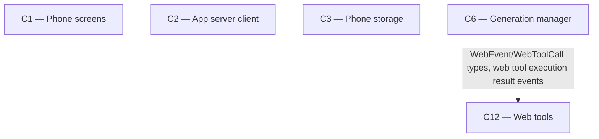

# As Built — M14

Baseline: 5786b3c727238758c073a499b678c4cb8757c095
Change source: git diff 5786b3c727238758c073a499b678c4cb8757c095 HEAD

## Diagram

## Components Observed

| Id | Name | Files | Claimed? |
| --- | --- | --- | --- |
| C1 | Phone screens | `mobile/src/ui/chatItems.ts` | Yes |
| C2 | App server client | `mobile/src/api/client.ts` | Yes |
| C3 | Phone storage | `mobile/src/store/conversationStore.ts` | Yes |
| C6 | Generation manager | `server/src/generations/manager.ts` | Yes |
| C12 | Web tools | `server/src/web/tools.ts` | No |

## Edges Observed

| From | To | What crosses | Evidence |
| --- | --- | --- | --- |
| C6 | C12 | `WebEvent`, `WebToolCall` types; calls to `webTools.tools()`, `webTools.execute()`, `webTools.systemNote()` | `server/src/generations/manager.ts` line 18: `import { createWebTools, type WebEvent, type WebToolCall } from "../web/tools"` and usage at lines 166-167, 216-219, 248-249 |

## Unmapped Files

| File | Why it could not be attributed |
| --- | --- |
| `shared/api.ts` | This file defines shared type definitions (`StepEventData`) used by multiple components (C2, C3, C6) to validate and serialize API events. It is infrastructure/type definitions rather than a component with distinct responsibility. Updates enable C2/C3/C6 to handle new step kinds (`"continue"`, `"answer_now"`). |
| `mobile/src/chat/webQuietSession.test.ts` | Test file validating the streaming path for new step kinds through `sendInConversation → store → buildChatItems`. Tests C2/C1 integration; part of C2 and C1 testing, not a separate component. |
| `server/src/http/webQuiet.test.ts` | Test file validating C6's FR33 logic (quiet round detection, prodding, answer-now round, note delivery). Part of C6 testing, not a separate component. |

## Claim vs Observation

No mismatch. The milestone claimed C1, C2, C3, C6 and all four were observed implementing their parts of FR33:
- C1: Labels for new step kinds ("Asked the model to continue", "Asked the model to answer now")
- C2: Parser accepts `"continue"` and `"answer_now"` step kinds
- C3: Storage persists new step kinds in message steps
- C6: Implements quiet round detection (blank content, no tool calls), prodding with max 2, answer-now round, and NO_ANSWER_NOTE delivery

C12 was not claimed but is observed: it defines and exports the `StepEvent` type with the new `kind` values that C6 emits. This is existing edge I15 (C6→C12 tool execution) extended with new event types.
