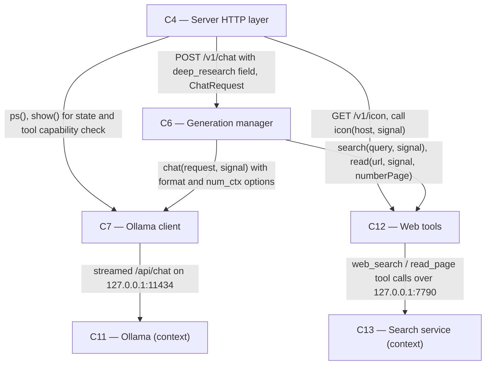

# As Built — M15

Baseline: b48673499df9aa0d846bad7bbefe1548d57cb272
Change source: git diff b48673499df9aa0d846bad7bbefe1548d57cb272 HEAD

## Diagram

## Components Observed

| Id | Name | Files | Claimed? |
| --- | --- | --- | --- |
| C4 | Server HTTP layer | server/src/http/server.ts, server/src/http/deepResearch.test.ts | Yes |
| C6 | Generation manager | server/src/generations/manager.ts, server/src/generations/research.ts, server/src/generations/research.test.ts | Yes |
| C7 | Ollama client | server/src/ollama/client.ts, server/src/ollama/client.test.ts | Yes |
| C12 | Web tools | server/src/web/tools.ts, server/src/web/tools.test.ts | Yes |

## Edges Observed

| From | To | What crosses | Evidence |
| --- | --- | --- | --- |
| C4 | C6 | POST /v1/chat request body; ChatRequest with deep_research field | server/src/http/server.ts:531–596, calls genManager.startGeneration(genId, body) where body parsed by parseChatRequest() |
| C4 | C7 | Model state queries (ps, show, tags) | server/src/http/server.ts:452–573, ollama.ps(), ollama.show(name) |
| C4 | C12 | Icon lookup function and request forwarding | server/src/http/server.ts:419–448, receives icon?: (host, signal) => Promise<IconResult>; calls icon(host, req.signal) |
| C6 | C7 | Chat requests with schema format and num_ctx options | server/src/generations/manager.ts:127–141, research.ts:271, OllamaChatRequest with format and options fields; calls client.chat(structuredClone(request), signal) |
| C6 | C12 | Search and read operations with page numbering | server/src/generations/manager.ts:153–159, research.ts:34–36, calls webTools.search(query, signal) and webTools.read(url, signal, numberPage) |

## Unmapped Files

None. All changed files outside `.harness/` are accounted for in the components above. Shared API types (shared/api.ts) defines ChatRequest, ContentEvent, DoneEvent, StepEventData, SourcesEvent interfaces used across C4, C6, C12; these are not a separate component but infrastructure.

## Claim vs Observation

No mismatch. All four claimed components (C4, C6, C7, C12) are present in the diff. C6 gains a new internal research module (research.ts) for the deep research loop (FR35–FR40), which imports types from C7 (OllamaChatRequest, OllamaShowResponse) and C12 (SearchResult, ReadPage, StepEvent, WebEvent, and the ResearchWebTools interface). C4 accepts and routes the deep_research boolean field to C6. C7 expands OllamaChatRequest to include format and num_ctx options. C12 adds step event kinds "plan" and "write" and exports types used by the research module.
