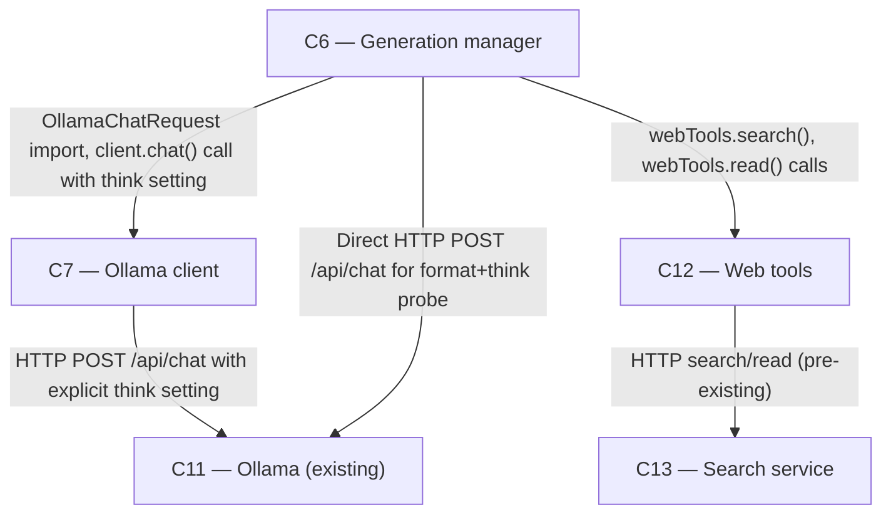

# As Built — M16

Baseline: d4037fb0e9652dc2113bf33816bf63205c893d03
Change source: git diff d4037fb0e9652dc2113bf33816bf63205c893d03 HEAD

## Diagram

## Components Observed

| Id | Name | Files | Claimed? |
| --- | --- | --- | --- |
| C6 | Generation manager | server/scripts/probe-format-think.ts, server/src/generations/research.ts, server/src/generations/research.test.ts | YES |
| C7 | Ollama client | server/src/ollama/client.ts, server/src/ollama/client.test.ts | YES |
| C11 | Ollama (existing) | (external) | YES |
| C12 | Web tools | (imported and called, not modified) | YES |
| C13 | Search service | (called indirectly via C12, not modified) | YES |

## Edges Observed

| From | To | What crosses | Evidence |
| --- | --- | --- | --- |
| C6 | C7 | OllamaChatRequest type import, OllamaChatClient method calls | server/src/generations/research.ts line 23 (`import type { OllamaChatRequest }...`), line 291 (`client.chat(...)`) |
| C6 | C12 | Type imports (ReadPage, SearchResult, StepEvent), function calls to webTools | server/src/generations/research.ts line 24 (`import type { ReadPage, SearchResult...}`), line 412 (`webTools.read()`), line 445 (`webTools.search()`) |
| C7 | C11 | HTTP POST requests to Ollama /api/chat, /api/tags, /api/ps, /api/show, /api/generate | server/src/ollama/client.ts line 156-227 (fetch to `http://127.0.0.1:11434`) |
| C6 | C11 | Direct HTTP POST requests for format+think probe (M16-AC2 testing) | server/scripts/probe-format-think.ts line 16 (OLLAMA constant), line 81 (fetch to `/api/chat`) |
| C12 | C13 | HTTP search/read requests on loopback (pre-existing edge, exercised by M16 live run) | server/src/web/tools.ts line 71 (baseUrl default `http://127.0.0.1:7790`), implicit via research.ts calling webTools |

## Unmapped Files

| File | Why it could not be attributed |
| --- | --- |

(All 5 files attributed; none unmapped)

## Claim vs Observation

No mismatch. All claimed components (C6, C7, C11, C12, C13) are observed:
- C6 (Generation manager): Modified with deep research think setting support (research.ts) and format+think probe script (new file)
- C7 (Ollama client): Modified to send explicit think setting to Ollama when provided in request
- C11 (Ollama): Tested by M16-AC2 probe (format+think compatibility) and M16-AC3 live run
- C12 (Web tools): Invoked by C6's deep research search/read functionality, not modified in this milestone
- C13 (Search service): Invoked indirectly via C12 by C6's deep research, not modified in this milestone
