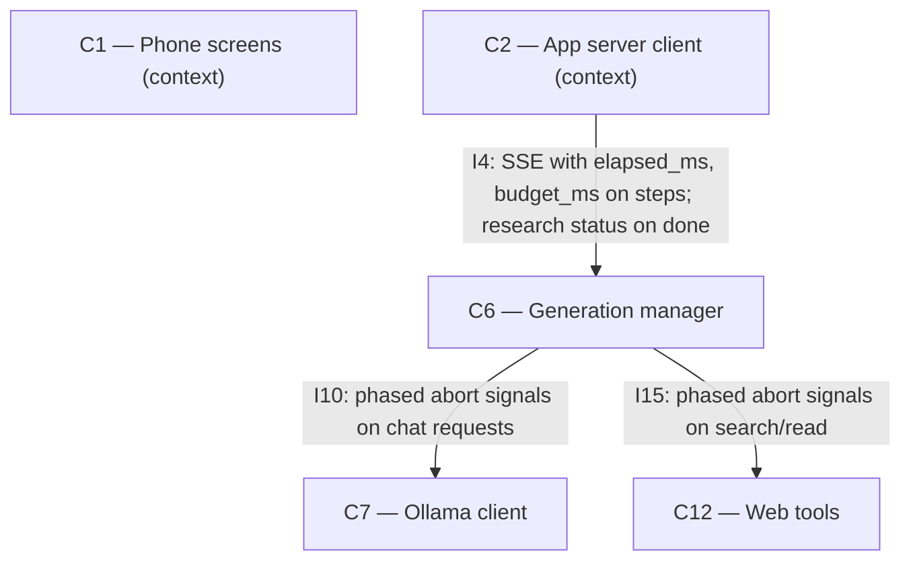

# As Built — M17

Baseline: 003da19138951edcc615474a3d57c944a320e089
Change source: git diff 003da19 HEAD

## Diagram

## Components Observed

| Id | Name | Files | Claimed? |
| --- | --- | --- | --- |
| C6 | Generation manager | server/src/index.ts, server/src/index.test.ts, server/src/generations/manager.ts, server/src/generations/research.ts, server/src/generations/research.test.ts, server/src/http/deepResearch.test.ts | Yes |
| C7 | Ollama client | (called by C6 with modified signals; no C7 code changes) | No (context only) |
| C12 | Web tools | (called by C6 with modified signals; no C12 code changes) | Yes |
| C1 | Phone screens | (receives enhanced SSE via C2; no C1 code changes) | No (context only) |
| C2 | App server client | (receives enhanced SSE; no C2 code changes in this milestone) | No (context only) |

## Edges Observed

| From | To | What crosses | Evidence |
| --- | --- | --- | --- |
| C6 | C7 | Ollama chat requests with phase-specific abort signals (research phase vs write phase) | server/src/generations/research.ts line 336: `client.chat(structuredClone(request), phaseSignal())` where `phaseSignal()` returns either `researchSignal` or `writeSignal` depending on current phase |
| C6 | C12 | Web search and read requests with phase-specific abort signals | server/src/generations/research.ts lines 464, 497: `webTools.read(candidate.url, phaseSignal(), numberPage)` and `webTools.search(query, phaseSignal())` |
| C2 | C6 | SSE events now carry `elapsed_ms` and `budget_ms` on step events, and a `research` object on done events | shared/api.ts: StepEventData gains optional `elapsed_ms` and `budget_ms`; DoneEvent gains optional `research` field with status, elapsed_ms, budget_ms |

## Unmapped Files

None. All changed files map to C6 or the shared API contract.

## Claim vs Observation

- **C6**: Claimed and observed. The generation manager and its research module (server/src/generations/research.ts) implement time budget enforcement, phase-based deadline checks, and run status tracking per D-M17-1. The server entry point parses PHONE_MODELS_RESEARCH_BUDGET_MS and passes it through to the research settings.

- **C12**: Claimed but not code-observed. No changes to C12 itself (server/src/web/tools.ts). C6's research module passes phase-specific abort signals when calling C12's search and read operations, but this is an internal C6 change in how it uses the existing I15 interface. The interface signature and C12's responsibility remain unchanged.

- **C13**: Claimed but not code-observed. The deviation D-M17-1 explicitly states "C13 is not changed by M17". No files under search/ were modified. C13 remains unchanged from M16.

- **D-M17-1**: Claimed and observed. The deviation accurately describes the implementation: FR36's budget is enforced inside C6's research module with `budgetMs` and `writeReserveFraction` settings, one cancellation signal per phase (research/write), and additive fields on SSE events (`elapsed_ms`, `budget_ms` on step; `research` status object on done). The status values (`complete`, `partial`, `failed`) flow through the SSE done event.
