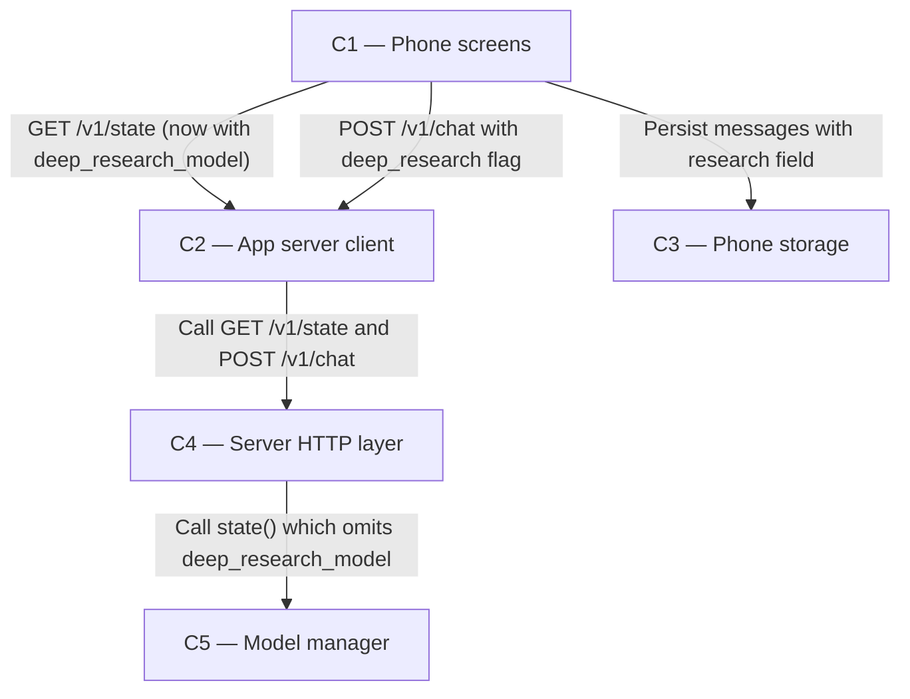

# As Built — M18

Baseline: 983623f4619963eb458f13b2fba99b3775bfd00a
Change source: git diff 983623f4619963eb458f13b2fba99b3775bfd00a 88372e1

## Diagram

## Components Observed

| Id | Name | Files | Claimed? |
| --- | --- | --- | --- |
| C1 | Phone screens | mobile/src/app/chat.tsx, mobile/src/ui/chatItems.ts, mobile/src/ui/chatItems.test.ts, mobile/src/ui/deepResearch.ts, mobile/src/ui/deepResearch.test.ts, mobile/src/ui/modelActions.test.ts, mobile/src/ui/modelList.test.ts, mobile/src/ui/streamReducer.ts, mobile/src/ui/streamReducer.test.ts | Yes |
| C2 | App server client | mobile/src/api/client.ts, mobile/src/api/client.test.ts, mobile/src/api/errorMessages.ts, mobile/src/api/errorMessages.test.ts, mobile/src/chat/chatController.ts, mobile/src/chat/chatController.test.ts, mobile/src/chat/conversationSession.ts, mobile/src/chat/conversationSession.test.ts | Yes |
| C3 | Phone storage | mobile/src/store/conversationStore.ts, mobile/src/store/conversationStore.test.ts | Yes |
| C4 | Server HTTP layer | server/src/http/server.ts, server/src/http/deepResearch.test.ts, server/src/http/deepResearchGate.test.ts, server/src/index.ts, server/src/index.test.ts | Yes |
| C5 | Model manager | server/src/models/manager.ts | Yes |

## Edges Observed

| From | To | What crosses | Evidence |
| --- | --- | --- | --- |
| C1 | C2 | Deep research button onclick calls handleSendMessage({ deepResearch: true }) which calls sendInConversation with options.deepResearch | mobile/src/app/chat.tsx lines 511-516 |
| C1 | C2 | getState() call to fetch deep_research_model from server state | mobile/src/app/chat.tsx lines 151-157, mobile/src/api/client.ts getState() |
| C1 | C3 | Message.research field persisted to store | mobile/src/chat/conversationSession.ts lines 157-167 |
| C2 | C4 | GET /v1/state request returns StateResponse with deep_research_model field | mobile/src/api/client.ts getState() sends GET request; server/src/http/server.ts line 462 returns state with deep_research_model added |
| C2 | C4 | POST /v1/chat with deep_research flag validated by server | mobile/src/chat/chatController.ts line 129 sends request with deep_research: true; server/src/http/server.ts lines 549-554 gate blocks if web off |
| C2 | C4 | POST /v1/chat with deep_research flag validated by resident model | server/src/http/server.ts lines 588-595 block if resident model is not researchModel |
| C4 | C5 | modelManager.state() called for GET /v1/state response | server/src/http/server.ts lines 461-462 |
| C1 | C1 | deepResearchAction logic imported from deepResearch.ts | mobile/src/app/chat.tsx line 91 calls deepResearchAction() |
| C1 | C1 | researchClockLabel logic imported from deepResearch.ts | mobile/src/ui/chatItems.ts line 106 calls researchClockLabel() |
| C1 | C1 | researchStatusLabel logic imported from deepResearch.ts | mobile/src/app/chat.tsx line 394 calls researchStatusLabel() |

## Unmapped Files

| File | Why it could not be attributed |
| --- | --- |
| shared/api.ts | Shared types file (imported by C1, C2, C4, C5 but not implementation of a component) |

## Claim vs Observation

No mismatch. All claimed components (C1, C2, C3, C4, C5) are present in the diff:

- **C1 (Phone screens)**: Deep research button UI, clock display during streaming, status display after completion, visibility and enabled-state logic via deepResearch.ts
- **C2 (App server client)**: Parses new deep_research_model field from GET /v1/state; sends deep_research flag on POST /v1/chat; validates and blocks requests according to server error responses
- **C3 (Phone storage)**: Persists Message.research field (status, elapsed_ms, budget_ms) to AsyncStorage; validates research data on load
- **C4 (Server HTTP layer)**: Returns deep_research_model on GET /v1/state; refuses POST /v1/chat with deep_research=true if web is off; refuses if resident model is not the configured research model
- **C5 (Model manager)**: Returns StateResponse without deep_research_model (C4 adds it); no changes to model manager's responsibilities

No new components observed. All changes implement M18 requirements within existing component boundaries.
