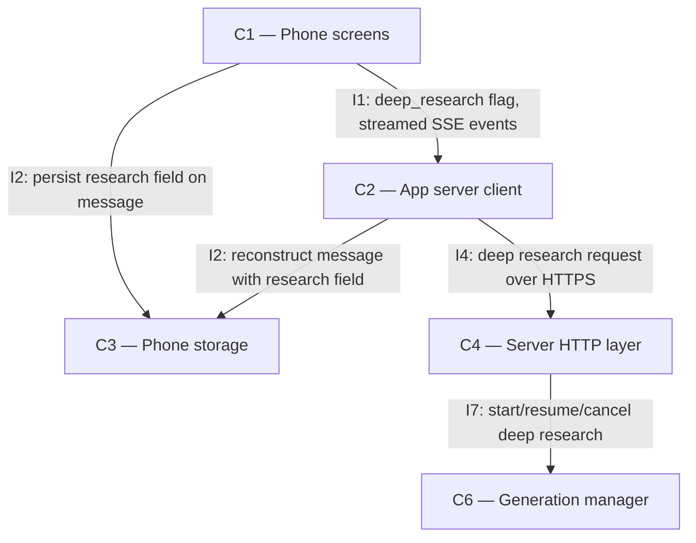

# As Built — M19

Baseline: 63d14e44a3ca8cb00411d0592d64b1804faf22e7
Change source: git diff 63d14e44a3ca8cb00411d0592d64b1804faf22e7 HEAD

## Diagram

## Components Observed

| Id | Name | Files | Claimed? |
| --- | --- | --- | --- |
| C1 | Phone screens | mobile/src/ui/chatItems.test.ts, mobile/src/chat/conversationSession.test.ts | Yes |
| C2 | App server client | mobile/src/api/client.test.ts | Yes |
| C3 | Phone storage | mobile/src/chat/conversationSession.test.ts | Yes |
| C4 | Server HTTP layer | server/src/http/deepResearchStop.test.ts, server/src/http/deepResearchResume.test.ts | Not in claim |
| C6 | Generation manager | server/src/generations/manager.ts, server/src/generations/manager.test.ts, server/src/generations/research.ts, server/src/generations/research.test.ts | Yes |

## Edges Observed

| From | To | What crosses | Evidence |
| --- | --- | --- | --- |
| C1 | C2 | `deep_research: true` in chat request, SSE events with step/elapsed_ms/budget_ms/research fields | mobile/src/api/client.test.ts: "AC3.4: a drop mid deep research resumes" test, client.chat() with deep_research flag |
| C2 | C4 | HTTP POST /v1/chat with deep_research flag; GET /v1/generations/{id}/events with Last-Event-ID header | mobile/src/api/client.test.ts: chat() POST call, events() GET call with Last-Event-ID |
| C4 | C6 | manager.subscribe(), manager.startGeneration() with deep_research flag, manager.cancelGeneration() | server/src/http/deepResearchResume.test.ts, server/src/http/deepResearchStop.test.ts: server.ts calls manager methods |
| C6 | C6 (research.ts) | runResearch() called from GenerationManager.runDeepResearch() | server/src/generations/manager.ts line 163: runResearch() import and call |
| C1 | C3 | C3 persists research field with steps, sources, status | mobile/src/chat/conversationSession.test.ts: "AC3.1: saves a deep research reply" test, store operations on message with research data |
| C2 | C3 | C2 reconstructs message from storage including research field | mobile/src/chat/conversationSession.test.ts: APIClient reads from stored conversation |

## Unmapped Files

| File | Why it could not be attributed |
| --- | --- |

## Claim vs Observation

1. Claimed C5 (Model manager) but no files in C5 were changed in this milestone. The deep research functionality implemented does not require changes to the model manager component.
