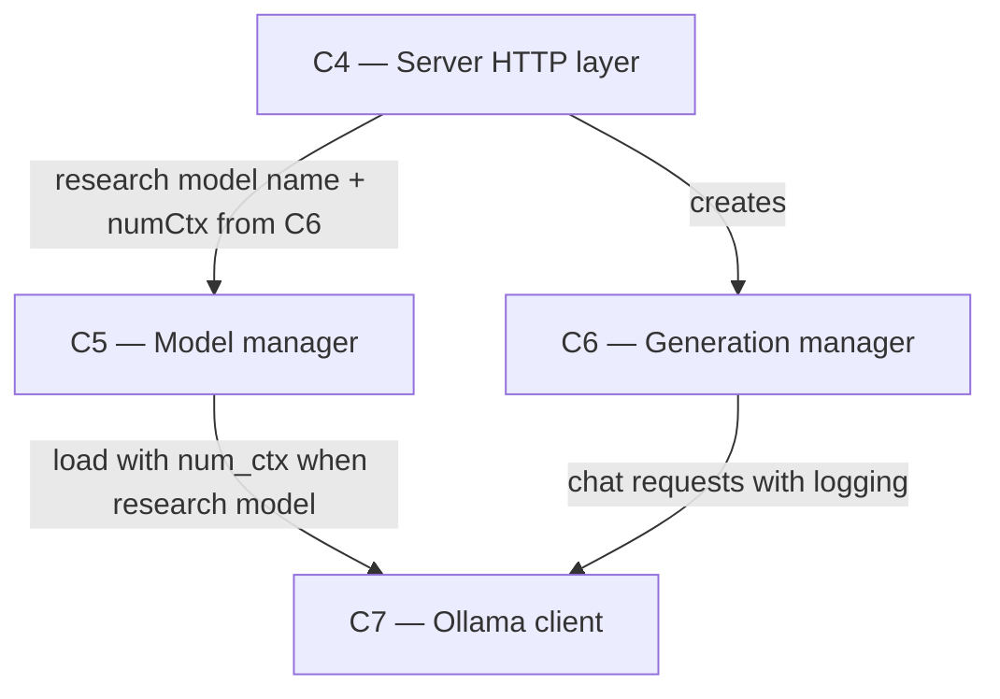

# As Built — M19b

Baseline: ba44206ef3b643d83f13119555c295b8baa6ed3a
Change source: git diff ba44206ef3b643d83f13119555c295b8baa6ed3a HEAD

## Diagram

## Components Observed

| Id | Name | Files | Claimed? |
| --- | --- | --- | --- |
| C4 | Server HTTP layer | server/src/http/server.ts, server/src/http/deepResearchModelCalls.test.ts | Yes |
| C5 | Model manager | server/src/models/manager.ts, server/src/models/manager.test.ts | Yes |
| C6 | Generation manager | server/src/generations/manager.ts, server/src/generations/research.ts, server/src/generations/research.test.ts | Yes |
| C7 | Ollama client | server/src/ollama/client.ts, server/src/ollama/client.test.ts | Yes |

## Edges Observed

| From | To | What crosses | Evidence |
| --- | --- | --- | --- |
| C4 | C5 | Research model name and numCtx configuration | server/src/http/server.ts:420 passes `{ model: researchModel, numCtx: genManager.researchNumCtx() }` to ModelManager constructor |
| C4 | C6 | Creates GenerationManager with logger | server/src/http/server.ts:419 instantiates GenerationManager, passing logModelCall function at line 142 of deepResearchModelCalls.test.ts setup |
| C5 | C7 | Load with num_ctx when loading research model | server/src/models/manager.ts:295-298 conditionally calls `this.ollama.load(name, { num_ctx: this.research.numCtx })` when name matches research model |
| C6 | C7 | Chat requests with think, num_predict, format, num_ctx settings and logging | server/src/generations/research.ts:387-403 sends structured OllamaChatRequest with schema format, think flag (true for plan/write, false for others), num_predict cap, sampling, and num_ctx; line 507-520 logs ModelCallLog to provided logger |

## Unmapped Files

| File | Why it could not be attributed |
| --- | --- |
| reports/Fast local deep research redesign.md | Uncommitted research/analysis document; not implementation code |
| research_notes/Fast local deep research redesign/ | Uncommitted directory of research notes; not implementation code |

## Claim vs Observation

No mismatch. All claimed components (C5, C6, C7) are present in the change set. C4 is touched by necessity (to wire the research configuration) but was not claimed; it appears as a context component whose server.ts file passes the research model name and numCtx from C6 to C5 during initialization.

**Additions to claimed scope:**
- C4's server.ts gains the `researchModel` parameter and passes it to ModelManager's constructor with C6's `researchNumCtx()` method result (FR41 requirement).
- Deep research model-call logging is realized across C6 (research.ts exports ModelCallLog type and logModelCall function, runResearch accepts and invokes a logger) and used in tests (deepResearchModelCalls.test.ts).

All changes fit the architecture: no new component boundaries, no technology shifts, no responsibility ownership changes to C5, C6, C7. C4's existing responsibility to route and instantiate managers is unchanged; it now simply passes one more configuration value through.
