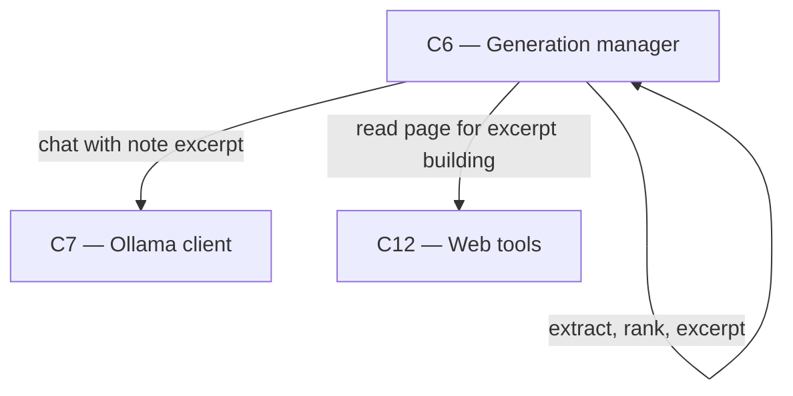

# As Built — M19c

Baseline: 5abbe7a93651ca550d160438d2e6a9291af71797
Change source: git diff 5abbe7a93651ca550d160438d2e6a9291af71797 HEAD

## Diagram

## Components Observed

| Id | Name | Files | Claimed? |
| --- | --- | --- | --- |
| C6 | Generation manager | server/src/generations/passages.ts, server/src/generations/passages.test.ts, server/src/generations/research.ts, server/src/http/deepResearch.test.ts, server/src/http/deepResearchModelCalls.test.ts, server/src/http/deepResearchPassages.test.ts, server/src/http/deepResearchResume.test.ts, server/src/http/deepResearchStop.test.ts | Yes |

## Edges Observed

| From | To | What crosses | Evidence |
| --- | --- | --- | --- |
| C6 | C6 | Page text split into passages, ranked by BM25, excerpted with title and first paragraph | server/src/generations/research.ts:31 imports `buildNoteExcerpt` from "./passages"; line 667 calls `buildNoteExcerpt({ title: page.title, text: page.text }, ...)` to build excerpt; skip if empty/blocked and log via PageSkipLog |
| C6 | C12 | Read pages for excerpt building (existing edge) | server/src/generations/research.ts:36-40 ResearchWebTools.read interface; lines 650-656 calls webTools.read() to fetch page before excerpt building |
| C6 | C7 | Chat requests with model now receive excerpt instead of full page text (existing edge modified) | server/src/generations/research.ts:674-681 modelStep sends "The excerpt above holds the page's title, first paragraph and most relevant passages" and `untrusted(built.excerpt)` instead of full page text to model |

## Unmapped Files

| File | Why it could not be attributed |
| --- | --- |
| reports/Fast local deep research redesign.md | Uncommitted research/analysis document; not implementation code |
| research_notes/Fast local deep research redesign/ | Uncommitted directory of research notes; not implementation code |

## Claim vs Observation

No mismatch. The claimed component C6 is fully realised in the change set. M19c implements note passage handling as part of C6's deep research responsibility, not as a separate component.

**Scope of change:**
- **New module `passages.ts`**: Pure passage handling — split pages on headings/paragraphs, rank by BM25, build excerpts capped at token limit, detect bot challenges and empty pages.
- **New test file `passages.test.ts`**: Comprehensive tests for passage splitting, ranking, and excerpt building.
- **Modified `research.ts`**: Research loop now calls `buildNoteExcerpt()` on each page before requesting notes; skips empty/blocked pages without model calls; logs skipped pages via new `PageSkipLog` type and `logPageSkip()` function.
- **Modified HTTP test files**: All deep research HTTP tests (`deepResearch.test.ts`, `deepResearchModelCalls.test.ts`, `deepResearchResume.test.ts`, `deepResearchStop.test.ts`) gain a `NO_SKIP` setting that disables passage selection to test their own concerns; `deepResearchPassages.test.ts` is new and tests passage selection behaviour.

All changes are internal to C6; no new component boundaries, no technology shifts, no responsibility changes to C7 or C12. The existing C6 → C12 edge (read pages) and C6 → C7 edge (send chat requests) remain; only the content sent to C7 changes from full page text to excerpted passages.
