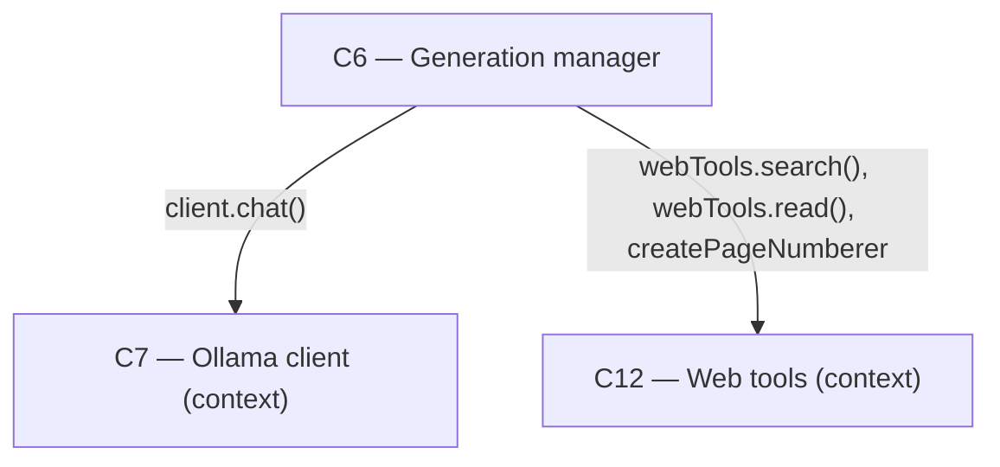

# As Built — M19d

Baseline: 4f0953ed372dad6716122c5f9491353006a57039
Change source: git diff 4f0953ed372dad6716122c5f9491353006a57039 HEAD (git-tracked files only)

## Diagram

## Components Observed

| Id | Name | Files | Claimed? |
| --- | --- | --- | --- |
| C6 | Generation manager | server/src/generations/research.ts, server/src/generations/research.test.ts, server/src/http/deepResearchBreadthFirst.test.ts, server/src/http/deepResearchModelCalls.test.ts, server/src/http/deepResearchPartialNotes.test.ts | Yes |
| C7 | Ollama client | (context; no changes) | No |
| C12 | Web tools | (context; no changes) | Yes |

## Edges Observed

| From | To | What crosses | Evidence |
| --- | --- | --- | --- |
| C6 | C7 | OllamaChatClient interface and client.chat() streaming call | research.ts line 37 import, line 556: `for await (const chunk of client.chat(...))` |
| C6 | C12 | Search and read execution; page numbering | research.ts line 38 import of ReadPage/SearchResult/WebEvent types; line 39 import of createPageNumberer/pageUrlKey; line 674: `webTools.read(...)`, line 765: `webTools.search(...)` |

## Unmapped Files

| File | Why it could not be attributed |
| --- | --- |
| reports/Fast local deep research redesign.md | Uncommitted; research notes documenting design work, not a source file constituting a component |
| research_notes/Fast local deep research redesign/ | Uncommitted; research notes documenting design work, not a source file constituting a component |

## Claim vs Observation

C6 claimed and observed (modified in this milestone).

C12 claimed but not observed in the diff: no files in server/src/web/ (C12's location) were modified. The milestone's research.ts code imports types and functions from C12 and calls them, so C12 is a boundary crossed in this milestone, but C12 itself was not changed.

C7 not claimed but observed as a boundary crossed: research.ts imports OllamaChatRequest/OllamaChatResponse types from C7 and calls client.chat() at runtime. C7 was not modified in this milestone but provides types and interfaces that C6's new code depends on.
