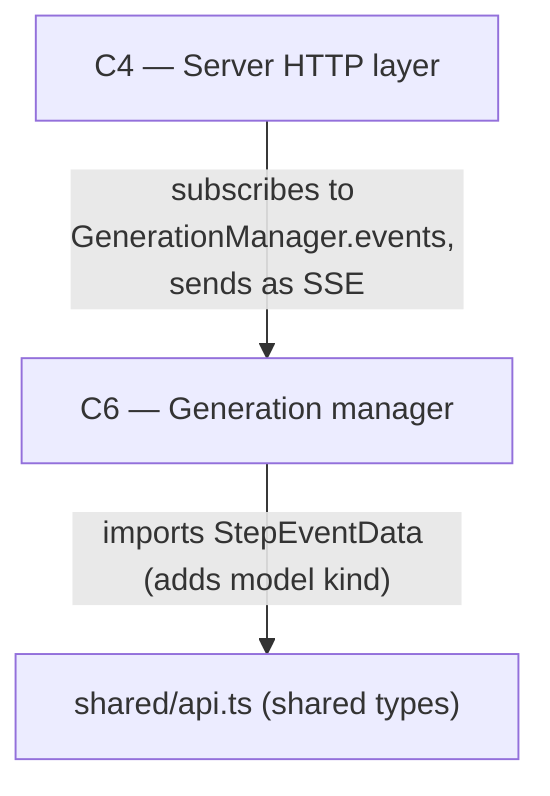

# As Built — M19e

Baseline: 755fbc5594ddbb162ebb827b22c8be7f0661f6da
Change source: git diff 755fbc5594ddbb162ebb827b22c8be7f0661f6da HEAD

## Diagram

## Components Observed

| Id | Name | Files | Claimed? |
| --- | --- | --- | --- |
| C4 | Server HTTP layer | server/src/http/server.ts, server/src/http/streamKeepAlive.test.ts | Yes |
| C6 | Generation manager | server/src/generations/research.ts, server/src/generations/research.test.ts, server/src/http/deepResearchStartedSteps.test.ts | Yes |

## Edges Observed

| From | To | What crosses | Evidence |
| --- | --- | --- | --- |
| C6 | shared/api.ts | StepEventData type with "model" kind | server/src/generations/research.ts: yields step({ kind: "model", ... }); shared/api.ts StepEventData.kind union includes "model" |
| C4 | C6 | Receives GenerationEvent stream from GenerationManager | server/src/http/server.ts:333 `sseResponse` calls `manager.subscribe(genId, fromSeq)` and encodes events from the AsyncGenerator |
| C4 (internal) | Client | SSE keep-alive comments every keepAliveMs | server/src/http/server.ts:348-353: setInterval sends ": keep-alive\n\n" at keepAliveMs intervals |

## Unmapped Files

| File | Why it could not be attributed |
| --- | --- |
| server/src/web/tools.ts | Type definition update (StepEvent.kind union) mirrors shared/api.ts; part of type contract but owned by C6's use of these types |

## Claim vs Observation

No mismatch. Both claimed components C4 and C6 appear in the change set:
- **C4**: HTTP layer gains SSE keep-alive comment mechanism (DEFAULT_KEEP_ALIVE_MS constant, keepAliveMs parameter, interval timer in sseResponse)
- **C6**: Research manager gains model step kind ("model") emission with pre-announcement pattern (modelCall async generator, step_id tracking for search/read to unify pre-announced and late steps)
- **Deviation D-M19e-1**: New step kind "model" for deep research model-call steps is realized across C6 (research.ts emits it) and shared API types (api.ts adds it to StepEventData.kind union)
