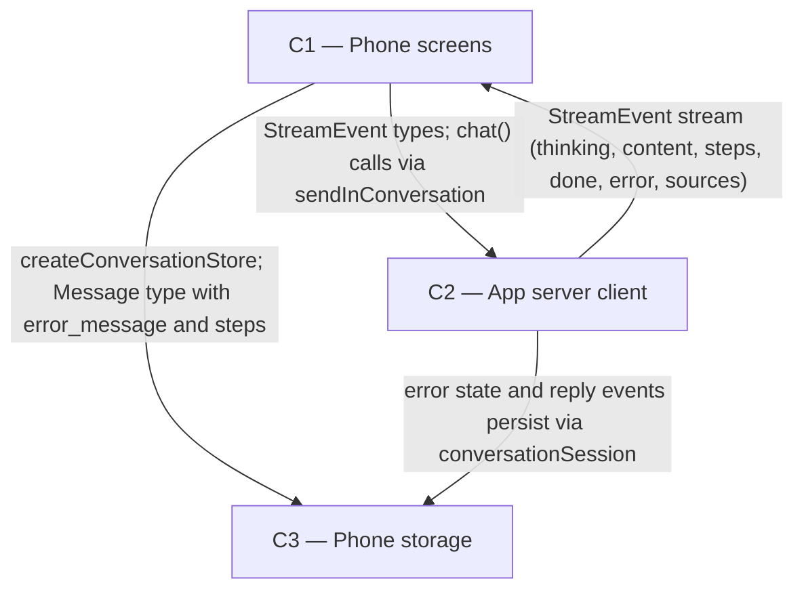

# As Built — M19f

Baseline: 6897b7a42cb49268affdce55f299ded341f09646
Change source: git diff 6897b7a42cb49268affdce55f299ded341f09646 f9877f5

## Diagram

## Components Observed

| Id | Name | Files | Claimed? |
| --- | --- | --- | --- |
| C1 | Phone screens | mobile/src/ui/deepResearch.ts, mobile/src/ui/errorReply.ts, mobile/src/ui/errorReply.test.ts, mobile/src/ui/researchClock.test.ts, mobile/src/ui/chatItems.ts, mobile/src/ui/chatItems.test.ts, mobile/src/ui/streamReducer.ts, mobile/src/ui/streamReducer.test.ts, mobile/src/app/chat.tsx, mobile/src/chat/conversationSession.ts, mobile/src/chat/conversationSession.test.ts, mobile/src/chat/errorReplySession.test.ts | yes |
| C2 | App server client | mobile/src/api/client.ts, mobile/src/api/client.test.ts, mobile/src/api/resume.ts | yes |
| C3 | Phone storage | mobile/src/store/conversationStore.ts | yes |

## Edges Observed

| From | To | What crosses | Evidence |
| --- | --- | --- | --- |
| C1 | C2 | StreamEvent types; function calls to client.chat() and stream setup | `mobile/src/ui/streamReducer.ts` imports `type StreamEvent` from `@/api/client`; `mobile/src/app/chat.tsx` calls `sendInConversation` which invokes `client.chat()`; `mobile/src/ui/errorReply.ts` imports `UnreachableError` from `@/api/client` for error classification |
| C2 | C1 | Stream of typed events: thinking, content, step, sources, done, error; step events carry elapsed_ms and budget_ms for deep research clock | `mobile/src/app/chat.tsx` receives events via `onEvent` callback and applies them with `applyStreamEvent(acc, event, Date.now())`; `mobile/src/ui/streamReducer.ts` processes step events and anchors deep research clock at each event |
| C1 | C3 | conversationStore factory, Message and Conversation types; Message gains error_message and steps fields | `mobile/src/app/chat.tsx` imports `createConversationStore`, `Conversation` type; `mobile/src/ui/chatItems.ts` imports `Message` type; `mobile/src/ui/chatItems.ts` uses `message.error_message` and `message.steps` to render error lines and steps |
| C2 | C3 | Error status, error_message, steps, research metadata persist as Message fields | `mobile/src/chat/conversationSession.ts` bridges C2 (APIClient, error handling) and C3 (store.appendMessage, store.updateMessage) to persist error state, step events, and research metadata |

## Unmapped Files

None. All 16 changed files are attributed to C1, C2, or C3.

## Claim vs Observation

No mismatch. M19f claimed C1, C2, C3. All three components are observed:

- **C1** (phone screens): extends display of streaming replies with deep research clock (`researchClock.test.ts`, `deepResearch.ts`), error line display (`errorReply.ts/test.ts`), and step-with-error rendering (`chatItems.ts/test.ts`). Tests verify these work live and when persisted. conversationSession modules test the full send-to-persist flow with error handling.

- **C2** (app server client): extends resume allowance logic to apply per outage and reset after successful resume (client.ts, client.test.ts, resume.ts). Tests verify multiple short outages resume successfully and one long outage ends the reply.

- **C3** (phone storage): Message type gains `error_message` (plain text for error replies with no answer) and stores existing `steps` field to persist deep research, ordinary web, and switch-off error steps. Stored messages reload with error line intact.

No components observed outside the claim. All changes implement FR45 (phone half) and FR40 (amended per-outage resume allowance and error line on ordinary replies).
