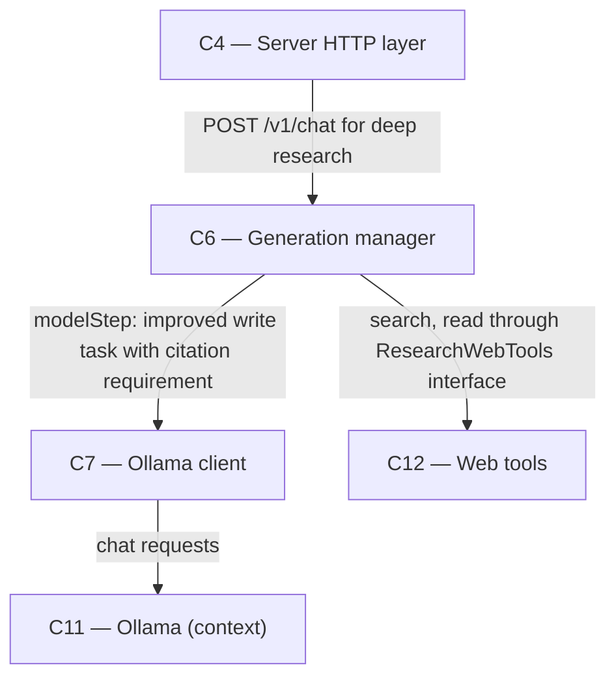

# As Built — M19g

Baseline: 8fcf6b9ebabed670d86d3a1fd14cccc230977638
Change source: git diff 8fcf6b9ebabed670d86d3a1fd14cccc230977638 HEAD (excluding .harness/)

## Diagram

## Components Observed

| Id | Name | Files | Claimed? |
| --- | --- | --- | --- |
| C4 | Server HTTP layer | server/scripts/ac29-live-run.ts, server/scripts/ac29-live-run.test.ts, server/scripts/ac29-questions.json, server/src/http/deepResearchModelCalls.test.ts | Yes |
| C6 | Generation manager | server/src/generations/research.ts | Yes |
| C7 | Ollama client | (imported by research.ts; not modified) | Yes |
| C12 | Web tools | (imported by research.ts; not modified) | Yes |
| C11 | Ollama (existing) | (context: called by C7) | Yes |

## Edges Observed

| From | To | What crosses | Evidence |
| --- | --- | --- | --- |
| ac29-live-run.ts | C4 | POST /v1/chat with deep_research flag | `server/scripts/ac29-live-run.ts`: HTTP request to server endpoint for AC29 live run testing |
| C4 | C6 | HTTP server invokes generation manager | `server/src/http/deepResearchModelCalls.test.ts`: test creates server and mocks generation manager; deepResearchModelCalls.test.ts imports createServer and GenerationManager |
| C6 | C7 | improved write task with citation requirement | `server/src/generations/research.ts` line 1077–1081: `await modelStep("write", "Write the final report... every sentence that uses a note must end with that note's page number in square brackets...")` |
| C6 | C12 | search and read execution within research loop | `server/src/generations/research.ts` imports ResearchWebTools interface; search/read calls in existing research loop (not modified but still present) |
| C7 | C11 | Ollama HTTP requests | architecture I10: C7 calls Ollama on 127.0.0.1:11434 |

## Unmapped Files

| File | Why it could not be attributed |
| --- | --- |

(All files attributed to components.)

## Claim vs Observation

Claimed C4: Observed. Modified with new test scripts (ac29-live-run.ts, ac29-live-run.test.ts) and live-run test data (ac29-questions.json), plus new deep research write-citation test (deepResearchModelCalls.test.ts M19g test).

Claimed C6: Observed. Modified research.ts with two changes: (1) added RunEndLog interface and logRunEnd() function to emit `deep_research_run_end` event before the `done` event (FR45-aligned logging), (2) improved the write task wording to require citations on every sentence using notes and provide example with a real note number (addressing M19g-T5 finding that prior task wording was insufficient for post-write-guard think:false re-issue).

Claimed C7: Observed. Not modified, but C6's modified code calls modelStep with the improved write task, which sends requests to C7. Edge exists in the changed research.ts code.

Claimed C11: Observed as context. External Ollama not modified; called by C7.

Claimed C12: Observed. Not modified, but C6's modified code uses ResearchWebTools interface to call search and read. Edge exists in the research loop.

Claimed C13: Not observed. Search service is not directly touched by this milestone. C12 calls C13, but C12 itself is not modified. C13 only appears in the architecture as a pre-existing dependency of C12, not in this milestone's change set.

No mismatch: The diff contains all of C4, C6, C7, C11, and C12 as expected. C13 is claimed but does not appear in the change set.
