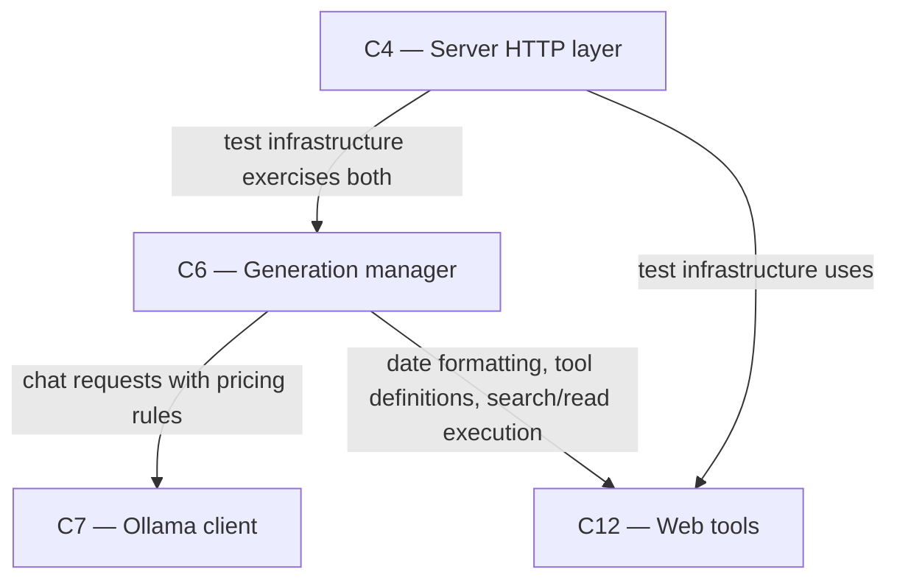

# As Built — M19i

Baseline: 602333e53e116e7829ab83fbb1acd962193c9333
Change source: git diff 602333e..HEAD, with uncommitted research notes

## Diagram

## Components Observed

| Id | Name | Files | Claimed? |
| --- | --- | --- | --- |
| C6 | Generation manager | server/src/generations/manager.ts, server/src/generations/research.ts | Yes |
| C12 | Web tools | server/src/web/tools.ts | No |
| C4 | Server HTTP layer | server/src/http/deepResearchDate.test.ts, server/src/http/deepResearchPrices.test.ts | Yes |
| C7 | Ollama client | (called, not modified) | Yes |

## Edges Observed

| From | To | What crosses | Evidence |
| --- | --- | --- | --- |
| C6 | C7 | chat requests with Ollama format and optional pricing rules in user messages | manager.ts line 265-266: `this.ollamaClient.chat(request, signal, ...)` and research.ts lines 969, 1092 incorporating PLAN_PRICES_RULE and WRITE_* rules |
| C6 | C12 | date formatting, tool definitions, search/read execution | manager.ts line 18: `import { createWebTools, ... } from "../web/tools"` and research.ts line 38: `import { todayLine, ... } from "../web/tools"` |
| C4 | C6 | HTTP layer integration tests | deepResearchDate.test.ts line 2: imports createServer; line 4: imports GenerationManager |
| C4 | C12 | test helpers use todayLine | deepResearchDate.test.ts line 6: imports todayLine |

## Unmapped Files

| File | Why it could not be attributed |
| --- | --- |
| reports/Fast local deep research redesign.md | Uncommitted research notes; not part of the implementation |
| research_notes/Fast local deep research redesign/ | Uncommitted research notes directory; not part of the implementation |

## Claim vs Observation

- **C4 claimed; C4 observed**: test infrastructure added in server/src/http/ to verify C6 and C12 behavior, not direct C4 implementation changes
- **C6 claimed; C6 observed**: primary implementation; pricing rules (PLAN_PRICES_RULE, WRITE_DATE_RULE, WRITE_SUM_RULE, WRITE_NO_PRICE_RULE) added to research.ts; injectable `now()` function added to manager.ts for date-aware testing
- **C7 claimed; C7 not directly modified**: C7's code unchanged; C7's chat() method called by C6 with pricing rules embedded in user messages
- **C12 not claimed but C12 modified**: todayLine() function added to web/tools.ts (formats "Today's date is..." for FR46a); "model" step kind added to StepEvent definition for deep research model-call steps

One mismatch: C12 (Web tools) was modified to provide FR46(a) date formatting but is not listed in the claimed components for this milestone.
