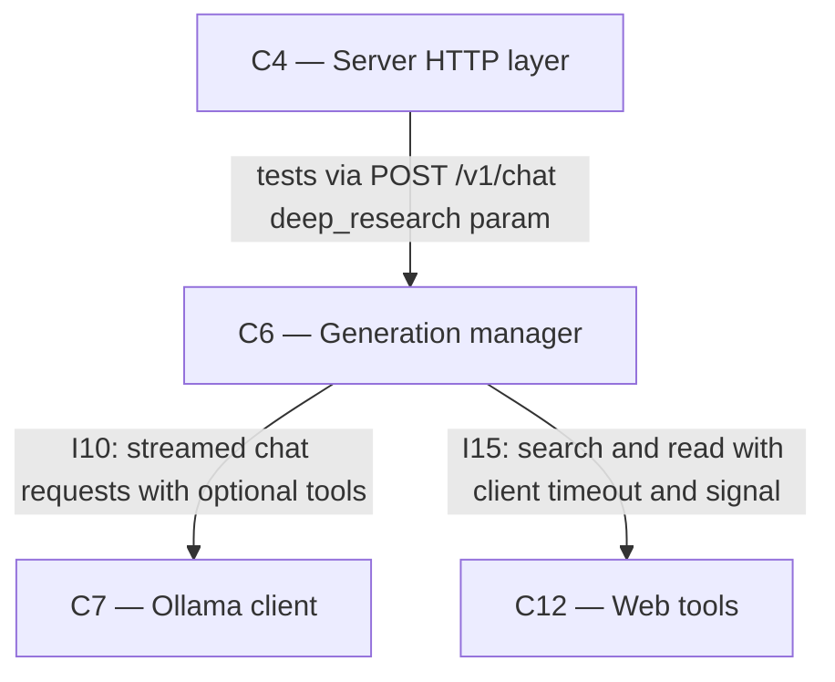

# As Built — M19j

Baseline: 6a56912889985f168d355548965a977c0ecc7a7c
Change source: git diff 6a56912..HEAD

## Diagram

## Components Observed

| Id | Name | Files | Claimed? |
| --- | --- | --- | --- |
| C4 | Server HTTP layer | server/src/http/deepResearchModelCalls.test.ts, server/src/http/deepResearchPassages.test.ts, server/src/http/deepResearchPlanCount.test.ts, server/src/http/deepResearchPrices.test.ts | Yes |
| C6 | Generation manager | server/src/generations/research.ts | Yes |
| C7 | Ollama client | (imported and called from C6, no changes) | Yes |
| C12 | Web tools | (imported and called from C6, no changes) | Yes |

## Edges Observed

| From | To | What crosses | Evidence |
| --- | --- | --- | --- |
| C6 | C7 | Streamed OllamaChatRequest with optional `tools` field and explicit `options.num_ctx` | server/src/generations/research.ts line 598: `for await (const chunk of client.chat(...))` |
| C6 | C12 | Search queries and page read requests with AbortSignal, returning results and events | server/src/generations/research.ts lines 846, 751: `webTools.search(query, phaseSignal())` and `webTools.read(url, phaseSignal(), numberPage)` |
| C4 | C6 | Deep research generation execution via POST /v1/chat with `deep_research: true` param and web search enabled | server/src/http/deepResearch*.test.ts files test the endpoint; servers created with GenerationManager and called with deep_research requests |

## Unmapped Files

| File | Why it could not be attributed |
| --- | --- |
| server/scripts/ac29-live-run.ts | Testing/verification tool (not a running system component); sends deep research questions through the HTTP API and captures SSE stream responses; parses FR41 model call logs for acceptance criterion checking |
| server/scripts/ac29-questions.json | Test question data used by ac29-live-run.ts for acceptance testing |

## Claim vs Observation

C11 claimed but not observed: C11 (Ollama) is called indirectly via C7, which is unchanged in this milestone. C11 itself remains an external process with no code changes.

C13 claimed but not observed: C13 (Search service) is called indirectly via C12, which is unchanged in this milestone. C12 imports types from web tools but C13 is not directly touched.

The claimed components C4, C6, C7, C12 are all observed. C11 and C13 are external existing components that receive requests indirectly through C7 and C12 respectively, but are not changed by this milestone.
