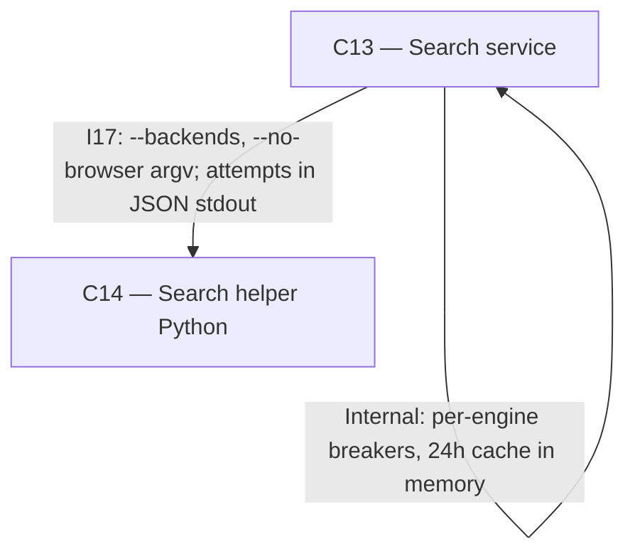

# As Built — M20

Baseline: 7adc092e938134a3455fabdf19f1f02043f381d2
Change source: git diff 7adc092e938134a3455fabdf19f1f02043f381d2 HEAD (excluding .harness/)

## Diagram

## Components Observed

| Id | Name | Files | Claimed? |
| --- | --- | --- | --- |
| C13 | Search service | search/src/cache/resultCache.ts, search/src/cache/resultCache.test.ts, search/src/search/breakers.ts, search/src/http/breakers.test.ts, search/src/http/cache.test.ts, search/src/http/server.ts, search/src/index.ts, search/src/search/runHelper.ts | Yes |
| C14 | Search helper (Python) | search/helper/search.py, search/helper/test_search.py | Yes |

## Edges Observed

| From | To | What crosses | Evidence |
| --- | --- | --- | --- |
| C13 | C14 | Helper subprocess invocation with ordered engine list and browser control; helper output parsed for attempts array | search/src/search/runHelper.ts lines 43-45 build argv with `--backends` and `--no-browser`; line 118 parses `attempts` from JSON output |
| C13 | (internal) | Per-backend circuit breaker state: rate-limited backends rest 1h, CAPTCHA backends rest 24h | search/src/search/breakers.ts: Breakers class tracks resting state by backend; search/src/http/server.ts line 76 filters available backends before calling helper |
| C13 | (internal) | 24h TTL cache keyed by normalised query + max_results for searches, final URL for page reads; cache hit/miss header on response | search/src/cache/resultCache.ts: TtlCache class with CACHE_TTL_MS = 24h; search/src/http/server.ts lines 71-89 check and populate cache with `x-cache` header |

## Unmapped Files

| File | Why it could not be attributed |
| --- | --- |
| reports/Fast local deep research redesign.md | Documentation outside the system under construction; not part of the implemented architecture |
| research_notes/Fast local deep research redesign/ (directory, 4 files) | Research notes documenting design choices; not part of the implemented architecture |

## Claim vs Observation

C12 was claimed but not observed in the diff. The Architecture document specifies C12 (Web tools) resides in `server/src/web/` and is responsible for tool definitions and execution against C13. No changes to C12 were made in this milestone; the interface I15 between C12 and C13 remains unchanged. C13 gained internal state (breakers, cache) and extended its interface with I17 to pass backend attempts back to C13's own handler, but C12's contract with C13 did not change.
