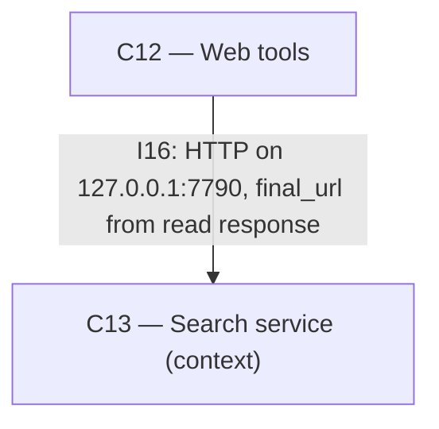

# As Built — M21

Baseline: 6d89bfe98a3e3738c194926b432f77787f808c7b
Change source: git diff 6d89bfe98a3e3738c194926b432f77787f808c7b HEAD (excluding .harness/)

## Diagram

## Components Observed

| Id | Name | Files | Claimed? |
| --- | --- | --- | --- |
| C12 | Web tools | server/src/web/tools.ts, server/src/web/tools.test.ts | Yes |

## Edges Observed

| From | To | What crosses | Evidence |
| --- | --- | --- | --- |
| C12 | C13 | HTTP GET/POST to 127.0.0.1:7790, including `final_url` from read response | server/src/web/tools.ts:77, 118, 217 (baseUrl parameter and doFetch calls); read() function calls fetch to C13's /v1/read and uses `b.final_url` from response |

## Unmapped Files

| File | Why it could not be attributed |
| --- | --- |
| reports/Fast local deep research redesign.md | Analysis and recommendations document; not system implementation code. Untracked file added to repository during milestone execution. |
| research_notes/Fast local deep research redesign/ | Supporting research notes directory; documentation of investigation and design rationale, not system components. Untracked files added during milestone execution. |

## Claim vs Observation

- C1 (Phone screens) — Claimed but not observed in diff.
- C6 (Generation manager) — Claimed but not observed in diff. (C6 is a consumer of C12; the milestone touched only C12.)
- C11 (Ollama, existing) — Claimed but not observed in diff. (No change to Ollama interaction code.)
- C12 (Web tools) — Observed and claimed. Bug fix ensures read step "done" event reports the final URL after redirects (FR31), matching the source event URL so citations resolve correctly.
- C13 (Search service, existing) — Claimed but not observed in diff. C12 continues to call C13 at 127.0.0.1:7790; C13's code itself is unchanged.
