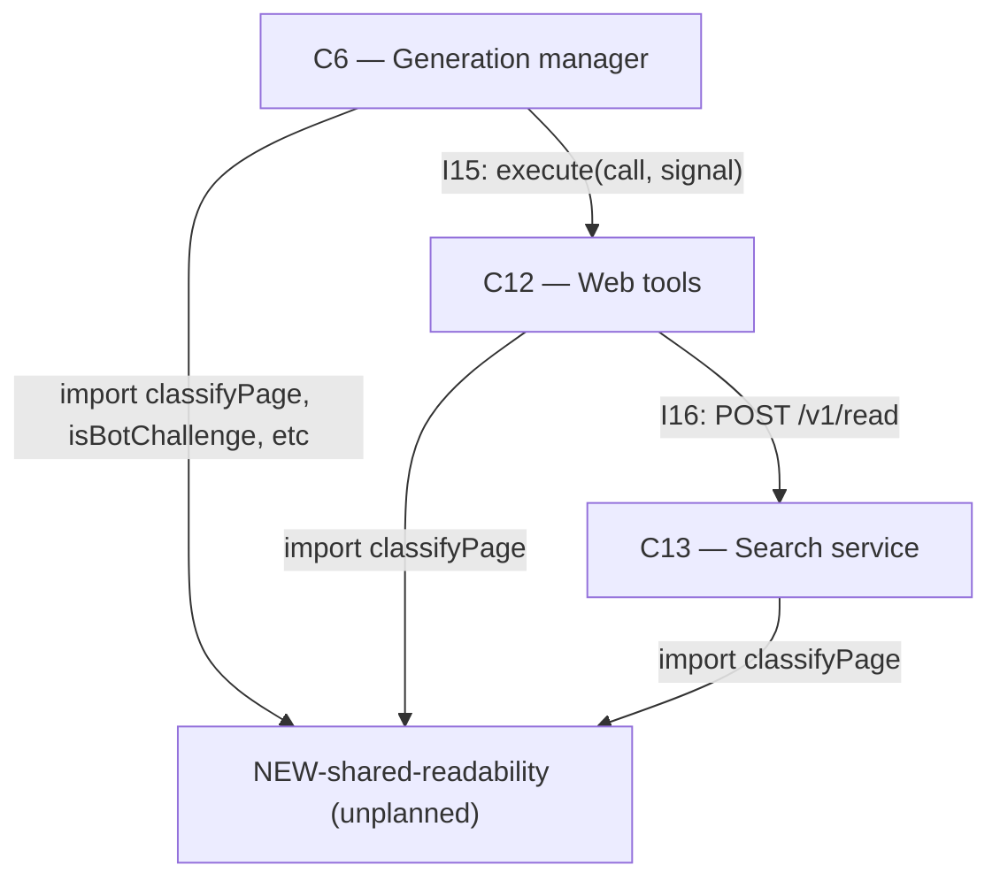

# As Built — M22

Baseline: a7e97a76e8b0e44c54e78b3289e1ae3965f4aa26
Change source: git diff a7e97a76e8b0e44c54e78b3289e1ae3965f4aa26 48fd628

## Diagram

## Components Observed

| Id | Name | Files | Claimed? |
| --- | --- | --- | --- |
| C6 | Generation manager | server/src/generations/passages.ts, server/src/generations/research.ts | Yes |
| C12 | Web tools | server/src/web/tools.ts, server/src/web/tools.test.ts, server/src/web/readability.test.ts | Yes |
| C13 | Search service | search/src/http/server.ts, search/src/http/cache.test.ts, search/src/http/unreadableCache.test.ts, search/tsconfig.json | Yes |
| C4 | Server HTTP layer | server/src/http/deepResearchPassages.test.ts, server/src/http/deepResearchUnreadable.test.ts, server/src/http/webUnreadable.test.ts | Yes |
| NEW-shared-readability | Shared page readability classification (classifyPage, isBotChallenge, bot-challenge markers, word-count threshold) | shared/readability.ts | No |

## Edges Observed

| From | To | What crosses | Evidence |
| --- | --- | --- | --- |
| C6 | NEW-shared-readability | import classifyPage, isBotChallenge, etc. | server/src/generations/passages.ts line 6: `import { classifyPage as classifyPageCore } from "@shared/readability"` |
| C6 | C12 | I15: execute(call, signal) with UnreadablePage returned | server/src/generations/research.ts lines 49, 763: `{ page: ReadPage \| null; events: WebEvent[]; unreadable?: UnreadablePage }` |
| C12 | NEW-shared-readability | import classifyPage | server/src/web/tools.ts line 8: `import { classifyPage } from "@shared/readability"` |
| C12 | C13 | I16: POST /v1/read | server/src/web/tools.ts line 187: `const o = await post("/v1/read", { url }, signal)` |
| C13 | NEW-shared-readability | import classifyPage | search/src/http/server.ts line 13: `import { classifyPage } from "@shared/readability"` |

## Unmapped Files

| File | Why it could not be attributed |
| --- | --- |

No unmapped files; all files in the change set attribute to the agreed architecture or a new shared module.

## Claim vs Observation

Claimed C4, C6, C12, C13. Observed: C4 (test files only, no implementation changes), C6, C12, C13, plus NEW-shared-readability.

The shared readability module (NEW-shared-readability) was not mentioned in the Claimed Components. This is a new shared facility (`shared/readability.ts`), extracted from implementation changes across C6, C12, and C13 to avoid duplication of the page-readability check. The architecture summary D-M22-1 acknowledges it as moving logic from `server/src/generations/passages.ts` and placing it in a shared location for import by C6, C12, and C13.

