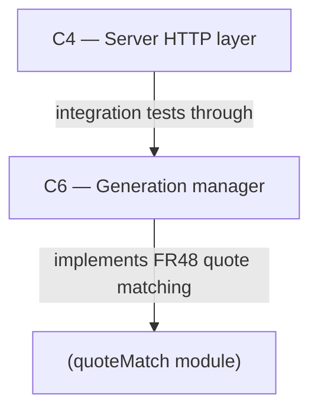

# As Built — M23

Baseline: 7a37887986ea2bd762ca5d3133466d775c4c3cb3
Change source: git diff 7a37887..7b10c89 (HEAD on m23-quote-match)

## Diagram

## Components Observed

| Id | Name | Files | Claimed? |
| --- | --- | --- | --- |
| C6 | Generation manager | `server/src/generations/quoteMatch.ts`, `server/src/generations/quoteMatch.test.ts`, `server/src/generations/research.ts` (modified), `server/src/generations/manager.ts` (modified), `server/src/generations/research.test.ts` (modified) | Yes |
| C4 | Server HTTP layer | `server/src/http/deepResearchQuotes.test.ts`, `server/src/http/deepResearchModelCalls.test.ts` (modified) | Yes |

## Edges Observed

| From | To | What crosses | Evidence |
| --- | --- | --- | --- |
| C6 (research.ts) | C6 (quoteMatch.ts) | `normaliseForQuote(quote)`, `quoteOnPage(quote, normalisedPageText)` for FR48 quote validation | Line 43: `import { normaliseForQuote, quoteOnPage } from "./quoteMatch"`, Lines 969 & 995: calls to validate notes against page text |
| C4 | C6 | Integration tests: `GenerationManager`, `ResearchSettings`, `ResearchWebTools` instantiation and HTTP layer requests to `/v1/chat` with deep research | `server/src/http/deepResearchQuotes.test.ts` lines 1-7: imports and setup of test infrastructure |

## Unmapped Files

| File | Why it could not be attributed |
| --- | --- |
| (none) | All files attributed |

## Claim vs Observation

No mismatch. Both claimed components (C4, C6) are observed in the change set:
- C6: Quote matching module (`quoteMatch.ts`/`quoteMatch.test.ts`), integrated into `research.ts` and `manager.ts`
- C4: Integration tests in HTTP test suite (`deepResearchQuotes.test.ts`)
