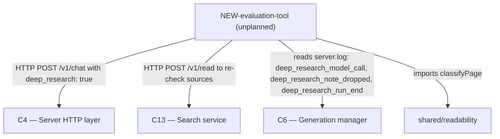

# As Built — M24

Baseline: 1bc598b1e2754d13e1e6e42b06cbbfa24f9e7ba8
Change source: git diff 1bc598b HEAD | non-git inspection (uncommitted files)

## Diagram

## Components Observed

| Id | Name | Files | Claimed? |
| --- | --- | --- | --- |
| C4 | Server HTTP layer | (no new files, used via API) | Yes |
| C6 | Generation manager | (no new files, logs read) | Yes |
| C13 | Search service | (no new files, used via API) | Yes |
| NEW-evaluation-tool | AC29 acceptance-criteria evaluation tool | server/scripts/ac29-live-run.ts, server/scripts/ac29-live-run.test.ts, server/scripts/ac29-questions.json | No |

## Edges Observed

| From | To | What crosses | Evidence |
| --- | --- | --- | --- |
| NEW-evaluation-tool | C4 | HTTP POST /v1/chat, model "qwen3.5:35b-a3b", deep_research: true, web: true | ac29-live-run.ts line 336-340 |
| NEW-evaluation-tool | C13 | HTTP POST /v1/read, url in body, expects markdown/title response | ac29-live-run.ts line 395-400 |
| NEW-evaluation-tool | C6 | Reads server.log for deep_research_model_call, deep_research_note_dropped, deep_research_run_end JSON events | ac29-live-run.ts line 364-370, selectFr41Lines, selectRunEndLine, selectNoteDroppedLines |
| NEW-evaluation-tool | shared/readability | Imports classifyPage, calls it with {title, text} to check page readability | ac29-live-run.ts line 39, line 194 |

## Unmapped Files

| File | Why it could not be attributed |
| --- | --- |
| reports/Fast local deep research redesign.md | Research report/documentation; not implementing system component responsibility |
| research_notes/Fast local deep research redesign/ | Analysis notes directory; not implementing system component responsibility |

## Claim vs Observation

1. C7 claimed but not directly touched: no imports, calls, or spawns of C7 in this milestone's files. Used transitively through C4/C6 APIs, but not directly.
2. C11 claimed but not directly touched: no imports, calls, or spawns of C11 in this milestone's files. Used transitively through Ollama client (C7), but not directly.
3. C12 claimed but not directly touched: no imports, calls, or spawns of C12 in this milestone's files. Used transitively through C4/C6 APIs, but not directly.
4. NEW-evaluation-tool observed but not claimed: ac29-live-run is a new test/evaluation harness for deep research acceptance criteria, realized in three files with unit tests.
