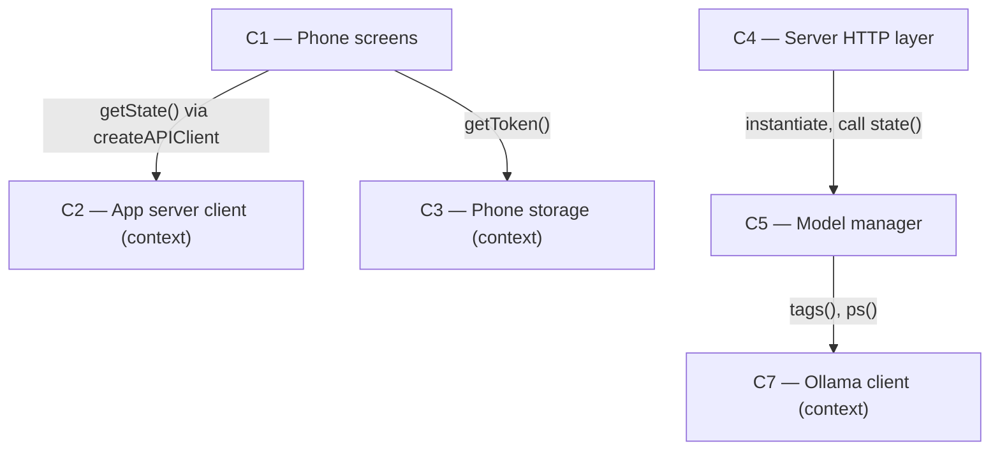

# As Built — M2a

Baseline: 2632a61df5ba160dd6850f0c31d37e412d23f504
Change source: git diff 2632a61..e826a62

## Diagram

## Components Observed

| Id | Name | Files | Claimed? |
| --- | --- | --- | --- |
| C1 | Phone screens | mobile/src/app/_layout.tsx, mobile/src/app/chat.tsx, mobile/src/app/models.tsx, mobile/src/ui/modelList.ts, mobile/src/ui/modelList.test.ts, mobile/src/app-routing/stackChildren.test.ts | Yes |
| C4 | Server HTTP layer | server/src/http/server.ts, server/src/http/server.test.ts | Yes |
| C5 | Model manager | server/src/models/manager.ts, server/src/models/manager.test.ts | Yes |
| C2 | App server client | (no changes in this milestone; imported by C1) | Claimed but not touched |
| C3 | Phone storage | (no changes in this milestone; imported by C1) | Not claimed; imported |
| C7 | Ollama client | (no changes in this milestone; imported by C5) | Claimed but not touched |

## Edges Observed

| From | To | What crosses | Evidence |
| --- | --- | --- | --- |
| C1 | C2 | getState() API call | mobile/src/app/models.tsx line 51: `const state = await clientRef.current.getState();` |
| C1 | C3 | Read token from secure storage | mobile/src/app/models.tsx line 44: `const token = await getToken();` imports from `@/api/secureStoreToken` |
| C1 | C1 | Internal component use | mobile/src/app/models.tsx line 25: `import { toModelListView, type ModelRow } from "@/ui/modelList";` |
| C4 | C5 | Instantiate and call state() | server/src/http/server.ts line 16: `import { ModelManager, OllamaDownError } from "../models/manager";` and line 312: `const modelManager = models ?? new ModelManager(ollama, genManager);` and line 314: `const state = await modelManager.state();` |
| C5 | C6 | Get active generation | server/src/models/manager.ts lines 21-24: `export interface ModelManagerGenerations { getActiveGeneration(): Generation \| null; }` and manager's constructor expects this |
| C5 | C7 | Call tags() and ps() | server/src/models/manager.ts line 7: `import type { OllamaTagsResponse, OllamaPsResponse } from "../ollama/client";` |

## Unmapped Files

| File | Why it could not be attributed |
| --- | --- |
| mobile/scripts/model-list-proof.ts | Live proof/test script; imports from components but is not itself part of any component responsibility |
| mobile/scripts/model-list-proof.sh | Shell wrapper for live proof; orchestrates testing but is not part of any component responsibility |

## Claim vs Observation

Mismatch found: C2 and C7 are claimed but have no code changes in this milestone. They are pre-existing components whose interfaces are used by C1 (C2) and C5 (C7) respectively, but no new or modified code belongs to C2 or C7 in this milestone.

Additionally, C3 (Phone storage) is imported by C1 but was not claimed in the milestone's Claimed Components list. C3 appears in this milestone's change set as an indirect dependency.

C6 (Generation manager) is also referenced by C5 but was not claimed and has no changes in this milestone.
