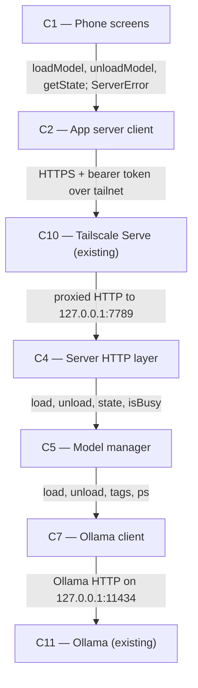

# As Built — M2b

Baseline: c9fdd5e42c23ebadf125b6d0cde83ae7d659f647
Change source: git diff c9fdd5e42c23ebadf125b6d0cde83ae7d659f647 HEAD (non-.harness files)

## Diagram

## Components Observed

| Id | Name | Files | Claimed? |
| --- | --- | --- | --- |
| C1 | Phone screens | mobile/src/app/models.tsx, mobile/src/ui/modelActions.ts, mobile/src/ui/modelActions.test.ts, mobile/src/ui/modelList.ts, mobile/src/ui/modelList.test.ts | Yes |
| C2 | App server client | mobile/src/api/client.ts, mobile/src/api/client.test.ts | Yes |
| C4 | Server HTTP layer | server/src/http/server.ts, server/src/http/server.test.ts | Yes |
| C5 | Model manager | server/src/models/manager.ts, server/src/models/manager.test.ts | Yes |
| C7 | Ollama client | server/src/ollama/client.ts, server/src/ollama/client.test.ts | Yes |

## Edges Observed

| From | To | What crosses | Evidence |
| --- | --- | --- | --- |
| C1 | C2 | Type-safe API calls for load, unload, state; error types | mobile/src/app/models.tsx: `import { ServerError, UnauthorizedError } from "@/api/client"`; calls `client.loadModel()`, `client.unloadModel()`, `client.getState()`; catches `ServerError` |
| C2 | C4 | HTTPS requests to /v1/models/load, /v1/models/unload, /v1/state with bearer token | mobile/src/api/client.ts: `POST /v1/models/load` and `/v1/models/unload` methods send requests via `fetch` to `${this.baseUrl}/v1/models/load` and `/v1/models/unload` |
| C4 | C5 | Async operation control and state queries | server/src/http/server.ts: calls `modelManager.load(parsed.name)`, `modelManager.unload()`, `modelManager.state()`, `modelManager.isBusy()` |
| C5 | C7 | Tagged generate requests for load/unload; tags and ps queries | server/src/models/manager.ts: calls `this.ollama.load(name)`, `this.ollama.unload(name)`, `this.ollama.tags()`, `this.ollama.ps()` |

## Unmapped Files

| File | Why it could not be attributed |
| --- | --- |
| mobile/scripts/model-swap-proof.sh | Shell wrapper script for live proof testing; test infrastructure, not a system component |
| mobile/scripts/model-swap-proof.ts | Live proof script that verifies swap-load, chat, idle, and unload against the real server and Ollama; imports from C1/C2 for testing; test infrastructure, not a system component |
| mobile/scripts/model-failed-load-proof.sh | Shell wrapper script for live proof testing; test infrastructure, not a system component |
| mobile/scripts/model-failed-load-proof.ts | Live proof script that verifies a failed load leaves nothing resident and shows failure reason; imports from C1/C2 for testing; test infrastructure, not a system component |

## Claim vs Observation

No mismatch.
