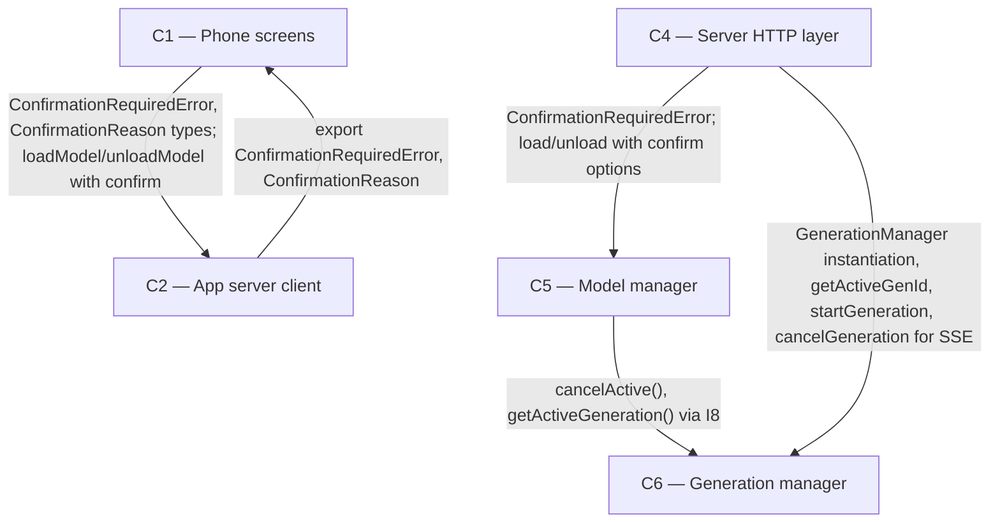

# As Built — M2c

Baseline: ef16c787b68ef54254df5557f114a6ad9abb0227
Change source: git diff ef16c787b68ef54254df5557f114a6ad9abb0227 HEAD (excluding .harness/)

## Diagram

## Components Observed

| Id | Name | Files | Claimed? |
| --- | --- | --- | --- |
| C1 | Phone screens | mobile/src/app/models.tsx, mobile/src/ui/modelActions.ts, mobile/src/ui/confirmation.ts (NEW), mobile/scripts/model-swap-proof.ts, mobile/scripts/model-failed-load-proof.ts | Yes |
| C2 | App server client | mobile/src/api/client.ts | Yes |
| C4 | Server HTTP layer | server/src/http/server.ts | Yes |
| C5 | Model manager | server/src/models/manager.ts | Yes |
| C6 | Generation manager | server/src/generations/manager.ts | Yes |

## Edges Observed

| From | To | What crosses | Evidence |
| --- | --- | --- | --- |
| C1 | C2 | ConfirmationRequiredError, ConfirmationReason types; loadModel/unloadModel API calls with confirm parameter | mobile/src/app/models.tsx line 33: existing import of ServerError, UnauthorizedError from "@/api/client"; line 173: `clientRef.current.loadModel({ name, confirm })`; line 177: `clientRef.current.unloadModel({ confirm })`. mobile/src/ui/modelActions.ts line 20-21: `import { ConfirmationRequiredError } from "@/api/client"` and `import type { ConfirmationReason } from "@/api/client"`. mobile/src/ui/confirmation.ts line 9: `import type { ConfirmationReason } from "@/api/client"` |
| C4 | C5 | ModelManager instantiation; ConfirmationRequiredError exception handling; load and unload calls with confirm options | server/src/http/server.ts lines 16-21: imports ModelManager, OllamaDownError, UnknownModelError, OperationInProgressError, ConfirmationRequiredError from "../models/manager"; line 418: `const operation = await modelManager.load(parsed.name, { confirm: parsed.confirm })`; line 449: `const operation = await modelManager.unload({ confirm: parsed.confirm })`; line 430: `if (error instanceof ConfirmationRequiredError) { return confirmationRequired(error); }` |
| C5 | C6 | cancelActive() and getActiveGeneration() calls via ModelManagerGenerations interface (I8) | server/src/models/manager.ts line 367: `this.generations.cancelActive()` in stopActiveReply method; lines 334, 360: `if (this.generations.getActiveGeneration() === null)` in checkConfirmation and stopActiveReply methods |
| C4 | C6 | GenerationManager instantiation and direct method calls for chat stream handling | server/src/http/server.ts lines 7-10: imports GenerationManager, GenerationEvent, OllamaChatClient from "../generations/manager"; line 383: `const genManager = manager ?? new GenerationManager(ollama)`; lines 488, 525, 528, 537, 545, 550, 558, 562: method calls on genManager instance (getActiveGenId, startGeneration, cancelGeneration, subscribe) |

## Unmapped Files

None. All changed files outside .harness/ are attributed to claimed components.

## Claim vs Observation

No mismatch. All claimed components (C1, C2, C4, C5, C6) are observed in the change set with implementation matching their responsibilities:

- C1: Implemented confirmation dialog, warning builder, and model action flow control for FR6 (busy-confirmation)
- C2: Implemented ConfirmationRequiredError exception class and confirm parameter propagation for FR6
- C4: Implemented parsing of confirm parameter, ConfirmationRequiredError response handling, and busy-check re-validation before chat for FR6
- C5: Implemented confirmation rule enforcement, claim tracking, and active reply cancellation for FR6
- C6: Implemented cancelActive() method to support confirmed load/unload operations (I8)
