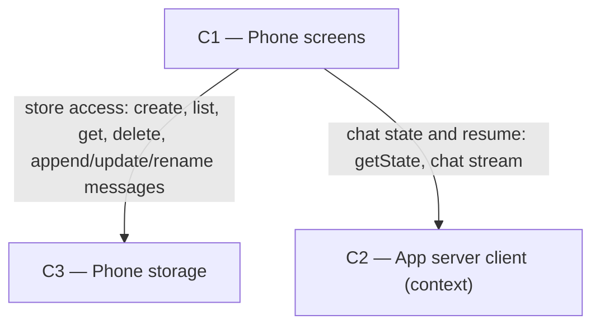

# As Built — M3

Baseline: abce8c05ff1f889081a0252f3835074fc924df1b
Change source: git diff abce8c05ff1f889081a0252f3835074fc924df1b f2042eb

## Diagram

## Components Observed

| Id | Name | Files | Claimed? |
| --- | --- | --- | --- |
| C1 | Phone screens | `mobile/src/app-routing/initialRoute.ts`, `mobile/src/app-routing/initialRoute.test.ts`, `mobile/src/app-routing/stackChildren.test.ts`, `mobile/src/app/_layout.tsx`, `mobile/src/app/chat.tsx`, `mobile/src/app/conversations.tsx`, `mobile/src/app/setup.tsx`, `mobile/src/chat/chatController.ts`, `mobile/src/chat/conversationSession.ts`, `mobile/src/chat/conversationSession.test.ts`, `mobile/src/ui/conversationList.ts`, `mobile/src/ui/conversationList.test.ts` | Yes |
| C3 | Phone storage | `mobile/src/store/storagePort.ts`, `mobile/src/store/asyncStorage.ts`, `mobile/src/store/conversationStore.ts`, `mobile/src/store/conversationStore.test.ts`, `mobile/src/store/fileStorage.ts` | Yes |

## Edges Observed

| From | To | What crosses | Evidence |
| --- | --- | --- | --- |
| C1 (chat.tsx) | C1 (chatController) | sendMessage, stopGeneration functions | `mobile/src/app/chat.tsx:34` imports `stopGeneration, UNAUTHORIZED_MESSAGE` from `@/chat/chatController` |
| C1 (chat.tsx) | C1 (conversationSession) | sendInConversation function | `mobile/src/app/chat.tsx:35` imports `sendInConversation` from `@/chat/conversationSession` |
| C1 (chat.tsx) | C3 (conversationStore) | ConversationStore type and interface | `mobile/src/app/chat.tsx:40-41` imports `createConversationStore, Conversation` from `@/store/conversationStore` |
| C1 (chat.tsx) | C3 (asyncStorage) | asyncStoragePort | `mobile/src/app/chat.tsx:42` imports `asyncStoragePort` from `@/store/asyncStorage` |
| C1 (conversationSession.ts) | C1 (chatController) | sendMessage function | `mobile/src/chat/conversationSession.ts:35` imports `sendMessage` from `./chatController` |
| C1 (conversationSession.ts) | C3 (conversationStore) | ConversationStore type | `mobile/src/chat/conversationSession.ts:39` imports `type ConversationStore, Message, MessageStatus` from `@/store/conversationStore` |
| C1 (conversations.tsx) | C1 (conversationList) | toConversationListView function | `mobile/src/app/conversations.tsx:24-26` imports `toConversationListView, ConversationRow` from `@/ui/conversationList` |
| C1 (conversations.tsx) | C3 (conversationStore) | createConversationStore function | `mobile/src/app/conversations.tsx:21` imports `createConversationStore` from `@/store/conversationStore` |
| C1 (conversations.tsx) | C3 (asyncStorage) | asyncStoragePort | `mobile/src/app/conversations.tsx:22` imports `asyncStoragePort` from `@/store/asyncStorage` |
| C1 (conversationList.ts) | C3 (conversationStore) | Conversation interface | `mobile/src/ui/conversationList.ts:9` imports `type Conversation` from `@/store/conversationStore` |
| C3 (conversationStore.ts) | C3 (storagePort) | StoragePort interface | `mobile/src/store/conversationStore.ts:30` imports `type StoragePort` from `./storagePort` |
| C3 (asyncStorage.ts) | C3 (storagePort) | StoragePort interface | `mobile/src/store/asyncStorage.ts:13` imports `type StoragePort` from `./storagePort` |
| C3 (fileStorage.ts) | C3 (storagePort) | StoragePort interface | `mobile/src/store/fileStorage.ts:9` imports `type StoragePort` from `./storagePort` |

## Unmapped Files

| File | Why it could not be attributed |
| --- | --- |
| `mobile/bun.lock` | Dependency lock file; not code implementing a component |
| `mobile/package.json` | Dependency manifest; not code implementing a component |
| `mobile/scripts/conversation-proof.sh` | Test/proof script; supports testing but not a system component |
| `mobile/scripts/conversation-proof.ts` | Test/proof script; supports testing but not a system component |
| `mobile/scripts/runtime-smoke.mjs` | Test/proof script (modified); supports testing but not a system component |
| `mobile/scripts/runtime-smoke.sh` | Test/proof script (modified); supports testing but not a system component |

## Claim vs Observation

No mismatch. Both claimed components (C1 and C3) were observed in the change set. C1 additions include new conversation-bound chat screens and conversation session logic. C3 additions include the conversation storage interface and implementations (AsyncStorage and file-based for testing).
