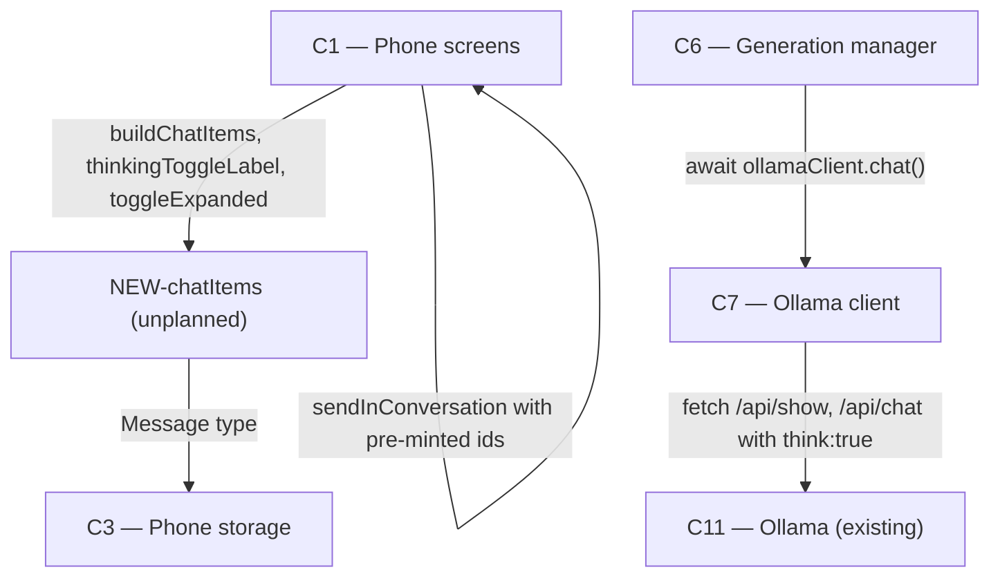

# As Built — M4a

Baseline: 7dee5da32a1f96ff040fdc1df75e45b53360d268
Change source: git diff 7dee5da32a1f96ff040fdc1df75e45b53360d268 17a7cf2

## Diagram

## Components Observed

| Id | Name | Files | Claimed? |
| --- | --- | --- | --- |
| C1 | Phone screens | mobile/src/app/chat.tsx, mobile/src/chat/conversationSession.ts, mobile/src/chat/conversationSession.test.ts | Yes |
| C3 | Phone storage | (no files changed) | Yes |
| C6 | Generation manager | server/src/generations/manager.ts, server/src/generations/manager.test.ts | Yes |
| C7 | Ollama client | server/src/ollama/client.ts, server/src/ollama/client.test.ts | Yes |
| NEW-chatItems | UI composition: merge persisted and pending messages | mobile/src/ui/chatItems.ts, mobile/src/ui/chatItems.test.ts | No |

## Edges Observed

| From | To | What crosses | Evidence |
| --- | --- | --- | --- |
| C1 | NEW-chatItems | buildChatItems, thinkingToggleLabel, toggleExpanded, PendingTurn type | mobile/src/app/chat.tsx: `import { buildChatItems, thinkingToggleLabel, toggleExpanded } from "@/ui/chatItems"; import type { PendingTurn }` lines 51-53 |
| NEW-chatItems | C3 | Message type from persisted store | mobile/src/ui/chatItems.ts: `import type { Message } from "@/store/conversationStore"` line 20 |
| NEW-chatItems | streamReducer | StreamAccumulator type | mobile/src/ui/chatItems.ts: `import type { StreamAccumulator } from "@/ui/streamReducer"` line 21 |
| C1 | C1 | sendInConversation with newMessageId, options for pre-minted ids | mobile/src/app/chat.tsx: `import { sendInConversation, newMessageId } from "@/chat/conversationSession"` and calls with userMessageId/assistantMessageId options lines 47, 125-127 |
| C6 | C7 | iterator = this.ollamaClient.chat(request, signal) | server/src/generations/manager.ts: `const chunk = next.value;` in loop from `for (;;) { const next = await Promise.race([iterator.next(), aborted])` |
| C7 | Ollama | /api/show to detect thinking support, /api/chat with conditional think:true | server/src/ollama/client.ts: `async show(name: string)` method fetching `/api/show`, and in `chat()` method `...(think ? { think: true } : {})` |

## Unmapped Files

| File | Why it could not be attributed |
| --- | --- |
| mobile/scripts/runtime-smoke.mjs | Test artifact — verifies bundled app behavior |
| mobile/scripts/runtime-smoke.sh | Test artifact — shell wrapper for runtime-smoke |
| mobile/scripts/thinking-proof.sh | Test artifact — live tailnet proof script |
| mobile/scripts/thinking-proof.ts | Test artifact — TypeScript proof of thinking streaming |

These are test/proof scripts added during the milestone to verify behavior, not part of the system's production code organization.

## Claim vs Observation

1. **Claimed C3 but C3 had no file changes.** The Message type in the store already supported thinking from an earlier milestone; the only change in conversationSession.ts is the addition of pre-minted message ID options, which is C1 functionality. No store schema or persistence logic changed in this milestone.

2. **Observed NEW-chatItems not claimed.** A new module mobile/src/ui/chatItems.ts was added to implement the view-model that merges persisted messages with pending in-flight replies, required for FR9/FR10 (showing prompt immediately and streaming reply in place). This is distinct from C1 because it is pure function-based UI logic, not the screen component itself.
