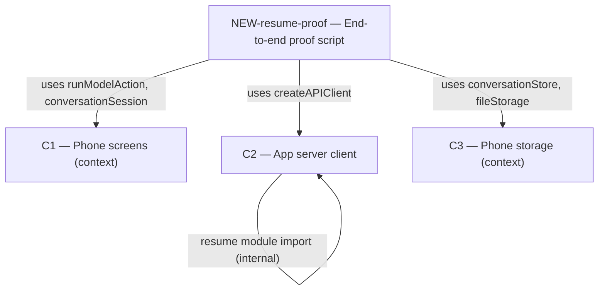

# As Built — M4b

Baseline: d46d8fd1757ca294fe9273c3aae11458c0198c07
Change source: git diff d46d8fd1757ca294fe9273c3aae11458c0198c07 HEAD

## Diagram

## Components Observed

| Id | Name | Files | Claimed? |
| --- | --- | --- | --- |
| C2 | App server client | mobile/src/api/resume.ts, mobile/src/api/resume.test.ts, mobile/src/api/client.ts, mobile/src/api/client.test.ts | ✓ Yes |
| NEW-resume-proof | End-to-end proof script | mobile/scripts/resume-proof.sh, mobile/scripts/resume-proof.ts | ✗ No |

## Edges Observed

| From | To | What crosses | Evidence |
| --- | --- | --- | --- |
| C2 | C2 | `resumeDelayMs`, `RESUME_BUDGET_MS` | `mobile/src/api/client.ts:25` imports `{ resumeDelayMs, RESUME_BUDGET_MS } from "./resume"` |
| NEW-resume-proof | C2 | `createAPIClient`, `StreamEvent`, `FetchImpl` | `mobile/scripts/resume-proof.ts:326` imports from `../src/api/client`; line 53 imports types |
| NEW-resume-proof | C1 | `runModelAction`, `sendInConversation` | `mobile/scripts/resume-proof.ts:327-328` dynamic imports from `../src/ui/modelActions` and `../src/chat/conversationSession` |
| NEW-resume-proof | C3 | `createConversationStore`, `createFileStorage` | `mobile/scripts/resume-proof.ts:329-330` dynamic imports from `../src/store/conversationStore` and `../src/store/fileStorage` |

## Unmapped Files

None.

## Claim vs Observation

**C1 (Phone screens):** Claimed but not observed in diff. The proof script imports from C1 modules (runModelAction, conversationSession), but no C1 source files were modified in this milestone. C1 functionality was not changed; the proof script only calls it.

**C6 (Generation manager):** Claimed but not observed in diff. No server-side files (location: server/src/generations/) were changed in this milestone.

**NEW-resume-proof:** Observed but not claimed. The milestone created proof/validation infrastructure (mobile/scripts/) that does not belong to any component in the agreed architecture.
