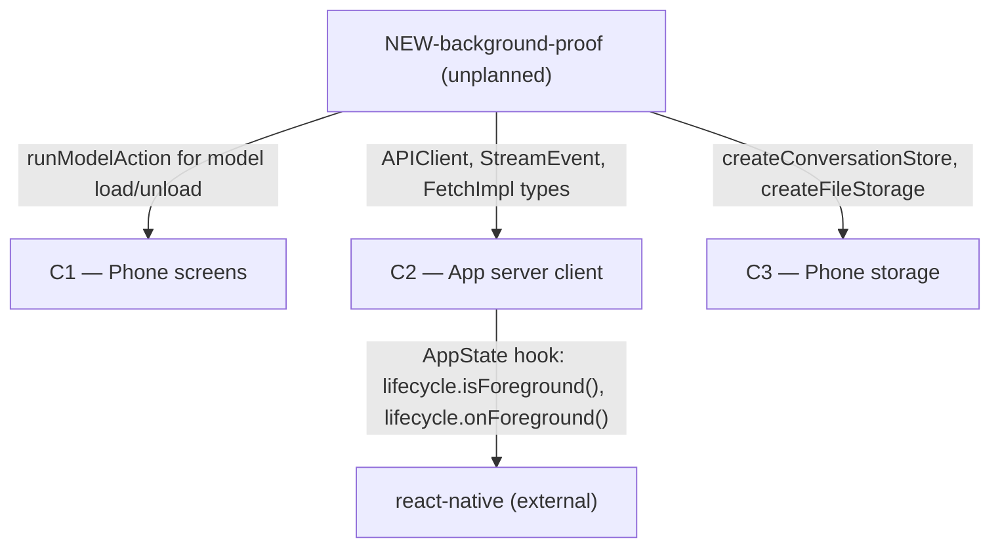

# As Built — M4c

Baseline: 1d74498fc5099d7fa3a049c39a1a036bb33d1137
Change source: git diff 1d74498fc5099d7fa3a049c39a1a036bb33d1137 HEAD

## Diagram

## Components Observed

| Id | Name | Files | Claimed? |
| --- | --- | --- | --- |
| C2 | App server client | mobile/src/api/client.ts, mobile/src/api/expoFetchClient.ts, mobile/src/api/client.test.ts | Yes |
| NEW-background-proof | Integration test script for M4-AC3 foreground resume | mobile/scripts/background-proof.sh, mobile/scripts/background-proof.ts | No |

## Edges Observed

| From | To | What crosses | Evidence |
| --- | --- | --- | --- |
| C2 | react-native (external) | AppState hook for foreground detection | mobile/src/api/expoFetchClient.ts: `import { AppState } from "react-native"` and `appStateLifecycle` implementation using `AppState.currentState` and `AppState.addEventListener` |
| NEW-background-proof | C2 | APIClient instantiation, StreamEvent and FetchImpl types, ClientLifecycle interface | mobile/scripts/background-proof.ts: line 56 `import type { StreamEvent, FetchImpl, ClientLifecycle }` and line 530 `const { APIClient } = await import("../src/api/client")` |
| NEW-background-proof | C1 | runModelAction for load/unload state tracking | mobile/scripts/background-proof.ts: line 531 `const { runModelAction } = await import("../src/ui/modelActions")` |
| NEW-background-proof | C3 | Conversation and file storage for test data persistence | mobile/scripts/background-proof.ts: lines 534-535 imports `createConversationStore` and `createFileStorage` |

## Unmapped Files

| File | Why it could not be attributed |
| --- | --- |

## Claim vs Observation

The claim stated this milestone realizes C1, C2, C3, C6. The diff shows:

1. **C2 was modified**: Files in mobile/src/api/ changed to implement foreground-aware resume (ClientLifecycle interface, AppState integration, resumeStream modifications). **Claim matched.**

2. **C1 was not modified**: No changes to mobile/app/ or mobile/src/ui/. The proof script uses runModelAction from C1, but does not modify C1. **Claim not matched: C1 claimed but not implemented.**

3. **C3 was not modified**: No changes to mobile/src/store/. The proof script uses the conversation store and file storage, but does not modify C3. **Claim not matched: C3 claimed but not implemented.**

4. **C6 was not modified**: No changes to server/src/generations/. **Claim not matched: C6 claimed but not implemented.**

5. **NEW-background-proof observed**: A new proof script component created to demonstrate M4-AC3 functionality. This was not claimed in the architecture. **Unplanned component introduced.**

The milestone appears to implement only the client-side (C2) changes needed for foreground-aware resume, without changes to the UI (C1), storage (C3), or server generation manager (C6). The test/proof infrastructure is new and unaccounted for in the claimed components.
