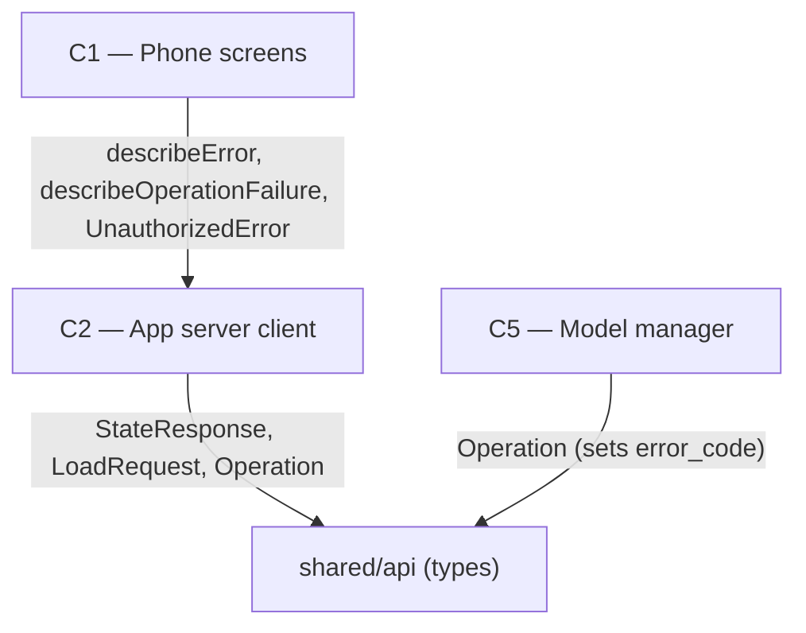

# As Built — M5b

Baseline: 69aed5333cdee09d7d1c38aa73fcfa06f2ff3c16
Change source: git diff 69aed5333cdee09d7d1c38aa73fcfa06f2ff3c16 a664ee2 (code only; .harness/ excluded)

## Diagram

## Components Observed

| Id | Name | Files | Claimed? |
| --- | --- | --- | --- |
| C1 | Phone screens | mobile/src/app/chat.tsx, mobile/src/app/models.tsx, mobile/src/ui/modelList.ts, mobile/src/ui/modelList.test.ts, mobile/src/chat/chatController.ts | Yes |
| C2 | App server client | mobile/src/api/client.ts, mobile/src/api/client.test.ts, mobile/src/api/errorMessages.ts, mobile/src/api/errorMessages.test.ts | Yes |
| C5 | Model manager | server/src/models/manager.ts, server/src/models/manager.test.ts | No |

## Edges Observed

| From | To | What crosses | Evidence |
| --- | --- | --- | --- |
| C1 | C2 | describeError function | mobile/src/app/chat.tsx:48 imports from errorMessages |
| C1 | C2 | describeError, UnauthorizedError | mobile/src/app/models.tsx:35,33 imports from errorMessages, client |
| C1 | C2 | describeOperationFailure function | mobile/src/ui/modelList.ts:9 imports from errorMessages |
| C1 | C2 | UNAUTHORIZED_MESSAGE re-export | mobile/src/chat/chatController.ts:25 imports from errorMessages |
| C2 | shared/api | StateResponse, LoadRequest, UnloadRequest, ChatRequest, OperationResponse, etc. | mobile/src/api/client.ts:13-24 imports types |
| C2 | shared/api | Operation type | mobile/src/api/errorMessages.ts:11 imports Operation |
| C5 | shared/api | Operation (error_code field) | server/src/models/manager.ts:11-16 imports Operation, sets error_code at lines 239-243, 269-273 |

## Unmapped Files

| File | Why it could not be attributed |
| --- | --- |
| mobile/scripts/error-messages-proof.sh | Proof/evidence script; no component responsibility |
| mobile/scripts/error-messages-proof.ts | Proof/evidence script testing all six failure modes; no component responsibility |

## Claim vs Observation

1. **C4 (Server HTTP layer) claimed but not observed**: No files under server/src/http/ were modified in this diff. The claimed component C4 has no observed change.
2. **C5 (Model manager) observed but not claimed**: C5's manager.ts was modified to set error_code on Operation for failed loads. Deviation D-M5b-1 explicitly documents this as C5's role, but C5 does not appear in the Claimed Components list "C1, C2, C4".
