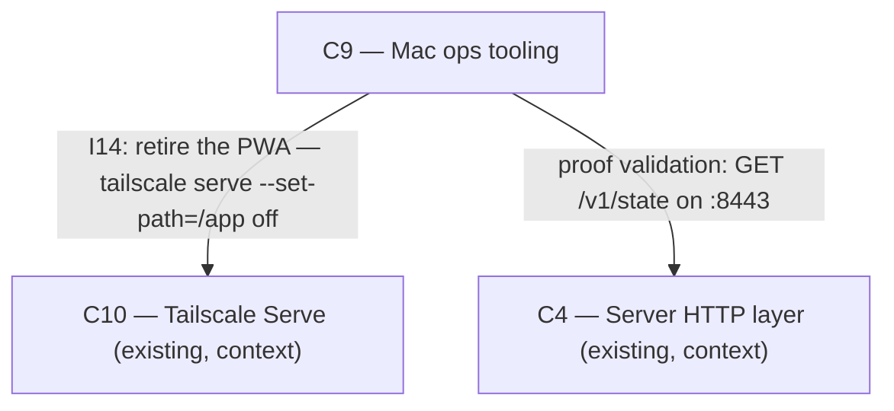

# As Built — M5c

Baseline: 52bc8248c798fe91e1029cb27b7f28e60b881fbb
Change source: git diff 52bc8248c798fe91e1029cb27b7f28e60b881fbb HEAD (excluding .harness/)

## Diagram

## Components Observed

| Id | Name | Files | Claimed? |
| --- | --- | --- | --- |
| C9 | Mac ops tooling | ops/scripts/retire-pwa.sh, ops/scripts/retire-pwa-proof.sh | Yes |

## Edges Observed

| From | To | What crosses | Evidence |
| --- | --- | --- | --- |
| C9 | C10 | I14: tailscale serve configuration change to remove /app | ops/scripts/retire-pwa.sh line 109: `"$TAILSCALE" serve --https="$HTTPS_PORT" --set-path="$SERVE_PATH" off` |
| C9 | C4 | Proof validation: HTTP GET to /v1/state endpoint | ops/scripts/retire-pwa-proof.sh line 235: `curl -s -m 10 "https://$TAILNET_NAME:8443/v1/state"` |

## Unmapped Files

None.

## Claim vs Observation

No mismatch. The milestone claimed C9 and the diff contains two new shell scripts in `ops/` that implement C9's responsibility to "retire the PWA" (FR17): `retire-pwa.sh` performs the retirement (removing the :443 /app Tailscale Serve handler and unloading the LaunchAgent), and `retire-pwa-proof.sh` validates the retirement. Both scripts are explicitly tagged as C9, FR17 in their file headers.
