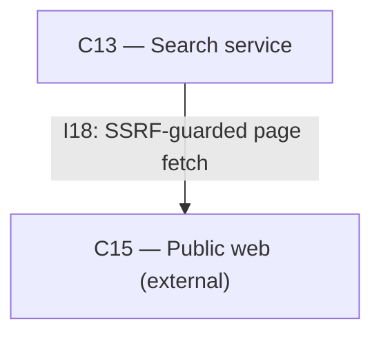

# As Built — M6

Baseline: 662d1901ad22979562feda4dc08ac68a6fdda028
Change source: git diff 662d1901ad22979562feda4dc08ac68a6fdda028 HEAD

## Diagram

## Components Observed

| Id | Name | Files | Claimed? |
| --- | --- | --- | --- |
| C13 | Search service | search/.gitignore, search/bun.lock, search/package.json, search/scripts/read-proof.sh, search/src/extract/extract.test.ts, search/src/extract/extract.ts, search/src/fetch/addressPolicy.test.ts, search/src/fetch/addressPolicy.ts, search/src/fetch/fetchPage.test.ts, search/src/fetch/fetchPage.ts, search/src/http/server.test.ts, search/src/http/server.ts, search/src/index.ts, search/tsconfig.json | Yes |
| C15 | Public web (external) | (external) | Yes |

## Edges Observed

| From | To | What crosses | Evidence |
| --- | --- | --- | --- |
| C13 | C15 | SSRF-guarded page fetch (I18) | `search/src/fetch/fetchPage.ts`: imports `node:http` and `node:https` (lines 25-26); `requestOnce()` function (lines 194-272) issues HTTP/HTTPS requests to external URLs; destination policy enforced by `isPublicAddress()` from `addressPolicy.ts` |

## Unmapped Files

| File | Why it could not be attributed |
| --- | --- |
| (none) | All source files under `search/` are attributed to C13; configuration and lock files are part of the same component. |

## Claim vs Observation

No mismatch. Both claimed components are observed:
- C13 (Search service): Fully implemented in the `search/` directory as a Bun HTTP service on loopback 127.0.0.1:7790, handling `/v1/read` and `/v1/health` routes, with SSRF-guarded page fetching and main-content extraction.
- C15 (Public web): Observed as the external destination for C13's SSRF-guarded HTTP/HTTPS requests; no internal implementation required.
