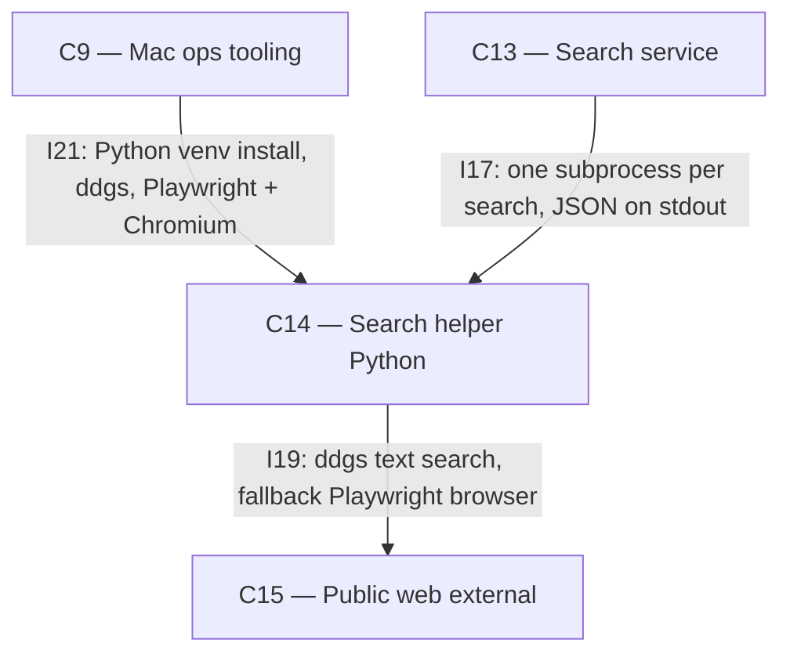

# As Built — M7a

Baseline: 46a0750f19e47ee9ee3b7f6e7ee085f6cfdd194c
Change source: git diff 46a0750 HEAD

## Diagram

## Components Observed

| Id | Name | Files | Claimed? |
| --- | --- | --- | --- |
| C9 | Mac ops tooling | ops/scripts/install-search-helper.sh | Yes |
| C13 | Search service | search/src/http/server.ts, search/src/search/runHelper.ts, search/src/search/search.test.ts, search/scripts/search-proof.sh | Yes |
| C14 | Search helper (Python) | search/helper/requirements.txt, search/helper/search.py, search/helper/test_search.py | Yes |
| C15 | Public web (external) | — (external, no implementation) | Yes |

## Edges Observed

| From | To | What crosses | Evidence |
| --- | --- | --- | --- |
| C9 | C14 | I21: LaunchAgent, Python venv install (ddgs, Playwright), Chromium via playwright | `ops/scripts/install-search-helper.sh` lines 29–33: `"$PYTHON" -m venv "$VENV"` then pip install from requirements, playwright install chromium |
| C13 | C14 | I17: subprocess spawn, CLI args `--query <q> --max <n>`, JSON on stdout | `search/src/search/runHelper.ts` line 34: `Bun.spawn(argv, ...)` with line 23: DEFAULT_COMMAND = `[...helper/.venv/bin/python, ...helper/search.py]` |
| C14 | C15 | I19: ddgs text search, region uk-en; fallback Playwright headless Chromium | `search/helper/search.py` line 25: `hits = client.text(query, region=REGION, safesearch="moderate", max_results=max_results)` where ddgs is imported line 16 and requirements.txt pins ddgs==9.16.0 and playwright==1.63.0 |

## Unmapped Files

| File | Why it could not be attributed |
| --- | --- |
| .gitignore | Configuration file; changes add search/helper/.venv/ and __pycache__/ to ignore list (supporting ops/config, not a component responsibility) |

## Claim vs Observation

No mismatch. All claimed components (C9, C13, C14, C15) appear in the diff. C15 is correctly marked as external with no implementation code in the milestone; the other three are fully represented.
