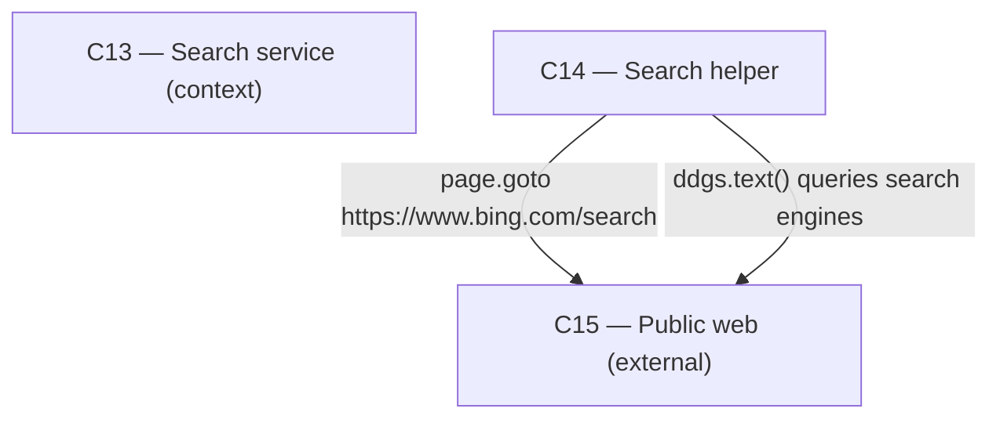

# As Built — M7b

Baseline: ad7570f5e0777549fb0f9b9607d4982575c4f4e6
Change source: git diff ad7570f5e0777549fb0f9b9607d4982575c4f4e6 HEAD

## Diagram

## Components Observed

| Id | Name | Files | Claimed? |
| --- | --- | --- | --- |
| C14 | Search helper (Python) | search/helper/search.py, search/helper/test_search.py, search/scripts/fallback-proof.sh, search/scripts/search-proof.sh | Yes |
| C13 | Search service (context) | None changed | Yes |
| C15 | Public web (external, context) | None changed | Yes |

## Edges Observed

| From | To | What crosses | Evidence |
| --- | --- | --- | --- |
| C14 | C15 | Headless Chromium page load to Bing search results | `page.goto(url, ...)` in browser_search() at line 88 of search/helper/search.py; URL is `https://www.bing.com/search?q={query}&cc=GB&setlang=en-GB&form=QBLH` |
| C14 | C15 | DuckDuckGo search API queries | `client.text(query, region=REGION, ...)` in _ddgs_step() at line 161 of search/helper/search.py; uses ddgs library |

## Unmapped Files

| File | Why it could not be attributed |
| --- | --- |
| (none) | All files were successfully attributed to C14 |

## Claim vs Observation

C13 is claimed but not observed: The diff contains no changes to search/src/ (C13's location). The milestone realizes browser fallback entirely within C14. C13's runHelper.ts remains unchanged and continues to spawn C14 as a subprocess; the environment variable SEARCH_HELPER_FORCE_DDGS is inherited by C14 but does not constitute a code change in C13.
