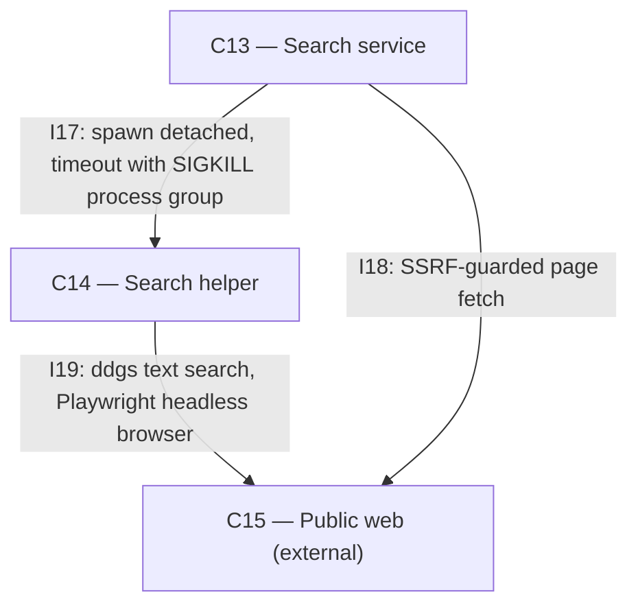

# As Built — M7c

Baseline: 06aade1194d6fd1a010ed47697adf26f8a9d24c4
Change source: git diff 06aade1 HEAD | 8 files changed, 1464 insertions(+), 33 deletions

## Diagram

## Components Observed

| Id | Name | Files | Claimed? |
| --- | --- | --- | --- |
| C13 | Search service | search/src/index.ts, search/src/http/server.ts, search/src/search/runHelper.ts | Yes |
| C14 | Search helper (Python) | search/helper/search.py | Yes |

## Edges Observed

| From | To | What crosses | Evidence |
| --- | --- | --- | --- |
| C13 | C14 | Spawns subprocess with detached process group; kills entire group (helper + driver + Chromium) on timeout or abort with SIGKILL | `spawn(argv[0]!, argv.slice(1), { stdio: ["ignore", "pipe", "ignore"], detached: true })` in runHelper.ts line 43; `process.kill(-pid, "SIGKILL")` in runHelper.ts line 51 |
| C14 | C15 | Invokes ddgs text search; fallback headless Chromium loads Bing results page | `from ddgs import DDGS` in search.py line 39; `pw.chromium.launch(headless=True)` in search.py line 93 |
| C13 | C15 | Fetches and extracts page content via SSRF-guarded `node:http(s)` with custom DNS lookup | `import { fetchPage, ... } from "../fetch/fetchPage"` in server.ts line 6; already present at baseline |

## Unmapped Files

| File | Why it could not be attributed |
| --- | --- |
| search/helper/test_search.py | Test file; testing responsibility belongs to C14 but the test file itself is not an implementation of C14 |
| search/src/search/timeout.test.ts | Test file; testing responsibility belongs to C13 but the test file itself is not an implementation of C13 |
| search/scripts/search-proof.sh | Proof/demo script; validates behaviour but not an implementation of a component |
| search/scripts/failure-proof.sh | Proof/demo script; validates 503/504 error paths but not an implementation of a component |

## Claim vs Observation

No mismatch. Both claimed components C13 and C14 are observed in the change set.

### Key Implementation Details

**M7c adds timeout enforcement to C13→C14 subprocess execution:**
- C13's `runHelper.ts` changed from `Bun.spawn` to `node:child_process`'s `spawn` with `detached: true` (line 43), creating a new process group
- Timeout race added via `Promise.race([exited, timedOut, aborted])` (line 84) with default 25 s from `DEFAULT_TIMEOUT_MS = 25_000` (line 27)
- Process group kill via `process.kill(-pid, "SIGKILL")` (line 51) kills helper + all children (Playwright driver, Chromium) on timeout, abort, or after normal exit
- Returns `{ ok: false, detail: "helper timed out", timeout: true }` (line 88) to distinguish timeout from other failures
- `search/src/index.ts` reads optional `SEARCH_TIMEOUT_MS` env var and passes `timeoutMs` option to server (lines 11-14)
- `search/src/http/server.ts` maps timeout outcome to HTTP 504 status and non-timeout failure to 503 (lines 48-49)

**C14 test-only hook for proving timeout path:**
- `SEARCH_HELPER_FORCE_BROWSER` env var (`fail` or `hang`) added to `search/helper/search.py` (lines 95-96, 189)
- `hang` sleeps 3600 s to hold a live browser for timeout testing
- `fail` simulates browser step failure without launching browser
- Allows timeout.test.ts to prove 504 path without network access (uses fake helpers that hang)
- Companion to existing `SEARCH_HELPER_FORCE_DDGS` hook from M7b

**Tests and proofs validate the implementation:**
- `search/src/search/timeout.test.ts` (145 lines): Tests that timeout kills entire process group and no children linger
- `search/scripts/failure-proof.sh` (226 lines): Proves 503 search_unavailable and 504 timeout via real C13 HTTP with force hooks
- `search/scripts/search-proof.sh`: Minor update, likely adding timeout test invocation
