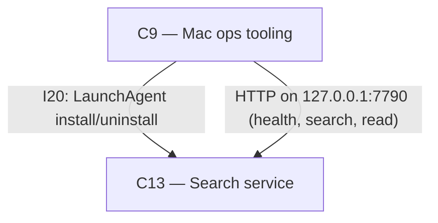

# As Built — M8

Baseline: 1057559a3dad47f2107e7e9b5817f6f822a0a6ad
Change source: git diff 1057559a3dad47f2107e7e9b5817f6f822a0a6ad HEAD

## Diagram

## Components Observed

| Id | Name | Files | Claimed? |
| --- | --- | --- | --- |
| C9 | Mac ops tooling | `ops/scripts/com.harness.search.plist`, `ops/scripts/install-search-agent.sh`, `ops/scripts/uninstall-search-agent.sh`, `ops/scripts/search-service-proof.sh`, `ops/scripts/verify-ops-install.sh` (modified) | Yes |
| C13 | Search service | `search/API.md` | Yes |

## Edges Observed

| From | To | What crosses | Evidence |
| --- | --- | --- | --- |
| C9 | C13 | LaunchAgent installation and management | `install-search-agent.sh` installs `com.harness.search.plist` to `~/Library/LaunchAgents/` and loads it via `launchctl bootstrap` (line 55-56); `uninstall-search-agent.sh` removes the agent via `launchctl bootout` (line 10) and deletes the plist (line 13) |
| C9 | C13 | HTTP API calls on loopback | `search-service-proof.sh` calls `GET /v1/health` (line 42), `POST /v1/search` (line 199), and `POST /v1/read` (line 221) on `http://127.0.0.1:7790` without Authentication header |
| C9 | C13 | LaunchAgent verification | `verify-ops-install.sh` verifies `com.harness.search.plist` exists, contains correct paths to `$REPO_ROOT/search` and `src/index.ts`, and has no test-only environment overrides (lines 126-138) |

## Unmapped Files

None. All changed files are attributed.

## Claim vs Observation

No mismatch. Both claimed components (C9, C13) are observed in the change set.
- **C9** is realized by LaunchAgent plist, installer/uninstaller scripts, and proof script additions to `ops/scripts/`.
- **C13** is realized by HTTP API documentation in `search/API.md`, which documents the loopback-only search service that was already implemented at the baseline.
