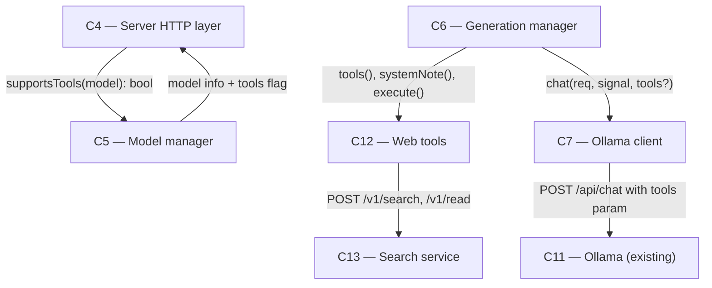

# As Built — M9

Baseline: 9830d5c60f43e7761b9dbd48fea4e377713734cb
Change source: git diff 9830d5c60f43e7761b9dbd48fea4e377713734cb 5a13c8a

## Diagram

## Components Observed

| Id | Name | Files | Claimed? |
| --- | --- | --- | --- |
| C4 | Server HTTP layer | server/src/http/server.ts, server/src/http/server.test.ts | Yes |
| C5 | Model manager | server/src/models/manager.ts, server/src/models/manager.test.ts | Yes |
| C6 | Generation manager | server/src/generations/manager.ts, server/src/generations/manager.test.ts | Yes |
| C7 | Ollama client | server/src/ollama/client.ts, server/src/ollama/client.test.ts | Yes |
| C12 | Web tools | server/src/web/tools.ts, server/src/web/tools.test.ts | Yes |
| shared | API types | shared/api.ts | No (not claimed, support layer) |

## Edges Observed

| From | To | What crosses | Evidence |
| --- | --- | --- | --- |
| C4 | C5 | `supportsTools(name: string): Promise<boolean>` | server/src/http/server.ts line 513: `await modelManager.supportsTools(body.model)` |
| C5 | C4 | `models: [{name, size_bytes, tools}]` | server/src/models/manager.ts line 214-218: `tools: await this.supportsTools(m.name)` added to model info; server/src/http/server.ts parses for /v1/state response |
| C6 | C12 | `tools(): WebTool[]`, `systemNote(now): string`, `execute(call, signal): Promise<{toolResult, events}>` | server/src/generations/manager.ts lines 10-11: imports createWebTools; line 117: `this.webTools.systemNote(new Date())`; line 168: `this.webTools.execute(toolCall, signal)` |
| C6 | C7 | `chat(req, signal, tools?: OllamaTool[]): AsyncGenerator<...>` | server/src/generations/manager.ts lines 155-156: `this.ollamaClient.chat(request, signal, this.webTools.tools())` when web is enabled |
| C7 | C11 | `tools` array in POST /api/chat body | server/src/ollama/client.ts lines 278-281: conditionally includes `tools` in request body to Ollama |
| C12 | C13 | HTTP POST to `http://127.0.0.1:7790/v1/search` and `/v1/read` | server/src/web/tools.ts lines 119, 154: `post("/v1/search", ...)` and `post("/v1/read", ...)` |

## Unmapped Files

| File | Why it could not be attributed |
| --- | --- |
| server/scripts/record-proxy.ts | Utility script for live proof; not a component of the system. Records proxied requests for test evidence. |
| server/scripts/web-chat-proof.sh | Bash script that orchestrates the M9 live proof; provides test infrastructure and validation, not a system component. |
| server/src/index.ts | Initialization/wiring code for C4, C6, C12. Modification creates GenerationManager with createWebTools and passes both to createServer. Supports C4, C6, C12 collectively. |
| mobile/src/ui/modelActions.test.ts | Test file only; tests C1 but does not implement M9 functionality. |
| mobile/src/ui/modelList.test.ts | Test file only; tests C1 but does not implement M9 functionality. |

## Claim vs Observation

No mismatch. All claimed components (C4, C5, C6, C7, C12) are present and integrated in the diff. The web tool-calling loop is implemented across these five components exactly as claimed:

- **C4** validates the `web` parameter on POST /v1/chat and checks model tools support via C5
- **C5** reports tools capability per model via Ollama's /api/show endpoint
- **C6** runs the tool-calling loop when web is enabled, respecting the 10-call cap, offering tools only while under the limit, and integrating C12's tool execution into the generation stream
- **C7** passes tools to Ollama's /api/chat and yields tool calls back to C6
- **C12** defines web_search and read_page tools, calls the search service C13, and emits step and source events into the generation log

All edges flow through code, not claim.
